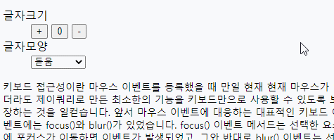

# Ajax(Asynchronous JavaScript XML)

Ajax는 웹 2.0의 기반 기술 중 하나로, 기존의 동기식 웹의 구성을 비동기식으로 만들 수 있는 기술로 웹 상에서의 다양한 통신 방법 중 하나이다.  
Ajax는 Standard JavaScript, XMLHttpRequest, XML, HTML, CSS, XSLT, DOM을 조합하여 구성한 것으로, 웹 화면을 사용자가 보기에 CS 프로그램처럼 작동할 수 있도록 하는 개념이다.  
브라우저의 페이지를 새로 고침할 필요 없이 서버에서 데이터를 로드해 올 수 있는 서버와 비동기 요청을 만드는 기법이다.  

- 동기식 웹의 구성은 필요로 하는 정보들을 화면 단에서 가공하고 전송할 경우, 헤더 값에 해당 내용을 담아 웹 서버로 전달한다. 웹 서버는 요청된 내용을 각종 데이터로 가공 처리를 한 후 보게됭 데이터의 내용을 클라이언트에 전달한다. 이렇게 전송된 내용을 웹 브라우저가 화면에 표시를 하게 된다.

- JQuery의 라이브러리를 받아서 사용한다.

## AJAX의 장점
- 새로 고침을 통해 새로운 컨텐츠를 반영해야 하는 정적인 페이지가 아닌 동적인 웹 페이지를 만들 수 있다.
- 전체 페이지에서 실제로 바뀌어야 할 내용이 특정 부분에 해당한다면 이 영역의 데이터만을 따로 서버에서 받아올 수 있으므로 경우에 따라 서버의 네트워크 부하를 최대한으로 줄여 줄 수 있다.
- 인터렉티브한 효과를 이용해 사용자에게 바뀐 부분을 부각시켜 줄 수 있다.

- 비동기식 웹을 구현하는 기술 Ajax는 필요한 데이터만 서버로 보내고, 해당 정보를 XML이나 JSON 형태로 제공해서 받게됨. 그리고 클라이언트에서 필요한 정보들을 DOM을 통해 화면을 재가공하여 사용자에게 변화된 데이터를 보여주게 된다. 이 때 서버와 교환되는 데이터의 양이 적어지므로 서버 자원의 점유율이 낮아진다. 화면 단에 대한 재가공 처리를 클라이언트의 PC에 맡기므로 서버에서 좀 더 많은 응답 요청에 신속하게 응대해 줄 수 있는 장점이 있다.

- 단점 : 특정 위치의 정보만 다시 받아야 하는 경우, 바뀌지 않아도 되는 부분의 정보도 재가공되어 서버를 통해 클라이언트에 보내지므로 자원의 낭비가 생기고 화면의 재작성으로 인해 화면 단의 변화에 대한 상태 값들을 유지하기 어렵다.


### ※ 비동기 통신
비동기 방식은 웹 페이지를 리로드하지 않고 데이터를 불러오는 방식. 이 방식의 장점은 페이지 리로드의 경우 전체 리소스를 다시 불러와야 하는데 이미지, 스크립트, 기타 코드등을 모두 재 요청할 경우 불필요한 리소스 낭비가 발생하게 되지만, 비동기식 방식을 이용할 경우 필요한 부분만 불러와 사용할 수 있으므로 매우 큰 장점이 있다.


## AJAX에서 반드시 알고 있어야 하는 핵심 내용
- XMLHttpRequest 객체
	* 모든 현대적인 웹 브라우저에서 XMLHttpRequest 객체를 지원.
	* XMLHttpRequest 객체는 내부적으로 클라이언트와 서버간의 데이터 요청 및 응답 처리를 담당함. 가장 먼저 생성해야 하는 객체.
- get 방식, post 방식
	* 서버에 보낼 데이터를 url에 포함시켜서 보낼지(get 방식), 아니면 요청 페이지 몸체에 담아 보낼지(post 방식)와 관련된 부분.
- 동기식, 비동기식
	* 서버에 요청을 보내고 서버측 응답이 올 때 까지 다음 코드를 실행하지 않고 무작정 기다릴 것인지(동기식), 아니면 다른 것을 처리하면서 서버측 응답이 왔다는 소식을 브라우저에 의해 이벤트로 받을 것인지(비동기식) 선택하는 부분. Ajax에서 A가 비동기를 의미하듯 여기서는 이 가운데 비동기식을 주로 사용.
- CSV, JSON, XML
	* 서버에서 클라이언트로 요청에 대한 응답을 보내는 방식을 설정.
	* 데이터를 하나로 묶어서 보낼 것인지(CSV, Comma Seperated Value), 아니면 널리 사용하는 XML 형식으로 보낼 것인지, 또는 리터럴 방식의 자바 스크립트 객체를 의미하는 JSON(JavaScript Object Nation) 방식으로 보낼지를 설정. 상황에 따라 3가지 방식을 모두 사용할 때가 있으니 모두 알고 있는 것이 좋다.


## Ajax 형식

```javascript
$.ajax({
	type : 통신 타입을 설정 - "get" 또는 "post"
	async : 비동기식으로 처리할지를 결정 - false인 경우 동기식으로 처리. 생략시에는 비동기식으로 처리(default:true). 
	url : 요청할 url을 설정.
	data : 서버에 요청할 때 보낼 매개변수를 설정. - 서버로 전송할 데이터 변수.
	dataType : 응답을 받을 데이터의 타입을 설정. - text, xml, json 등.
	success : 요청 및 응답에 성공했을 때 처리할 내용을 설정.
	error : 요청 및 응답에 실패했을 때 처리할 내용을 설정.
	complete : 모든 작업을 마친 후 처리할 내용을 설정.
});
```

## Ajax 관련 중요 함수
- `.ajaxComplate()` : Ajax에 관련 요청이 완료(성공, 실패)되면 실행되는 콜백 함수.
- `.ajaxError()` : Ajax에 괸련 요청이 실패되면 실행되는 콜백 함수.
- `.ajaxSend()` : Ajax에 관련 요청을 보내기 전에 항상 호출되는 콜백 함수.
- `.ajaxStart()` : Ajax에 관련 요청이 시작될 때 호출되는 콜백 함수.
- `.ajaxStop()` : Ajax에 관련 요청에 대한 응답을 받은 직후 호출되는 콜백 함수.
- `.ajaxSuccess()` : Ajax에 관련 요청이 성공이 되면 실행되는 콜백 함수.


- `jQuery.get()` : GET 방식으로 서버와 통신.
- `jQuery.getJSON()` : 서버에게 GET 방식으로 요청하고 응답은 JSON 형식으로 받는다.
- `jQuery.getScript()` : 서버에게 GET 방식으로 요청하고 응답은 자바스크립트 형식으로 받는다.
- `jQuery.post()` : POST 방식으로 서버와 통신.
- `.load()` : 인수로 입력된 파일의 결과를 현재 element에 삽입.


- `jQuery.param()` : 배열 또는 객체를 Ajax 요청에 사용할 수 있도록 직렬화.
- `.serialize()` : 폼 요소에 관련된 데이터를 query String인 name=value&name=value로 변환.
- `.serializeArray()` : 폼 요소에 관련된 데이터를 Array 형식인 [name=value, name=value]로 변환.


- `jQuery.ajax()` : 서버 요청 정보를 Map(key, value)의 형태로 만들어 전송.
- `jQuery.ajaxPrefilter()` : Ajax 요청을 보내기 전이나 $.ajax() 함수에 의해 호출되기 전에 Ajax 옵션을 수정하거나 조작.
- `jQuery.ajaxSetup()` : 한 페이지에 동일하게 반복되는 코드를 global로 설정.
- `jQuery.ajaxTransport()` : 데이터의 실제 전송을 처리하는 객체를 만든다.


```javascript
$(function() {
	// 버튼을 누르면 Ex01_01.html 파일 결과를 
	// id=display인 태그에 삽입하여 출력.
	$("#btn").click(function() {
		$("#display").load("Ex01_01.html");
	});
});
```

<p align="center"></p>


```javascript


```
