# CSS(Cascading Style Sheet)
HTML이 웹 페이지의 "뼈대"라고 한다면 CSS는 "살"이라고 할 수 있다. 즉, HTML이 웹 페이지의 정보를 표현한다면, CSS는 HTML을 좀 더 보기 좋게 디자인하는 역할을 한다.	

* CSS 특징
	* Cascading Style Sheet
	* HTML 문서에 스타일(디자인)을 적용하는 언어
	* CSS 사용 방법 
		* 인라인 방식(태그에 직접 적용) : 번거로우므로 사용빈도가 낮다.
		* head 영역 선언 방식
		* 외부 파일(*.css) 링크 방식
	 
* CSS 형식 : 선택자 { 속성: 값; }
	* 선택자 : body 태그에서 선언한 태그
	* 하위태그 지정 : 상위태그 하위태그 { 속성: 값; }
	* 둘 이상의 요소에 같은 스타일을 적용하는 방법 : 태그1, 태그2 { 속성: 값; }


----------
## CSS 사용 방법 1  : 외부 파일(*.css) 링크 방식
### link : 현재 문서와 외부 리소스(*.css) 파일과의 관계를 명시.
* `rel="stylesheet"` : `<link>` 태그로 연결하는 파일이 외부에 있는 스타일시트 파일이란 뜻을 가지고 있다.
* `href` : 이 속성은 링크된 리소스의 url 경로를 참고한다.
	* `href="#"` : 링크없이 클릭만 가능
* 외부에 스타일시트 파일로 선언하고 사용할 때의 장점은 모든 HTML 파일에 동일하게 적용이 가능하다는 점이다.


```css
// main.css 파일
// html 파일에서 선언한 링크 "css/main.css" 주소에 파일을 만들고 아래의 코드를 작성하였다.

// 링크된 html의 <p>태그에 적용되는 css
p {
	color: blue; 		/* 글자 색상 */
	font-size: 20px; 	/* 글자 크기 */
	font-weight: bold;  /* 글자 굵기 */
	text-align: center; /* 글자 위치 */
	font-family: 궁서체   /* 글꼴(글자체) */
}

// 링크된 html의 <body> 태그에 적용되는 css
body {		
	background-color: pink;	/* 문서 전체 배경 색상 변경 */
	
	/* 배경 이미지를 지정하는 속성 */
	background-image: url("../images/beauty.jpg");
	
	/* 배경 이미지를 한 번만 표시하는 속성 */
	background-repeat: no-repeat;
	
	/* 배경 이미지를 웹 브라우저의 가운데 배치하는 속성 */
	background-position: center;
}
```


```html
// html 파일
<head>  // 헤더 안에서 선언
<link rel="stylesheet" href="css/main.css"> // 링크한 파일의 스타일을 적용한다.
</head>

<body>
<p>link 방식으로 스타일 지정하기</p>
</body>
```


엄청난 게 만들어졌다. 정말 beauty한 화면이다.    
링크한 css파일의 코드에 따라 p태그와 body태그의 디자인이 결정되었다.    
<p align="center">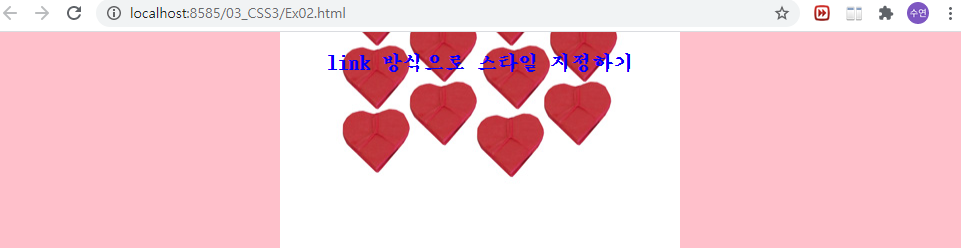</p>  


## CSS 사용 방법 2  : head 영역 선언 방식
`<head>` 영역에서 원하는 태그의 스타일을 지정한다.

* 하위 태그 지정 : '상위태그 하위태그 { 속성: 값;}'
* 둘 이상의 요소에 같은 스타일을 적용하는 방법 : 태그1, 태그2 { 속성: 값; }

```html
<head>
<meta charset="UTF-8">
<title>Insert title here</title>
<style type="text/css">

	ul li{ // ul태그의 하위 태그인 li태그의 스타일 정의 
		font-size: 18px;
		font-weight: bold;
		color: red;
	}
	
	h1, h2 { // 둘 이상의 태그를 한 번에 스타일 정의
		font-style: italic;
		font-weight: bold;
		text-decoration: underline; /* 텍스트에 밑줄 적용*/
	}
	
</style>
</head>
<body>

	<h3>음료 종류</h3>
	
	<hr>
	
	<ul>
		<li>콜라</li>
		<li>사이다</li>
		<li>환타</li>
		<li>생과일주스</li>
	</ul>
	
	<h1>나보다 동료의 생각이 더 옳을 수 있다는 믿음을 가집니다.</h1>	
	<h2>Trust to Trust</h2>

</body>
```
  
`<head>`에서 정의한 스타일이 li, h1, h2 태그에 각각 적용되어 출력된다.     
<p align="center">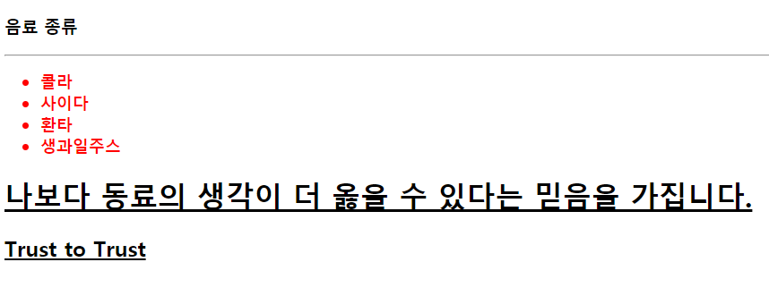</p>  


## CSS 형식 : 선택자 { 속성: 값; }
### * 선택자의 종류
* 태그 선택자 : 특정 태그를 사용한 요소에 스타일 적용. id 선택자와 class 선택자가 있다.
1. id 선택자 : 특정 부분에 스타일 적용.
	* 웹 문서에서 고유한 식별자를 정의할 때 사용한다.
	* 대체적으로 큰 골격의 이름에 사용하는 것이 좋다.
	* 같은 id 이름을 중복해서 사용하지 못한다. 하나의 요소에 여러 개의 id를 동시에 사용하지 못한다. 
	* 대체적으로 상단 헤더, 왼쪽 메뉴, 가운데 컨텐츠 영역, 하단 footer 영역에 사용한다.
	* 예) `<body> id="title"` ==> `<head> #title`
2. class 선택자 : 특정 부분에 스타일 적용.
	* 같은 클래스의 이름을 여러 요소에 중복하여 적용할 수 있다.
	* 주로 class 선택자를 많이 사용한다.
	* 예) `<body> class="main_text"` ==> `<head> .main_text`


#### [예] id 선택자 & class 선택자
id 선택자는 헤더영역에서 '#'을 선택자 이름 앞에, class 선택자의 이름은 헤더영역에서 '.'을 선택자 이름 앞에 붙여서 선언한다.
* id 선택자는 중복해서 사용할 수 없음에 주의한다.
* class 선택자는 중복해서 사용가능하므로 넓은 영역에서 사용 가능하다.


```html
<head>
<style type="text/css">

	#title { // id 선택자
		color: blue;
	}
	
	.main_text { // class 선택자
		font-weight: bold;
		font-size: 20px;
		color: red;
	}
	
</style>
</head>
<body>
	// id 선택자 title 적용
	<h1 id="title">제목1</h1>
	<h1>제목2</h1>
	<hr>
	
	// class 선택자 main_text 적용
	<p class="main_text">본문1</p>
	<p>본문2</p>
	<p class="main_text">본문3</p>
	<p>본문4</p>
	<p class="main_text">본문5</p>
</body>
```


'제목2'는 id 선택자 title의 스타일이 적용되었으며,
'본문1', '본문3', '본문4'는 class 선택자 main_text의 스타일이 적용되었다.    

<p align="center">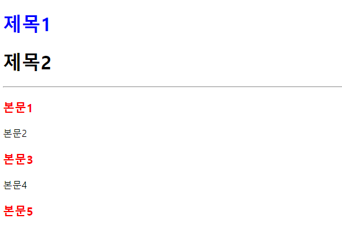</p>  


## 블록레벨 요소와 인라인 레벨 요소
### 1. 블록 레벨 요소
* 주요 태그 : `<div>`, `<hn>`, `<p>`
* 사용 가능한 최대 가로 너비를 사용한다.
* 크기를 지정할 수 있다.
* (default) `width:100%, heigh:0%`
* 수직으로 쌓인다.
* `margin`, `padding`의 속성에 상하좌우로 사용이 가능하다.
* 레이아웃을 설정하는 용도로 사용이 된다.


### 2. 인라인 레벨 요소
* 주요 태그 : `<span>`, ``
* 필요한 만큼만의 너비를 사용한다.
* 크기를 지정할 수 없다.
* (default) `width:0%, height:0%`
* 수평으로 쌓인다.
* `margin`, `padding`의 속성에 상하좌우로 사용이 불가능하다.
* 텍스트를 설정하는 용도로 사용이 된다.


### * div 태그
`<div>`는 특별한 의미가 없는 태그로, 주로 구분 용도로 사용된다. 즉, 영역 설정 용도. 
* `margin: 0 auto;` : `<div>`의 선택자에서 선언시 `<div>`박스가 가운데 정렬된다.


#### [예] 블록레벨요소 & 인라인 레벨 요소
	
```
	<p>블록 레벨 요소 : p태그</p>
	<span>인라인 레벨 요소 : span</span>
```


겉보기엔 별다를 게 없어보이는 p태그와 span 태그로 작성한 문장이지만    
<p align="center">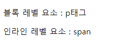</p>     


개발자모드(F12)로 보면 p태그는 작성하지 않은 가로 넓이 끝까지 블록이 지정되어 있으며,    
<p align="center">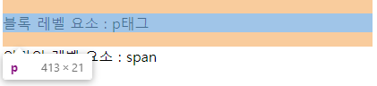</p>    


반면에 span 태그는 작성한 영역만 소숫점 단위로 너비가 지정되어 있음을 알 수 있다.
<p align="center">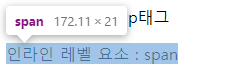</p>   


### * display 
`display`는 웹 페이지 상에서 요소들이 어떻게 보여지고 다른 요소와 어떻게 상호 배치되는지 결정하는 속성이다.
블록 레벨 요소를 인라인 레벨로, 인라인 레벨 요소를 블록 레벨로 등 변환하는 효과를 준다.
* `display: inline;`으로 지정된 요소는 전후 줄바꿈 없이 한 줄에 다른 요소들과 나란히 배치가 된다.
	* 예) `<span>`, `<a>`
* `display: block;`으로 지정된 요소는 전후 줄바꿈이 들어가 다른 요소들을 다른 줄로 밀어내고 혼자 한 줄을 차지한다.
	* 예) `<div>`, `<p>`, `<hn>`
* `display: inline-block;`으로 지정된 요소는 기본적으로 `inline` 요소처럼 전후 줄바꿈이 없이 한 줄에 다른 요소들과 나란히 배치된다. 하지만 `inline` 요소에서 불가능하던 `width`와 `height` 속성 및 `margin`과 `padding` 속성의 상하 간격 지정이 가능하다.


#### [예] display 1
다음과 같이 `<div>` 를 작성하면    

```html
<body>

	<div class="block">
		
		
		
	</div>
</body>
```


아래와 같이 가로로 3개의 이미지가 연달아 출력된다.     
<p align="center"></p>   


기본적으로 ``는 인라인 레벨 요소로 각각 필요한 만큼만 너비로 사용하기 때문이다.    
<p align="center">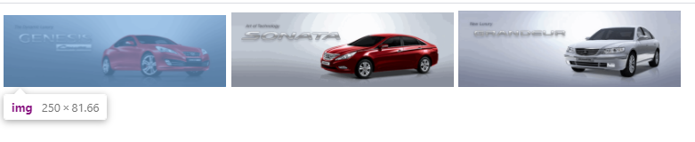</p>   


여기에 위에서 선언한 class 선택자에 `display: block;`라는 값을 주면

```html
<head>
<style type="text/css">
	.block img {
		display: block;
	}
</style>
</head>
```


아래와 같이 세로로 출력이 된다.    
<p align="center">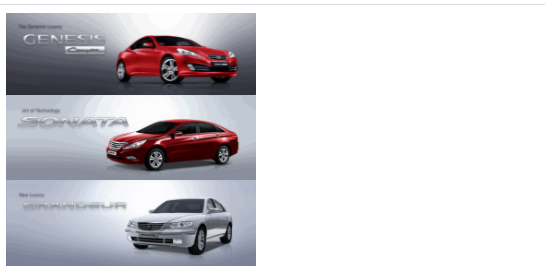</p>  


`display` 속성이 `block`이 되면서 각각의 이미지 전후에 줄바꿈이 들어가 다른 요소들을 다른 줄로 밀어내고 혼자 한 줄을 차지할 수 있게 되었기 때문이다.    
인라인 레벨에서 블록 레벨로 변환된 효과가 나타난다.    
<p align="center">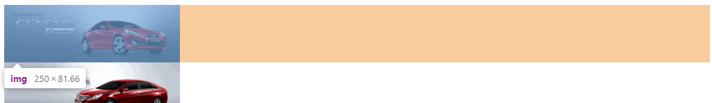</p>    


#### [예] display 2
`<li>`의 `display`도 변경해보자.

```html
<body>
	<ul>
		<li><a href="#">회사소개</a>	href="#" : 링크없이 클릭만 가능
		<li><a href="#">사업영역</a>	
		<li><a href="#">제품문의</a>
		<li><a href="#">고객센터</a>
		</li>
	</ul>
</body>
```

위와 같이 코드를 작성하고 실행하면 아래와 같은 창이 열린다.    
<p align="center"></p>


`<li>` 태그는 기본적으로 블록 레벨 요소이기 때문에, 각각 한줄씩 차지하여 세로로 출력이 된다.    
<p align="center">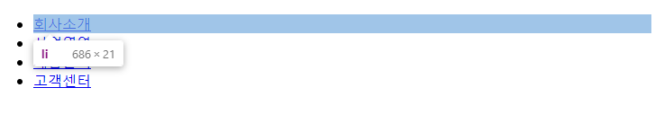</p>  


가로로 길게 보고 싶으므로, 아래와 같이 `<head>`영역에 하위태그 선택자를 입력하고 `display: inline;` 속성을 입력한다.

```html
<head>
<style type="text/css">

	ul li {
		display: inline;
	}

</style>
</head>

```

코드 입력 후 재실행 하면 아래와 같이 가로로 리스트가 출력되는 것을 볼 수 있다.   
<p align="center">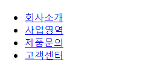</p>


display 속성이 inline이 되어 전후 줄바꿈 없이 한 줄에 다른 요소들과 나란히 배치가 된다.   
<p align="center">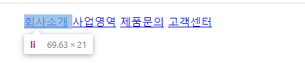</p> 


### * em 단위
* `em`은 사용하는 글꼴의 대문자 M을 기준으로 한다.
* 부모 요소에서 지정한 폰트의 대문자 M을 `1em`이라는 기준으로 설장하고 상대적 값을 계산하여 다른 요소들의 글자 크기를 지정한다.
* 만약 지정한 크기가 없다면 `<body>` 태그의 기본 글자 크기인 16px이 `1em`의 기준이 된다.


#### [예] em 단위
다음과 같이 `<body>` 태그에 코드를 작성하면

```html
<h1>3em의 크기를 가지는 제목입니다.</h1>
<p>1em의 크기를 가지는 p 태그입니다.</p>
```

아래와 같이 출력된다.    
<p align="center">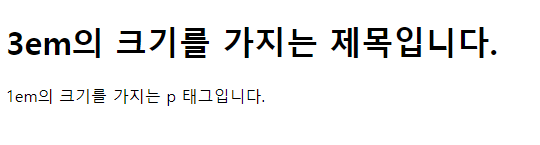</p>     


개발자모드로 보면 `<h1>` 의 기본 폰트 사이즈는 32px,    
<p align="center">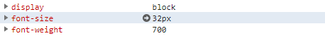</p>    


`<p>`태그의 기본 폰트사이즈는 16px이다.    
<p align="center">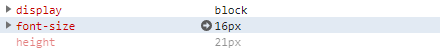</p>      


이 때, `<head>` 영역에서 `<h1>`의 폰트 사이즈를 3em으로 지정하면    

```css
h1 {
		font-size: 3em;
}
```
아래와 같이 `<h1>`의 크기가 변경된 것을 볼 수 있다.    
<p align="center">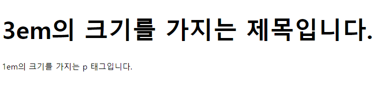</p>    


개발자모드로 보면 폰트사이즈가 48px로 변경되었음을 알 수 있다.   
즉, `<body>` 태그의 기본 글자 크기인 16px을 기준으로 3em(=3배)인 48px로 폰트사이즈가 변경되었다.    
<p align="center">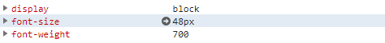</p>


## CSS의 여백

<p align="center">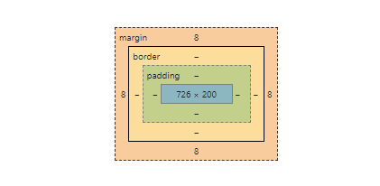</p>  

### 1. margin 

<p align="center">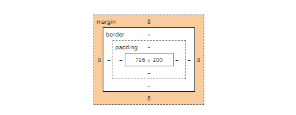</p>  

* 요소의 바깥쪽 여백을  지정한다.
* 바깥쪽 여백은 요소와 요소 사이의 여백(거리, 공간)을 생성할 때 사용한다.
* 단위 : px, em, cm, % 등의 단위로 지정.
* `%` : 너비를 백분율로 지정도 가능하다. 페이지에서 차지하는 비율을 말한다.
* 속성에는 상단, 오른쪽, 하단, 왼쪽 각각 다르게 지정할 수 있다.
* 사용법) 
	* `margin: 10px 20px 30px 40px;` : [상단] 10px, [오른쪽] 20px, [하단] 30px, [왼쪽] 40px 지정
	* `margin: 10px 20px 30px;` : [상단] 10px, [오른쪽/왼쪽] 20px, [하단] 30px
	* `margin: 10px 20px;` : [상단/하단] 10px, [오른쪽/왼쪽] 20px
	* `margin: 10px` : [상단/오른쪽/하단/왼쪽] 10px
	* `margin: 0 auto;` : `<div>` 박스를 가운데로 정렬.
	* `	margin-left: auto; margin-right: auto;` : 가운데 정렬. 좌우 여백을 자동으로 잡아준다.


### 2. padding 

<p align="center">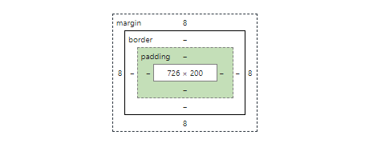</p>  

* 요소의 안쪽 여백을 지정한다.
* 단위 : px, em, cm, % 등의 단위로 지정.
* `%` : 너비를 백분율로 지정도 가능하다. 페이지에서 차지하는 비율을 말한다.
* 속성에는 상단, 오른쪽, 하단, 왼쪽 각각 다르게 지정할 수 있다.
* 사용법) 
	* `padding: 10px 20px 30px 40px;` : [상단] 10px, [오른쪽] 20px, [하단] 30px, [왼쪽] 40px 지정
	* `padding: 10px 20px 30px;` : [상단] 10px, [오른쪽/왼쪽] 20px, [하단] 30px
	* `padding: 10px 20px;` : [상단/하단] 10px, [오른쪽/왼쪽] 20px
	* `padding: 10px;` : [상단/오른쪽/하단/왼쪽] 10px


#### [예] margin
다음과 같은 `box1`이 있다.

```html
<head>
<style type="text/css">

	.box1 {
		width: 300px; 	/* 가로너비 300px */
		height: 200px;	/* 세로높이 200px */
		background-color: red;	
	}
	
</head>
<body>
	<div class="box1">1</div>
</body>
```

<p align="center">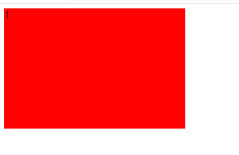</p>


class 선택자에 `margin` 속성을 추가하여 `box1`의 바깥 여백 값을 변경한다.

```css
.box1 {
	margin: 10px 10px 10px 10px; /* 바깥쪽 여백 - 상단, 오른쪽, 하단, 왼쪽 */
}
```
큰 차이가 없어보이나 개발자모드로 보면 기존보다 요소의 상하좌우로 여백이 생겼음을 알 수 있다.     
<p align="center">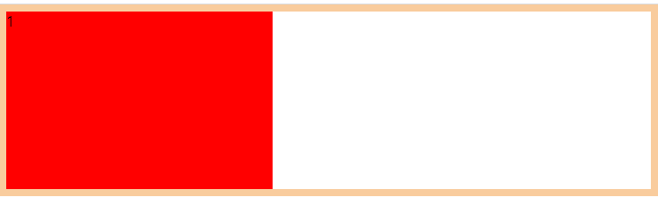</p>  
<p align="center">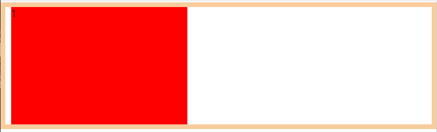</p>  


#### [예] padding
다음과 같은 `box2`가 있다.

```html
<head>
<style type="text/css">

	.box2 {
		width: 300px; 	/* 가로너비 300px */
		height: 200px;	/* 세로높이 200px */
		background-color: skyblue;	
	}
	
</head>
<body>
	<div class="box2">2</div>
</body>
```
<p align="center">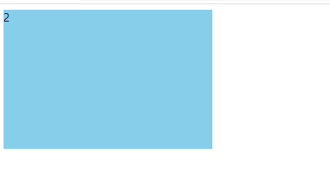</p>  


현재 `box2`의 사이즈는 300*200 이다.  
<p align="center">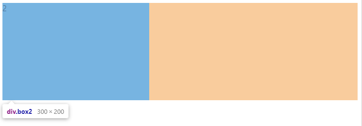</p>  


class 선택자에 `padding` 속성을 추가하여 `box2`의 안쪽 여백을 늘린다.

```css
.box2 {
	padding: 20px;	/* 안쪽 여백 - 상단, 오른쪽, 하단, 왼쪽 */
}
```

`padding` 값 지정 후 `box2`의 사이즈가 커졌다.   
<p align="center">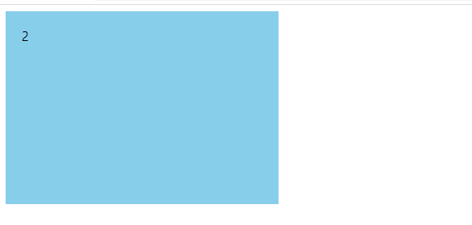</p>     


개발자 모드로 보면 사이즈가 340*240으로 상하좌우로 20px씩 내부여백이 늘어났음을 알 수 있다.    
즉, 내부 여백이 늘어났으므로 늘어난 크기만큼 요소의 크기가 커진다.   
<p align="center">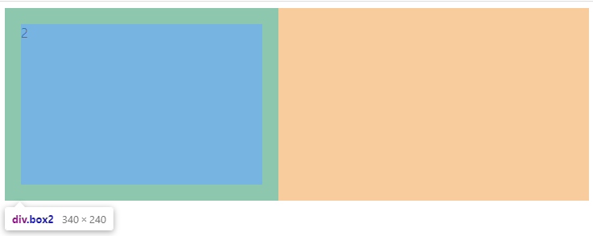</p>  


그렇다면 내부 여백이 커져도 최초의 크기를 유지하기 위해선 어떻게 해야 할까?    
바로 `box-sizing`을 활용하면 된다.

```html
.box2 { 
	box-sizing: border-box;	/* padding 변경되어도 전체 크기 유지 */
}
```

선택자에 `box-sizing` 속성을 추가하면 `padding`을 변경하여 내부 여백이 변하여도 요소의 전체 크기는 처음과 동일하게 유지된다.    
<p align="center">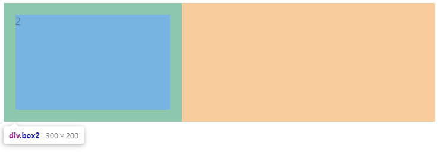</p>  
	

	
### * border 

<p align="center">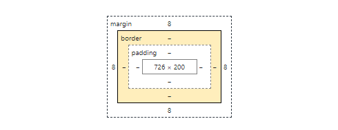</p>

`border`는 요소의 테두리 선을 지정할 때 사용하는 속성이다.
* 형식) `border: (두께) (종류) (색상);`
* 개별적으로 사용하는 속성.
	* `border-width` : 테두리 선의 두께
	* `border-style` : 테두리 선의 종류
	* `border-color` : 테두리 선의 색상	
	* `border-radius` : 모서리가 둥근 사각형 (CSS3에 추가된 기능)
		* 상단 오른쪽 하단 왼쪽순으로 둥글기를 지정한다. 
		* 예) ```border-radius: 0 20px 0 20px```
* 사용법
	* `border-style (테두리 선의 종류)`
		* `none` : 테두리 선 없음
		* `hidden` : 테두리 선 없음
		* `solid` : 실선, 단선(일반적인 선)
		* `dotted` : 점선(......)
		* `dashed` : 파선(------)
		* `doubled` : 두 줄선(이중선)
		* `groove` : 홈이 파여 있는 선
		* `ridge` : 솟은 모양의 선(groove의 반대)
		* `inset` : 요소 전체가 들어간 선
		* `outset` : 요소 전체가 나온 선


#### [예] border

다양한 스타일 중에 기본적인 solid 하나만 예로 작성해보자.  

```html
<head>
<style type="text/css">

	.box {
		width: 500px;
		height: 300px;
		border: 15px solid red;	/* 선굵기 선종류 선색상 */
	}
	
</style>
</head>
<body>

	<div class="box"></div>

</body>	

```


`border: 15px solid red;` 대신 아래와 같이 입력해도 동일한 결과가 나온다.    

```css
border-width: 15px; 
border-style: solid; 
border-color: red;		

```
<p align="center">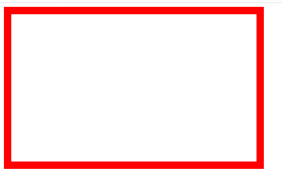</p>  


### * text-shadow
`text-shadow`는 텍스트에 그림자를 지정하는 속성이다.
* 형식) `text-shadow: (가로거리) (세로거리) (번짐정도) (색상);`
	* 가로거리 : 텍스트로부터 그림자까지의 가로 거리.
		* 양수 값은 글자 오른쪽으로, 음수 값은 왼쪽으로 그림자를 만든다.
		* 필수적으로 들어가야 하는 속성.
	* 세로거리 : 텍스트로부터 그림자까지의 세로거리.
		* 양수 값은 글자 아래로, 음수 값은 글자의 위쪽으로 그림자를 만든다.
		* 필수적으로 들어가야 하는 속성.
	* 번짐 정도 : 그림자가 번지는 정도.
		* 양수 값을 사용하면 그림자가 모든 방향으로 퍼져 나가며, 크게 나타난다.
		* 음수 값을 사용하면 그림자가 모든 방향으로 축소가 되어 보인다.
		* 기본 값은 0.
		
		
#### [예] text-shadow
		
```html
<head>
<style type="text/css">

	h2 {
		text-shadow: 3px 3px 1px gray;
	}

</style>
</head>
<body>

	<h2>text-shadow</h2>

</body>
```

<p align="center">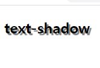</p>  


### * box-shadow 
box-shadow는 요소에 그림자를 만드는 속성이다.
* 형식) `box-shadow: (수평거리) (수직거리) (흐림정도) (번짐정도) (색상);`
	* 수평거리 : 그림자의 수평 거리(얼마나 떨어져 있는지)
		* 양수 값은 오른쪽, 음수 값은 왼쪽에 그림자를 만든다.
	* 수직거리 : 그림자의 수직 거리(얼마나 떨어져 있는지)
		* 양수 값은 아래쪽, 음수 값은 위쪽에 그림자를 만든다. 	
		* 흐림정도 : 그림자의 흐림 정도를 표현. 기본 값은 해가 진 그림자를 표시.
		* 값이 커질수록 부드러운 그림자를 표시한다.
		* 음수값은 사용불가.
	* 번짐정도 : 그림자가 번지는 정도를 표현.
		* 양수 값은 그림자가 모든 방향으로 퍼진다.
		* 음수 값은 그림자가 모든 방향으로 축소되어 보인다.


#### [예] box-shadow
튤립 이미지를 절대 위치로 설정한 후, 그림자를 만들어 보자.

```html
<head>
<style type="text/css">

	.shadow{
		position: absolute;	/* 절대 위치 */
		left: 450px;
		top: 20px;
		
		border-radius: 50px;
		box-shadow: 50px 50px 10px orange;
	}
	
</style>
</head>
<body>
	
	

</body>
```

<p align="center"></p>  
		


### * line-height 
`line-height`은 줄과 줄 사이의 간격, 즉 행간을 설정하는 속성이다.
 


### * word-spacing 
`word-spacing`은 글자와 글자 사이의 간격, 즉 자간을 설정하는 속성이다.


#### [예] line-height & word-spacing

```html
<body>

	<p>
		동해물과 백두산이 마르고 닳도록<br>
		하느님이 보우하사 우리나라 만세<br>
		무궁화 삼천리 화려강산<br>
		대한사람 대한으로 길이 보전하세<br>
	</p>

</body>
```

<p align="center">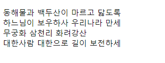</p>  


선택자에 속성을 넣어 행간과 자간을 조절한다.  

```html
<head>
<style type="text/css">

	p {
		line-height: 30px; 
		word-spacing: 10px;
	}

</style>
</head>
```
행간과 자간 모두 지정한 픽셀만큼 넓어졌다.    
<p align="center">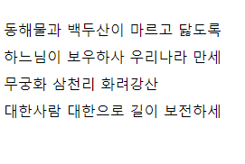</p>


### * float 속성 
`float`은 웹 문서의 요소를 떠 있게 하는 방법을 의미한다.
* 수직적인 요소를 수평적인 요소로 바꾸어 주는 속성.
* 왼쪽 구석이나 오른쪽 구석에 배치한다는 의미.
* 문서의 레이아웃을 구성하기 위해서 많이 사용되는 속성.
* `float` 속성의 종류
	* `right` : 오른쪽부터 차례로 왼쪽 방향으로 떠 있게 하는 속성.
	* `left` : 왼쪽부터 차례로 오른쪽 방향으로 떠 있게 하는 속성.
	* `both` : 양쪽에서 어느 쪽으로도 떠있지 않게 하는 속성. 즉, 해제하는 속성.
* `float` 속성을 사용한 후에는 반드시 해제(`clear=both`)해 주어야 한다.


#### [예] float

```html
<body>
	<div id="first">
		<h2>회사소개</h2>
		<ul>
			<li>대표인삿말</li>
			<li>조직도</li>
			<li>비전</li>
			<li>오시는 길</li>		
		</ul>	
	</div>
	
	<div id="second">
		<h2>사업영역</h2>
		<ul>
			<li>포탈사이트</li>
			<li>시스템 통합</li>
			<li>마케팅</li>
			<li>웹디자인</li>		
		</ul>	
	</div>
	
	<div id="first">
		<h2>고객센터</h2>
		<ul>
			<li>다운로드</li>
			<li>질의응답</li>
			<li>자유게시판</li>
			<li>1:1게시판</li>		
		</ul>	
	</div>
	
	<address>대한민국</address>

</body>
```

<p align="center">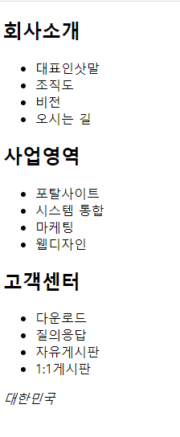</p>  


```html
<head>
<style type="text/css">

	#first ul li {
		line-height: 200%
	}
	
	#second ul li {
		list-style: square;
		line-height: 200%
	}
	
	#third ul li {
		list-style: circle;
		line-height: 200%
	}
	
	#first {
		float: left;
	}
	
	#second {
		float: left;
		margin-left: 150px;
	}
	
	#third {
		float: left;
	}
	
	address {
		clear: both; /* float 속성을 해제하는 방법 */
	}

</style>
</head>
```

<p align="center">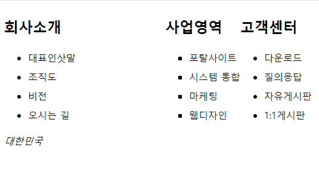</p> 


## * 접두사(prefix) 
CSS는 모듈이 많고 표준 규약이 아직 완성되지 않은 부분도 많이 있다. 따라서 현재 계속적으로 개발이 되고 있는 상황이다. 하지만 아직 표준 규약이 아닌 속성들은 브라우저에 따라 다른 방식으로 지원이 되기 때문에 속성 이름 앞에 접두사(prefix)를 붙여서 브라우저별로 구분을 해 주어야 한다.
* `-ms-` : 인터넷 익스플로어
* `-webkit` : 크롬, 사파리 브라우저
* `-moz-` : 모질라, 파이어폭스 브라우저
* `-o-` : 오페라 브라우저


#### [예] 접두사(prefix)

`transform` 은  아직 표준 규약이 제대로 완성되지 않은 속성이다.   
따라서 적용시키기 위해서는 아래와 같이 브라우저 별로 구분하여 접두사를 붙여야 한다.   

```html
<head>
<meta charset="UTF-8">
<title>Insert title here</title>
<style type="text/css">

	.photo {
		position: absolute;
		left: 50px;
		top: 100px;
		
		transform: rotate(15deg);	/* 회전을 시키는 명령어 */
		
		-ms-transform: rotate(15deg);
		-webkit-transform: rotate(15deg);
		-moz-transform: rotate(15deg);
		-o-transform: rotate(15deg);
	}

</style>
</head>
<body>

	
	

</body>

```

<p align="center">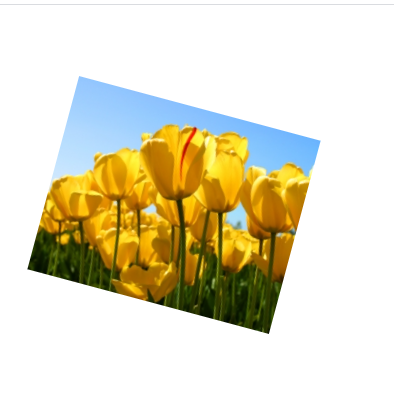</p>  


### * opacity 
`opacity` 속성은 투명도를 조절한다. 
* 0 ~ 1 사이로 조절할 수 있다.
	* 0 : 투명한 상태. 보이지 않는다.
	* 0.5 : 반투명한 상태.
	* 1 : 불투명한 상태. 원 상태 그대로 보인다.


#### [예] opacity
```html
<head>
<style type="text/css">

	.photo {
		opacity: 0.5; 
	}

</style>
</head>
<body>

	

</body>
```

위의 **[예] 접두사** 와 비교했을 때 확실히 투명해졌다.  
<p align="center"></p>  


### * :hover
호버 효과를 준다. 이미지 태그에 마우스가 올라갔을 때 디자인이 적용된다.    

* 형식) `선택자:hover { 속성: 값; }`
	* 기존의 상태에서 ```:hover```로 지정된 선택자 안의 디자인으로 바뀐다.
	* 따라서 별도로 설정해주어야 한다.
	* 

#### [예] hover

위의 **[예] opacity**에 호버효과를 적용해 보자.    
선택자에 다음 코드를 입력하면  

```html
.photo:hover {
	opacity: 1;
}
```

반투명했던 이미지가 마우스를 올릴 때마다 선명하게 전환된다.    


### input:focus {outline:2px solid #d50000;}


input 박스를 클릭 했을떄 나오는 테두리 색상 없애기
input:focus {outline:none;}