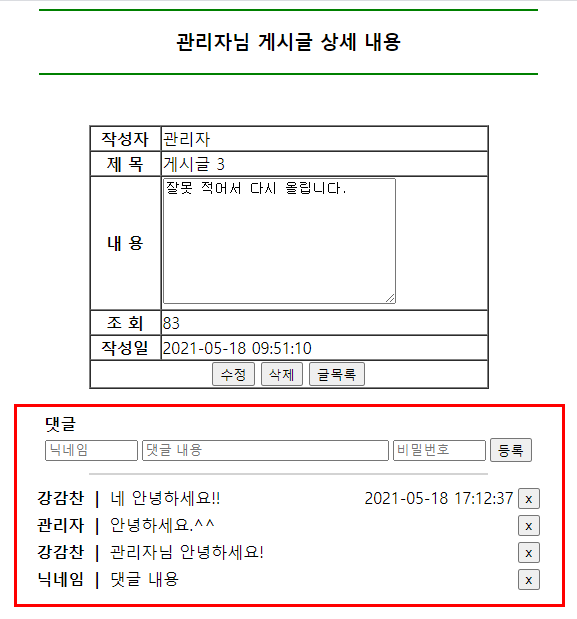
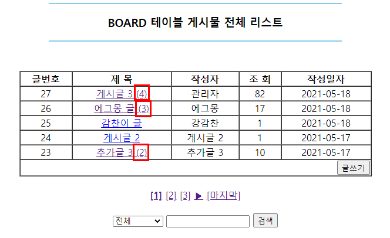

# 댓글 기능

<p align="center"></p>

댓글 기능은 추후에 배운다고 하였지만, 프로젝트를 만지다보니 어느정도 할 수 있을 것 같아서 도전해봤다.  
다음 수업을 듣고 비교하며 정리하는 것도 즐거울 듯하다.  


기본적인 틀은 이렇다.  
댓글 기능을 구현하기 위해 우선 DB에 댓글 테이블을 하나 생성하고, Board 테이블의 글 번호를 외래키로 두었다.  
게시글을 작성하면 댓글 작성자, 내용과 함께 해당 board 테이블의 글 번호를 레코드 값으로 가진다.  
따라서 게시글을 선택하면 해당 글 번호에 맞는 댓글이 select되어 출력된다.  


<p align="center"></p>

글 목록에서 제목 옆에 보이는 댓글 수는 Board 테이블에 카운트 컬럼을 추가하여 구성하였다.  
댓글을 작성하면 해당 글 번호의 카운트가 +1, 반대로 댓글을 삭제하면 해당 글 번호의 카운트가 -1 되는 식이다.   
 
 
## 1. DB 테이블 생성 : BOARD_COMMENT

board 테이블과의 연관성을 명시하기 위해  board_comment 라고 명명한 테이블을 생성하였다.  
board_no를 외래키로 두어 게시글에 맞는 댓글을 가져올 수 있도록 하였다.  


아직 수정 삭제 기능을 다 구현하지 못해서 비밀번호는 댓글 작성할 때 저장될 뿐 쓰임새는 명확하지 않다.  
추후 기능을 추가하며 모두 활용할 예정이다.  

```sql
create table board_comment (
    comment_no number(5),			-- 댓글의 고유번호
    comment_board_no number(5),		-- 댓글 단 board 테이블의 글 번호
    comment_writer varchar2(20),	-- 댓글 작성자
    comment_cont varchar2(1000),	-- 댓글 내용
    comment_pwd varchar2(20),		-- 댓글 비밀번호
    comment_sysdate date,			-- 댓글 작성일
    foreign key(comment_board_no) references board(board_no)	-- board 테이블의 board_no를 외래키로 가진다.
);
```


## 2. DB board 테이블에 컬럼 추가 : BOARD_C_COUNT
board 테이블에 댓글 개수를 셀 수 있도록 board_c_count 컬럼을 추가하였다.  
default 값을 0으로 두어 댓글이 없는 상태도 고려하였다.  

```sql
alter table board add board_c_count number(20) default 0;
```


## 3. 댓글 작성 form
게시물의 상세 내역을 조회하는 board_con.jsp 하단에 댓글 작성 form을 넣었다.  
댓글 작성자, 내용, 비밀번호를 입력하고 submit 하면 "프로젝트명/board_comment.do" 경로로 이동한다.  


경로로 이동할 때는 작성한 내용뿐만 아니라 **게시글 번호**와 **현재 페이지**도 함께 넘어간다.  
작성한 댓글을 외래키인 게시글 번호와 함께 DB 테이블에 저장하고, 다시 현재 페이지를 조회하기 위함이다.   

```jsp
<form method="post" action="<%=request.getContextPath() %>/board_comment.do">
	<input type="hidden" name="no" value="${dto.getBoard_no() }">
	<input type="hidden" name="page" value="${page }">
		<table>
		
			<tr>
				<td colspan="2" align="left">
					<b>댓글</b>
				</td>
			</tr>
			
			<tr>
				<td><input type="text" name="c_writer" placeholder="닉네임" size="8"></td>
				<td><input type="text" name="c_content" placeholder="댓글 내용" size="30"></td>
				<td><input type="password" name="c_pwd" placeholder="비밀번호" size="8"></td>
				<td><input type="submit" value="등록"></td>
			</tr>
			
		</table>
</form>
```


## 4. FrontController : 중간 다리
경로가 "*.do"이므로 서블릿 설정에 의해 FrontController에서 작업이 시작된다.  
BoardCommentAction이라는 클래스 객체가 생성되고, 해당 클래스의 실행 메서드가 실행된다. 


```java
if(command.equals("board_comment.do")) {
	action = new BoardCommentAction();
	action.execute(request, response);
}
```


## 5. BoardCommentAction : 댓글 작성 DB 연동
작성한 댓글 데이터를 모두 DB에 저장하는 작업을 하는 클래스이다.  
댓글 DTO를 CommentDTO로 만들어두었고, 이를 활용하여 데이터를 저장하고 이동한다.  
CommentDAO도 별도로 두면 좋았겠지만 우선 연습 삼아 기존에 있던 BoardDAO를 활용하였다.  


1) 넘어 온 파라미터를 변수에 저장한다.  
지정한 name에 따라 저장된 값을을 모두 불러와 변수에 저장한다.  
hidden으로 넘긴 게시글 번호(board_no)와 현재 페이지(page)도 잊지 않고 저장한다.  

```java
// 1) 넘어 온 변수 받기
String comment_writer = request.getParameter("c_writer").trim();
String comment_cont = request.getParameter("c_content").trim();
String comment_pwd = request.getParameter("c_pwd").trim();
int board_no = Integer.parseInt(request.getParameter("no"));
int page = Integer.parseInt(request.getParameter("page"));
```


2) 저장한 변수를 CommentDTO에 set한다.
한 번에 메서드로 넘겨주기 위하여 DTO 객체에 저장한 변수들을 set 한다.  

```java
// 2) DTO 객체에 저장
CommentDTO dto = new CommentDTO();
dto.setComment_writer(comment_writer);
dto.setComment_cont(comment_cont);
dto.setComment_pwd(comment_pwd);
```


3) DB에 저장한다.
변수들이 저장된 DTO 객체의 주소값을 메서드로 넘겨 DB에 저장한다.  
위에서 언급했든 BoardDAO 객체를 잠시 빌려 썼다.  
쿼리문은 select문을 작성한다. 

```java
// 3) DB 저장
BoardDAO dao = BoardDAO.getInstance();
int res = dao.insertComment(dto, board_no);
```


4) 저장 결과에 따라 페이지를 이동하거나 이전 페이지로 돌아간다.
DB에 데이터 저장이 성공하면 새롭게 페이지를 로딩하고, 실패하면 다시 작성하던 페이지로 돌아간다.  
중간 다리인 FrontController에서 한글 인코딩을 모두 했으므로 여기선 별도로 설정할 필요가 없다.  


이 때, 저장이 성공하여 DB에 반영되면 게시물의 댓글 개수가 증가한 것이므로   
board 테이블의 댓글 수를 체크하는 컬럼의 숫자가 +1 될 수 있도록 메서드를 호출한다.  

```java
PrintWriter out = response.getWriter();

if(res > 0) {
			out.println("<script>");
			out.println("alert('댓글 작성 완료!')");
			out.println("location.href='board_cont.do?no=" + board_no + "&page=" + page +"'");
			out.println("</script>");
			
			// 댓글 개수가 1 증가하는 메서드 호출
			dao.boardCountHit(board_no);
			
		}else {
			out.println("<script>");
			out.println("alert('댓글 작성 실패!')");
			out.println("history.back()");
			out.println("</script>");
		}
```

이하 메서드나 웹페이지에 출력하는 방법은 게시글 작성 방법과 동일하므로 생략한다.  


## 6. 글 목록에서 댓글 수 확인하기
board 테이블에 추가한 board_c_count 컬럼을 활용하여 글 목록에서 댓글 수를 확인할 수 있도록 하였다.  
DB 자체에 컬럼을 추가했으므로 별도의 서블릿 과정은 필요 없었다.  
대신 DB에서 DTO로 set 할 때 board_c_count 항목을 추가하였다.  


클릭하면 게시글 상세 내용으로 넘어가는 a태그가 걸려있는 제목 옆에 괄호()를 두고 if문을 작성하였다.  
댓글이 0개라면 굳이 표시할 필요가 없으므로, if문으로 댓글 수가 0개가 아닐 때는 출력되지 않도록 막는다.  


알아보기 쉽게 행을 세분화하여 정리하면 다음과 같다.  

```jsp
<td> 
	<a href="<%=request.getContextPath() %>/board_cont.do?no=${dto.getBoard_no() }&page=${page }">
		${dto.getBoard_title() } 
			<c:if test="${dto.getBoard_c_count() ne 0 }">
				(${dto.getBoard_c_count() })
			</c:if>
	</a>
</td>
```


