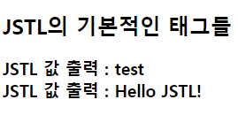
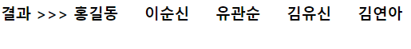
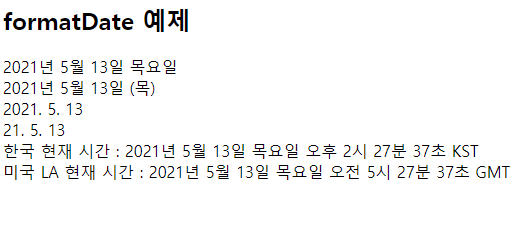
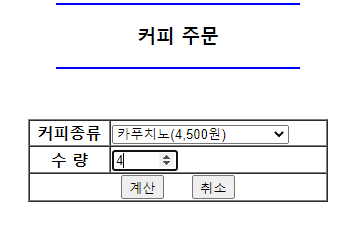

# EL(Expression Language : 표현 언어)
- 표현 언어라고 한다.
- JSP 2.0 이후 버전부터 사용 가능.
- 자바 코드가 들어가는 표현식(<%= %> or <%  %>)을 좀 더 편리하게 사용하는 데이터 출력 기능.
- 자바 코드를 사용해야 했던 모든 곳에 표현언어를 사용할 수 있다.
- 라이브러리 없이 사용이 가능하다.
- 표현 언어의 특징
	* 기존의 표현식보다 편리하게 값을 출력할 수 있다.
	* 변수와 여러 가지 연산자를 포함할 수 있다.
	* JSP 내장 객체에 저장된 속성 및 자바의 빈(bean) 속성도 표현언어로 출력할 수 있다.
	* 표현 언어 자체의 내장 객체도 지원이 된다.
- 표현 언어 형식
	* 예) `<%=변수 %>`  ===> `${변수(수식) }`
	* 표현식을 그대로 출력하고 싶다면 앞에 `\`를 추가하면 된다.
		* 예) `\${15+10 }` >>> `${15+10 }`
- 표현 언어의 연산자 종류
	* 산술연산자 : `+`, `-`, `*`, `/(div)`, `%(mod)`
		- EL언어에 결합은 존재하지 않는다. 문자열과 숫자가 더해질 때는 결합이 아니라 문자열을 우선 숫자로 변환한 뒤 덧셈이 수행된다. `${"10"+1 }` >>> `11` 101이 아니다.
	
	* 관계(비교)연산자 : 비교하여  `true` `false` 값을 반환한다.
		- `==` or `eq` : 두 수의 값이 같은지 비교.
		- `!=` or `ne` : 두 수의 값이 다른지 비교.
		- `>=` or `ge` : 값이 다른 값보다 크거가 같은지 비교.
		- `>` or `gt`  : 값이 다른 값보다 큰지 비교.
		- `<=` or `le` : 값이 다른 값보다 작거나 같은지 비교.
		- `<` or `lt`  : 값이 다른 값보디 작은지 비교.
	* 논리연산자
		- `&&` or `and` : 논리곱 연산.
		- `||` or `or` : 논리합 연산.
		- `!` or `not` : 부정 연산.
	* `empty` 연산자 : 값이 `null`이거나 빈 문자열이면 `true` 값을 반환.
  
- 표현언어에서 제공하는 내장객체
	* `pageScope` : 현재 페이지의 범위에만 한정됨. 페이지가 끝나면 유효하지 않게 된다.
	* `requestScope` : request 생명 주기는 request 요청을 받고, 요청에 대한 처리를 완료하는 시점까지만 유효하다. 요청 처리 완료 후에는 사용할 수 없다.
	* `sessionScope` : session의 생명 주기는 설정된 유효시간이 기준이 된다. 기본 30분.
	* `applicationScope` : 웹 사이트가 실행되는 동안만 유효. 어플리케이션이 종료가 되면 유효하지 않게 된다.
	* `param` : 파라미터 값을 얻어올 때 사용.
	* `paramValues` : 파라미터 값을 배열로 얻어올 때 사용.
          
※ 내장 객체를 사용할 때는 map 자료구조 형태로 `key, value`값을 저장.  
	- `setAttribute(String key, Object value)`
	- `getAttribute(String key)` 
        
        
```jsp
<%
	int k = 0
	pageContext.setAttribute("K", k);
	request.setAttribute("r", 10);
	session.setAttribute("s", 20);
	application.setAttribute("a", 30);
%>

page >>> ${pageScope.K } == ${K }<br>	
request >>> ${requestScope.r } == ${r }<br>
session >>> ${sessionScope.s } == ${s }<br>
application >>> ${applicationScope.a } == ${a }<br>
```        


```jsp
// 파라미터 값
<input type="text" name="id">
<input type="text" name="name">

// JSP 표현식을 이용하여 파라미터 값을 출력하는 방법
request.getParameter("id").trim()
request.getParameter("name").trim()

// 표현언어(EL)로 파라미터 값을 출력하는 방법
${param.id }
${param.name }
```
        
----------------

# JSTL(JSP Standard Tag Library)

- JSP 페이지에서 스크립트릿과 HTML 코드가 뒤섞이게 되는 현상이 발생한다. 이렇게 뒤섞인 코드는 알아보기가 쉽지 않다. 따라서 가독성이 낮아진다.
- JSP 페이지에서 스크립트릿에 들어가는 자바 코드 중에 논리적인 판단, 반복 처리, 포맷 처리 등을  HTML 태그처럼 사용할 수 있도록 표준으로 만들어서 정의한 것이 JSTL 라이브러리이다.
- JSTL을 사용하기 위해서는 라이브러리 파일이 필요하다.
	* jstl.jar, standard.jar
	
- JSTL 라이브러리 파일을 받는 사이트 주소
	* http://tomcat.apache.org/taglibs/standard/ 
	* 압축을 푼 후 jstl.jar, standard.jar 2개의 파일을 현재 프로젝트 - WebContent - WEB-INF - lib 에 복사

## 사용 방법
상단에 아래와 같이 선언한다.
```jsp
<%@ taglib prefix="c" uri="http://java.sun.com/jsp/jstl/core" %>
```

### 기본적인 JSTL 태그 
출력을 할 때는 EL 언어를 사용한다.

1. 변수 태그 `set`
	- 형식) `<c:set var="변수명" value="값"> </c:set>`
```jsp
<c:set var="test" value="Hello JSTL!" />
```

		
2. 출력 태그 `out`
	- 형식) `<c:out value="변수명"> </c:out>`
	- EL 언어를 사용해야 변수의 값이 출력된다.
	
```jsp
JSTL 값 출력 : <c:out value="test" /><br>
JSTL 값 출력 : <c:out value="${test }"/>
```

<p align="center"></p>
			
			
3. 삭제 태그 `remove`
	- 형식) `<c:remove var="변수명"> </c:remove>`
	
```jsp
<c:remove var="test"/>
삭제 후 JSTL 값 출력 : <c:out value="${test }">
```

		 	
4. 조건 처리 태그 `if문` : else문이 존재하지 않으므로 각각의 조건식을 작성해야 한다.
	- 형식) `<c:if test="조건식" var="변수명"> </c:if>`
	
```jsp
<c:if test="${10 > 5 }" var="k"/> 
조건식 결과 >>> <c:out value="${k }"/>
```
			
5. 조건 처리 태그 `choose문` : switch~case문과 유사하다.
- 형식)

```jsp

<c:choose> 
	<c:when test="조건식1">조건식1이 참인 경우 실행문</c:when>
	<c:when test="조건식2">조건식2이 참인 경우 실행문</c:when>
	<c:when test="조건식3">조건식3이 참인 경우 실행문</c:when>
	<c:otherwise>상기 조건식 이외의 경우 실행문</c:otherwise>
</c:choose>
```	


```jsp
<%-- 학점 처리 작업 --%>
<c:set var="grade" value="88" />
<c:choose>
	<c:when test="${grade >=90 }">결과 : A학점</c:when>
	<c:when test="${grade >=80 }">결과 : B학점</c:when>
	<c:when test="${grade >=70 }">결과 : C학점</c:when>
	<c:when test="${grade >=60 }">결과 : D학점</c:when>
</c:choose>
```
grade의 값이 88이므로 결과 : B학점 이 출력된다.


6. 반복문 태그 `forEach문` : for문과 유사하다.
	- 형식1) `<c:forEach begin="시작값" end="끝값" step="증감값" var="변수명"></c:forEach>`
```jsp
<%-- 1부터 10까지 출력하는 반복문 --%>
<c:forEach begin="1" end="10" step="1" var="su">
	<c:out value="${su }"></c:out>
</c:forEach>
```
	
	- 형식2) `<c:forEach items="객체명" var="변수명">`
```jsp
<%
	String[] str ={"홍길동", "이순신", "유관순", "김유신", "김연아"};
	pageContext.setAttribute("list", str);
%>
		
<%-- str 배열의 값을 차례로 출력 --%>		
결과 >>> <c:forEach items="${list }" var="i">
			${i } &nbsp;&nbsp;&nbsp;
	   </c:forEach>
```

<p align="center"></p>
	

### 포맷팅 라이브러리 종류
포맷팅 라이브러리를 상단에 추가해서 사용한다.

```jsp
<%@ taglib prefix="fmt" uri="http://java.sun.com/jsp/jstl/fmt" %>
```

- <fmt:timeZone> : 지정한 국가의 시간을 지정하는 태그. 태그를 열고 닫는 영역에서만 적용된다. 
- <fmt:setTimeZone> : 지정한 국가의 시간을 지정하는 태그.
- <fmt:formatNumber> : 표시할 숫자의 형식을 지정하는 태그.
	- value : 출력될 숫자의 형식 지정.
	- type : 출력될 타입 지정.
		* percent : %
		* number : 숫자 (default)
		* currency : 통화 형식
	- currencyCode : 통화 코드 지정. 한국 원화는 KRW.
	- currencySymbol : 통화를 표시할 때 사용할 기호를 표시.
	- var : <fmt:formatNumber> 태그의 결과를 저장할 변수 이름 지정.
	- scope : 변수의 접근 범위 지정.
	- pattern : 숫자가 출력될 양식 지정.
- <fmt:formatDate> : 지정한 형식의 날짜를 표시하는 태그.	
	- value : 포맷될 날짜를 지정하는 속성.
	- type : 포맷팅할 타입을 지정하는 속성.
		* date : 날짜 지정.
		* time : 시간 지정.
		* both : 날짜/시간 모두 지정.
	- dateStyle : 날짜의 출력 양식을 지정하는 속성. 값(value)에는 full, long, medium, short 등이 지정되어 있다. 
	- timeStyle : 시간 출력 형식을 지정하는 속성.
	- pattern : 직접 출력 형식을 지정하는 속성.
	- timeZone : 특정 나라 시간대로 시간을 설정하는 속성.


#### [예] 포맷팅 라이브러리
```jsp
<h2>formatDate 예제</h2>
<c:set var="now" value="<%=new Date()%>" />
<fmt:formatDate value="${now }" type="date" dateStyle="full" /><br>
<fmt:formatDate value="${now }" type="date" dateStyle="long" /><br>
<fmt:formatDate value="${now }" type="date" dateStyle="medium" /><br>
<fmt:formatDate value="${now }" type="date" dateStyle="short" /><br>

한국 현재 시간 : 
<fmt:formatDate value="${now }" type="both" dateStyle="full" timeStyle="full"/><br>
	
	
<fmt:timeZone value="America/LA">
	미국 LA 현재 시간 : <fmt:formatDate value="${now }" type="both" dateStyle="full" timeStyle="full"/><br>
</fmt:timeZone>
```

<p align="center"></p>

	

#### [예] 커피 주문
value로 값을 받아서 넘기면 JSTL로 받아서 포맷팅 라이브러리로 천단위로 쉼표(,)를 찍어서 웹 페이지에 출력.

```jsp
<body>
	<div align="center">
	  	<hr width="50%" color="blue">
	  		<h3>커피 주문</h3>
	  	<hr width="50%" color="blue">
	  	<br><br>
	  	
	  	<form method="post" action="Ex03.jsp">
	 		 <table border="1" cellspacing="0" width="300">
	 		 	<tr>
	 		 		<th>커피종류</th>
	 		 		<td>
	 		 			<select name="coffee_str">
	 		 				<option value="1">아메리카노(3,000원)</option>
	 		 				<option value="2">카페라떼(3,500원)</option>
	 		 				<option value="3">카푸치노(4,500원)</option>
	 		 				<option value="4">카라멜 마끼아또(4,000원)</option>
	 		 			</select>
	 		 		</td>
	 		 	</tr>
	 		 	
	 		 	<tr>
	 		 		<th>수 량</th>
	 		 		<td><input type="number" min="1" max="20" name="su"></td>
	 		 	</tr>
	 		 	
	 		 	<tr>
	 		 		<td colspan="2" align="center">
	 		 			<input type="submit" value="계산">
	 		 				&nbsp;&nbsp;&nbsp;
	 		 			<input type="reset" value="취소">
	 		 		</td>
	 		 	</tr>
	 		 </table>
	  	</form>
	</div>

</body>
```

```jsp
<body>
	<c:set var="coffee" value="${param.coffee_str }" />
	<c:choose>
		<c:when test="${coffee == 1 }">
			<c:set var="coffee_str1" value="아메리카노"/>
			<c:set var="price" value="3000" />
		</c:when>
		
		<c:when test="${coffee == 2 }">
			<c:set var="coffee_str1" value="카페라떼"/>
			<c:set var="price" value="3500" />
		</c:when>
		
		<c:when test="${coffee == 3 }">
			<c:set var="coffee_str1" value="카푸치노"/>
			<c:set var="price" value="4500" />
		</c:when>
		
		<c:when test="${coffee == 4 }">
			<c:set var="coffee_str1" value="카라멜 마끼아또"/>
			<c:set var="price" value="4000" />
		</c:when>
	</c:choose>
	
	<table border="1" cellspacing="0" width="300">
		<tr>
			<th>커피 종류</th>
			<td>${coffee_str1 }</td>
		</tr>
		<tr>
			<th>커피 단가</th>
			<td><fmt:formatNumber value="${price }"/>원</td>
		</tr>
		<tr>
			<th>커피 수량</th>
			<c:set var="amount" value="${param.su }" />
			<td>${amount }</td>
		</tr>
		<tr>	
			<th>공급가액</th>
			<td><fmt:formatNumber value="${amount * price }"/>원</td>
		</tr>
		
		<tr>
			<th>부가세액</th>
			<td><fmt:formatNumber value="${(amount * price) * 0.1 }" /> 원</td>
		</tr>
		
		<tr>
			<th>총 금 액</th>
			<td><fmt:formatNumber value="${amount * price + (amount * price) * 0.1 }"/> 원</td>
		</tr>
	</table>
</body>
```


<p align="center"></p>
<p align="center"></p>


