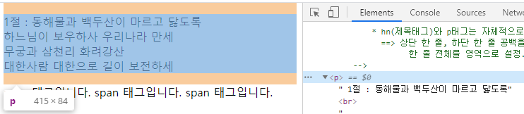
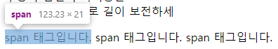
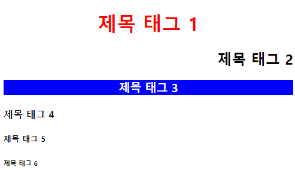
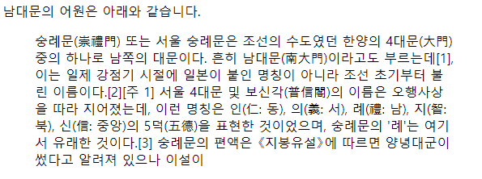
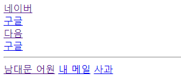
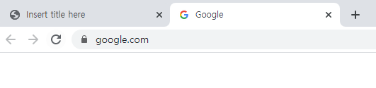
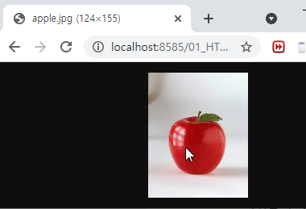

# HTML 태그

#### 제목 태그
제목을 나타내는 태그. 
- n : 숫자(1~6) 
- 글자가 굵게(bold) 나타난다.
- 상단과 하단에 여백이 나타난다.
- 숫자가 커질수록 글자 크기가 작아진다.
- 기본 글자크기는 제목태그"h4"와 동일하다.
- 제목태그는 숫자를 건너 뛰는 방법을 피하는 걸 권장한다. 

<p align="center"></p>

#### p(parapraph) 태그
하나의 문단(문장, 단락)을 사용하는 태그.


#### br 태그
줄바꿈을 해주는 태그. 끝태그 생략가능. 이러한 태그를 단독태그라고 한다.
- hn(제목태그)와 p태그는 자체적으로 줄바꿈 기능을 제공.
- 상단 한 줄, 하단 한 줄 공백을 지원함. 
- 한 줄 전체를 영역으로 설정.(블록레벨 요소)

```
<p> 1절 : 동해물과 백두산이 마르고 닳도록 <br>
		 	  하느님이 보우하사 우리나라 만세 <br>
			  무궁과 삼천리 화려강산 <br>
			  대한사람 대한으로 길이 보전하세 </p>
```


#### span 태그
단어나 문장의 글자만 선택을 하는 태그.(인라인레벨 요소) 

```
<span>span 태그입니다.</span>
<span>span 태그입니다.</span>
<span>span 태그입니다.</span>
```

* 개발자모드로 보면 p태그는 전체 블록이 잡힌다.

<p align="center"></p>

* 개발자모드로 보면 span 태그는 개별 문장이 잡힌다.

<p align="center"></p>
  

#### pre(preformatted text) 태그
사용자가 입력한 그대로 출력시키는 태그.

```
<pre>
	1절 : 동해물과           백두산이 마르고 닳도록
		 	  하느님이 보우하사 우리나라 만세
			  무궁과 삼천리 화려강산
			  대한사람 대한으로 길이 보전하세
</pre>

```

- pre 코드 실행시 띄어쓰기가 하나로 줄지 않고 전체 반영된다. pre 코드 미작성시 띄어쓰기 한 번으로 자동 수정되어 출력된다.

<p align="center"></p>


#### 태그의 속성
태그는 속성이라는 것을 줄 수 있다.
- 형식) <시작태그 속성="값" 속성="값"> </끝태그>
- align : 정렬. right/center/left
- color : 글자색
- background-color : 배경색

```
<h1 align="center" style="color:red;">제목 태그 1</h1>
<h2 align="right">제목 태그 2</h2> 
<h3 align="center" style="background-color:blue; color:white;">제목 태그 3</h3> 
<h4>제목 태그 4</h4>
<h5>제목 태그 5</h5>
<h6>제목 태그 6</h6>
```

<p align="center"></p>


#### blockquote 태그 
다른 블로그나 특정 사이트의 글을 인용할 경우 해당 태그를 이용해서 표시. 인용한 문장은 다른 텍스트보다 안쪽에 들여쓰기가 되는 것이 특징이다.

```
<body>
남대문의 어원은 아래와 같습니다.
	<blockquote>
	숭례문(崇禮門) 또는 서울 숭례문은 조선의 수도였던 한양의 4대문(大門) 중의 하나로 남쪽의 대문이다. 흔히 남대문(南大門)이라고도 부르는데[1], 이는 일제 강점기 시절에 일본이 붙인 명칭이 아니라 조선 초기부터 불린 이름이다.[2][주 1] 서울 4대문 및 보신각(普信閣)의 이름은 오행사상을 따라 지어졌는데, 이런 명칭은 인(仁: 동), 의(義: 서), 례(禮: 남), 지(智: 북), 신(信: 중앙)의 5덕(五德)을 표현한 것이었으며, 숭례문의 '례'는 여기서 유래한 것이다.[3] 숭례문의 편액은 《지봉유설》에 따르면 양녕대군이 썼다고 알려져 있으나 이설이 
	</blockquote>
</body>
```

<p align="center"></p>


#### font 태그
글자와 관련된 태그. 
- size : 1~7. 숫자가 커질수록 글씨크기가 커진다.
- color : 글자색. red, 색상코드, RGB 모두 사용 가능하다.
- face : 글자체.

```
<font>Font 태그1</font><br>
<font size="1">Font 태그1</font><br>
<font size="2">Font 태그2</font><br>
<font size="3">Font 태그3</font><br>
<font size="4">Font 태그4</font><br>
<font size="5" color="#FF5E00">Font 태그5</font><br>
<font size="6" face="궁서체">Font 태그6</font><br>
<font size="7">Font 태그7</font><br>
<font size="8">Font 태그7</font><br>
```

<p align="center"></p>

 
#### hr태그 
선그리기(수평) 태그 ⇒ 단독태그
- 문단의 분리를 위해서 사용되는 태그.
- 기본적으로 가운데 정렬(align="center").
- 속성 적용가능. 

```
<p> 1절 : 동해물과 백두산이 마르고 닳도록<br>
하느님이 보우하사 우리나라 만세<br>
무궁과 삼천리 화려강산<br>
대한사람 대한으로 길이 보전하세 </p>

<hr>
<hr width="800">
<hr width="80%">
<hr width="80%" align="left">

<p> 2절 : 남산 위에 저 소나무 철갑을 두른 듯<br>
바람 서리 불변함은 우리 기상일세<br>
무궁과 삼천리 화려강산<br>
대한사람 대한으로 길이 보전하세 </p>
```

<p align="center"></p>


#### a 태그 
다른 페이지, 파일, 이메일 주소, 전화번호 등 다른 url로 연결(이동)할 수 있는 하이퍼링크 태그.
- _self : 현재 창에서 특정 페이지로 이동하는 속성.(default)
- _blank : 새로운 창에서 특정 페이지로 이동하는 속성.
- target="_blank" : 새 창으로 열기
- email 계정 연결은 outlook 사용자만 사용가능.

```
 <!-- 사이트로 연결하는 방법 -->
 <a href="<http://www.naver.com>">네이버</a> <br>
 <a href="<http://www.google.com>">구글</a> <br>
 <a href="<http://www.daum.net>">다음</a> <br>

 <hr>

 <!-- html 페이지로 연결하는 방법 -->
 <a href="Ex06.html">남대문 어원</a>

 <!-- email 계정 연결하는 방법 -->
 <a href="mailto:test@mail.com">내 메일</a>

 <!-- 문서나 파일을 여는 방법 -->
 <a href="images/apple.jpg">사과</a>
```

- 태그 작성 후 코드 실행시 다음과 같이 클릭할 수 있는 문자열이 출력된다.
<p align="center"></p>

- '네이버' 클릭 시 현재 창에서 naver.com 으로 이동한다.
<p align="center"></p>

- '구글' 클릭 시 현재 창에서 google.com 으로 이동한다.
<p align="center"></p>

- '다음' 클릭 시 현재 창에서 daum.net 으로 이동한다.
<p align="center"></p>

- 두 번째 '구글' 클릭 시 새 창에서 google.com 으로 이동한다.
<p align="center"></p>

- '남대문의 어원' 클릭 시 위에서 작성한 내용이 적힌 페이지로 이동한다.
<p align="center"></p>

- '내 메일' 클릭 시 outlook 가입자가 아니므로 메일 앱과 연동가능한 설정창이 열린다. 
<p align="center"></p>

- '사과' 클릭시 경로에 위치한 이미지가 열린다. 기존에 존재하는 경로가 아닐 경우 오류가 발생한다. 
<p align="center"></p>


