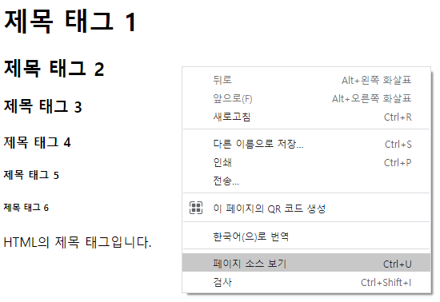
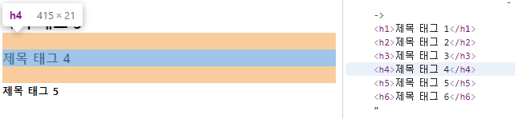

# HTML

### HTML의 기본코드
html 4.01(transitional) 

```html
<!DOCTYPE html PUBLIC "-//W3C//DTD HTML 4.01 Transitional//EN" "http://www.w3.org/TR/html4/loose.dtd">
<html>
<head>
<meta http-equiv="Content-Type" content="text/html; charset=UTF-8">
<title>문서제목</title>
</head>
<body>
	
</body>
</html>
```


### HTML(HyperText Markup Language)
HTML은 웹 페이지를 만드는데 사용되는 언어이며, 매우 쉽게 배울 수 있는 장점이 있다.
모든 태그는 미리 정의가 되어 있어서 각각의 태그와 속성을 사용하면 된다. 

* 요소 : HTML 페이지를 구성하는 각 부품(제목, 본문, 이미지 등)
* 태그 : 요소를 만들 때 사용하는 작성 방법. 
* 태그는 시작태그와 끝태그의 쌍으로 구성이 되어 있다.
  * 예) <시작태그>텍스트</끝태그>
  
	
```html
<!-- HTML에서의 주석 - 주석문 단축키 : ctrl+shift+/(슬래시) -->

<!-- 문서의 형식 : HTML 버전 1, 2, 3, 4, 5-->
<!DOCTYPE html PUBLIC "-//W3C//DTD HTML 4.01 Transitional//EN" "http://www.w3.org/TR/html4/loose.dtd">

<!-- 웹 문서(HTML) 시작 -->
<html>

<!-- 머릿말(meta, title) : 문서의 정보 -->
<head>

<!-- meta : 기타 정보 - 문서 타입, 문자 인코딩 지정(설정) -->
<meta http-equiv="Content-Type" content="text/html; charset=UTF-8">

<!-- 문서 제목 : 웹 브라우저의 제목 표시줄에 나타남. -->
<title>Insert title here</title>
</head>

<!-- 문서의 본문 시작 : 웹 브라우저에 보여질 내용 -->
<body>

	본문입니다.

<!-- 문서의 본문 끝 -->
</body>

<!-- 웹 문서(HTML) 끝 -->
</html>
```

#### 페이지 소스 보기
실행창에서 마우스 오른클릭 후 **페이지 소스보기**를 하면 다음과 같이 입력된 전체 소스코드를 볼 수 있다.

<p align="center"></p>
<p align="center"></p>


#### 개발자 모드 
- 실행창에서 F12를 누르면 실행된다.

- 코드를 마우스로 선택하면 해당 코드에 해당되는 영역이 표시된다.
<p align="center"></p>

- 제목태그는 상하로 일정영역이 잡혀있다.
<p align="center"></p>

- 일반텍스트는 상하로 별다른 영역이 잡혀있지 않다.
<p align="center"></p>


     
