# 웹 표준 
W3C에서 제안한 웹 관련 표준을 의미한다. 웹에서 표준으로 사용되는 기술이나 규칙을 의미하며, 이는 특정 브래우저에서만 사용되는 비 표준화된 기술은 배제하고, W3C의 토론을 통해서 나온 권고안을 사용하는 것을 말한다.  문서의 구조(HTML5)와 표현(CSS3), 그리고 동작(JavaScript, JQuery)을 구분해서 사용하는 것을 뜻한다.
 
* HTML5 : 웹 문서의 구조 작성
* CSS3 : 웹 문서의 디자인 적용(담당)
* JQuery : 웹 문서의 동적인 기능 담당 (JavaScript 최신 버전)
    
    
# HTML5와 CSS(Cascading Style Sheet)를 배우는 이유
	
1. 게시판이나 블로그를 좀 더 자유롭게 꾸밀 수 있음.
2. 웹 사이트 제작을 위해서는 HTML5와 CSS3가 필수적임.
3. 인터렉티브한 웹 사이트를 만들 수 있음.
4. 플래시 플러그(가장 큰이유)인이 없이도 멀티미디어 콘텐츠 제작이 가능.
5. 반응형 웹 사이트를 만들 수 있음.
6. 모바일용 앱을 만들 수 있음.
 	
[참고사이트] : http://w3schools.com <a href="http://w3schools.com">[사이트 이동]</a>
	
 
    
# HTML5의 태그
HTML4에서도 적용되는 태그도 있으나, HTML5에서 추가된 태그를 함께 보기 위하여 여기에 기술한다.

* ```<b>``` : 볼드체.
* ```<strong>``` : 볼드와 같은 역할.
* ```<mark>``` : 글자 배경색을 노란색 처리. style="background-color:yellow; 와 동일.

```html
<b>볼드체</b> <br>
<strong>스트롱</strong> <br>
<mark>mark 적용</mark> <br>
```
적용하면 아래와 같이 출력된다.    
<b>볼드체</b><br>
<strong>스트롱</strong><br>
<mark>mark 적용</mark><br>


## span 태그 ```<span> </span>```
span 태그 안에 폰트의 스타일을 사전에 정의한 후 호출하여 사용한다. 
* 일반적으로 타이틀 태그 아래에서 스판 태그를 선언한다.
* 일괄적인 스타일 변경 시 유용하다.

```html
<title>타이틀</title>
<style type="text/css">

	span {
		font-size: 20px;
		font-weight: bold;
		color: red;
	}

</style>
</head>
<body>

	<p>이제 <span>웹 표준</span>의 역할은 아주 <span>중요</span>합니다.</p>
	
</body>
```

코드 실행시 다음과 같이 출력된다.    
    

span 태그 내의 color: 를 color: blue; 로 변경시 다음과 같이 출력된다.    
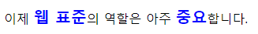


## 용어를 정의하고 용어를 설명하는 태그
dl 태그 안에 dt 태그와 dd 태그가 존재한다.
- dt 태그 : 용어
- dd 태그 : 용어를 설명하는 태그. dt 태그보다 들여쓰기가 된다.

```html
<h3>용어 정의 목록</h3>
	 <dl>
	 	<dt><b>키보드</b></dt>
	 		<dd>컴퓨터에 문자를 입력하는 장치이다.</dd>
	 
	 	<dt>마우스</dt>
	 		<dd>화면의 커서를 요리조리 움직이고 버튼을 눌러서 선택하는 장치이다.</dd>
	 
	 	<dt>노트북</dt>
	 		<dd>휴대하면서 영화를 보거나 웹 서핑이 가능한 장치이다.</dd>
	 		<dd>작고 가벼운 컴퓨터이다.</dd>
	 </dl>
```
코드 실행시 다음과 같이 출력된다.
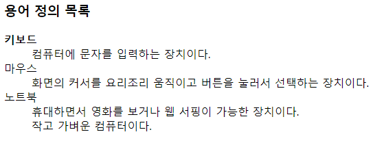


## form 태그 (☆)
사용자에게 입력을 받을 데이터 양식을 설정하는 태그.
		
### input 태그 속성
- autocomplate : 사용자가 이전에 입력한 값으로 자동완성기능을 사용할 것인지 여부. on(default) or off

- autofocus : 페이지가 로드될 때 자동으로 포커스를 이동할지 여부 확인.

- checked : 양식이 선택되었음을 표시할 지 여부 확인. type 속성 값이 radio, checkbox인 경우만 사용 가능.

- disabled : 양식을 비활성화할지 여부 확인.

- max : 지정 가능한 최대값 설정. type 속성이 number일 경우만 사용 가능. min 속성보다 큰 값만 허용.

- min : 지정 가능한 최소값 설정. type 속성이 number일 경우만 사용 가능. max 속성보다 작은 값만 허용.

- maxlength : 입력 가능한 최대 문자 수 설정. type 속성 값이 text, email, password, tel, url일 경우만 허용.

- multiple : 둘 이상의 값을 입력할 수 있는지 여부 설정. type 속성 값이 email, file일 경우만 허용 가능. email 경우 ,로 구분.

- name : 양식의 이름을 지정.

- placeholder : 사용자가 입력할 값의 힌트 설정. type 속성 값이 text, search, tel, url, email일 경우만 허용.

- readonly : 수정 불가능한 읽기 전용 설정.

- step : 유효한 증감 숫자 간격의 설정. type 속성 값이 number, range일 경우만 허용.

- src : 이미지의  url 설정. type 속성 값이 image일 경우만 허용.

- alt : 이미지의 대체 텍스트 설정. type 속성 값이 image일 경우만 허용. 
                   
- type : 입력 받을 데이터의 종류 설정. 아래에 type에 대한 내용 기재.

- value : 양식의 초기 값 설정.       
		        
		        
### 데이터의 종류(type)의 값(value)
- button : 일반 버튼. onClick 속성은 자바스크립트 함수를 호출할 때 사용.

- checkbox : 체크 박스. 여러 개 중 동시에 선택, 비선택 가능. 배열로 값이 전달됨.

- color : 색상 선택. IE 지원 불가.

- date : 날짜 선택. IE 지원 불가. 

- email : 이메일 선택.  
         
- file : 파일 선택.

- hidden : 보이지 않지만 전송할 양식 설정. 양식에는 보이지 않지만 값이 전달될 때는 값이 전달되는 양식.

- image : 이미지 제출 버튼.

- number : 숫자 선택. IE 지원 불가.

- password : 비밀번호 입력 가능. 입력된 내용이 안 보이는 형식.

- radio : 라디오 버튼. 여러 개 중 하나만 선택됨.

- range : 범위 컨트롤 지정. max, min, step, value(기본값) 속성 사용 가능. 

- reset : 초기화 하는 버튼. 해당 form 범위 내의 모든 양식 값이 초기화됨.

- search : 검색 기능.

- submit : 제출 버튼 기능. form 태그 속성 중 action 페이지로 해당 값들을 전송.

- tel : 전화번호 입력 기능. 

- text : 일반 텍스트 입력 기능.

- url : 절대 url 입력 기능.


### 예시 1

```html
	<h2>회원 로그인 화면	</h2>
	
	<h3>아이디와 비밀번호를 입력하세요.</h3>
	
	<form action="http://www.google.com">
		<table border="1" cellspacing="0">
			<tr>
				<th>아이디</th>
				<td>
					<input type="text" autofocus placeholder="4자리 이상 16자 미만">&nbsp;&nbsp;&nbsp; <!-- &nbsp; : 강제로 한칸띄어쓰기 -->
					<input type="button" value="중복확인">
				</td>
			</tr>
			
			<tr>
				<th>비밀번호</th>
				<td><input type="password"></td>
			</tr>		
			
			<tr>
				<td colspan="2" align="center">
					<input type="submit" value="전송">&nbsp;&nbsp;&nbsp;
					<input type="reset" value="취소">
				</td>
			</tr>
		</table>
	
	</form>
```
코드 실행 시 다음과 같은 창이 열린다.    
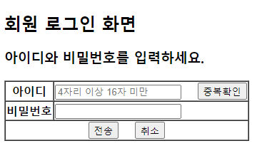

아이디칸에 입력하면 칸에 연하게 있던 '4자리 이상 16자리 미만' 문장은 사라지고 키보드로 입력한 값이 나타난다.     
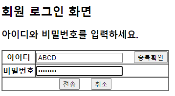

'전송'을 누르면 form action=에서 설정했던 구글창으로 넘어간다. 현재로선 실제적인 입력값이 전송되지는 않는다.    
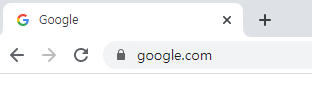


### 예시 2
```html
<script type="text/javascript">
	function going() {
		alert("버튼을 클릭하셨군요!!!") //경고창 
	}
</script>
</head>
<body>

	<button onclick="going()">클릭하세요</button>

</body>
```
버튼 클릭 시 위에서 스크립트로 정의한 going() 함수가 실행되어 경고창이 출력된다.    
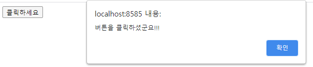


### 예시 3 체크박스 checkbox
```html
	<h3>당신의 취미는?</h3>
	
	<hr>
	
	<input type="checkbox" name="hobby" value="운동">운동
	<input type="checkbox" name="hobby" value="여행" checked>여행
	<input type="checkbox" name="hobby" value="독서">독서
	<input type="checkbox" name="hobby" value="수면">수면
	<input type="checkbox" name="hobby" value="숨쉬기">숨쉬기
```
체크박스는 다중 선택이 가능하다.    
checked 로 지정된 '여행'이 기본적으로 선택되어 있다.


### 예시 4 라디오 버튼 radio button
```html
	<h3>당신의 성별은?</h3>
	<hr>
	
	<input type="radio" name="gender" value="여자">여자	
	<input type="radio" name="gender" value="남자" checked>남자	

```
라디오 버튼은 다중 선택이 불가능하다.    
checked 로 지정된 '남자'항목이 기본적으로 선택되어 있다.    


### 예시 5 textarea 
textarea 태그는 여러 줄을 입력할 수 있는 태그이다.
- rows : 태그에 기본적으로 설정할 줄(행) 수 입력.
- cols : 태그에 기본적으로 설정할 열(column) 입력.

```html
	<h3>운영자에게 하고 싶은 말</h3>
	<hr>
	<textarea rows="5" cols="30">하고 싶은 말을 작성하세요.</textarea>
```
'하고 싶은 말을 작성하세요.' 적혀 있는 부분을 지우고 텍스트를 작성할 수 있다.    
텍스트가 길어질 경우 세로로 스크롤바가 자동 생성된다.    
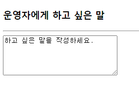


### 예시 6 file 

```html
	<h3>파일을 선택 하세요.</h3>

	<hr>
	
	<input type="file" multiple>
```
파일 선택 버튼 클릭시 파일을 삽입할 수 있는 창이 열린다.    
multiple 속성이 있으므로 ctrl 키를 누른 채 선택하면 다중 선택이 가능하다.    
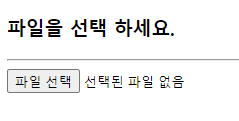 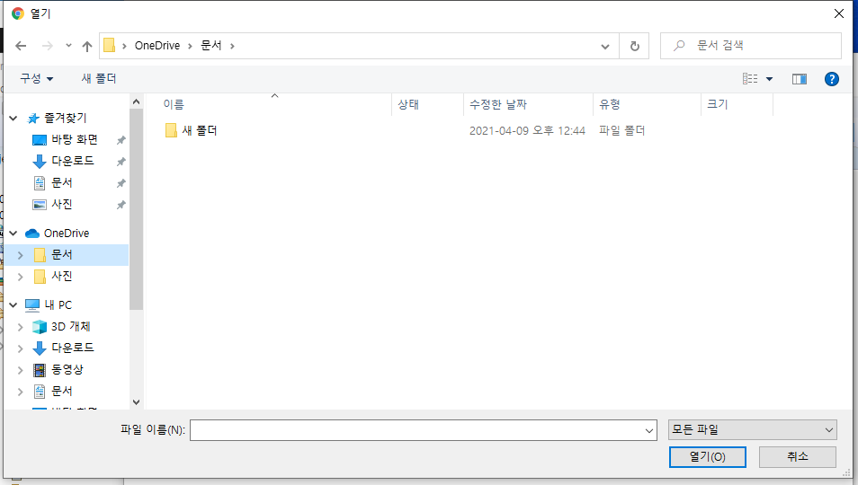
선택을 완료하면 몇 개의 파일이 선택되었는지 확인할 수 있다. 2개를 선택하였으므로 '파일 2개'라고 출력된다.    
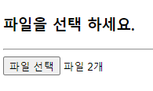
    
### 예시 7 select

```html
	<h3>직업을 선택하세요.</h3>
	<hr>
	<select multiple>
		<option value="">:::직업 선택:::</option>
		<option value="회사원">회사원</option>
		<option value="공무원">공무원</option>
		<option value="학생">학생</option>
		<option value="주부">주부</option>
		<option value="무직">무직</option>
		<option value="기타">기타</option>
	</select>
```
자바의 콤보박스와 비슷한 역할을 한다.    
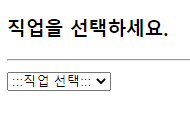
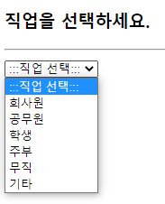
multiple 속성이 지정되어 있으므로 ctrl 키와 함께 클릭하면 다중 선택이 가능하다.    
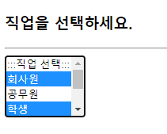

### 예시 8 color
```html
	<h3>색상을 선택하세요.</h3>
	<hr>
	<input type="color">
```
사각박스를 클릭 시 색상을 선택할 수 있다.    
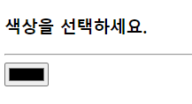
색상은 스펙트럼에서 고르거나 RGB 컬러값을 입력 또는 스포이드를 활용하는 등 다양하게 추출할 수 있다.    
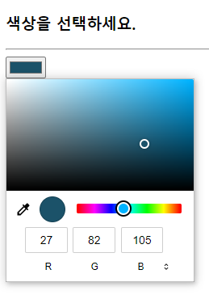

### 예시 9 date & time
```html
	<h3>날짜를 입력하세요.</h3>
	
	<hr>
	
	<input type="date">
	
	<hr>
	
	<input type="time">
```


날짜를 클릭하면 만년달력에서 자유롭게 날짜를 고를 수 있다.     
오늘 날짜를 선택하였다.    
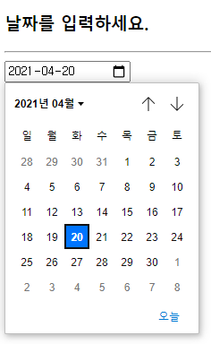
시간을 클릭하면 오전/오후, 시, 분 단위로 시간을 선택할 수 있다.    
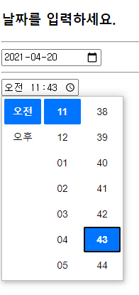


### 예시 10 number & range
```html
	<h3>수량을 선택하세요.</h3>

	<hr>

	<input type="number" min="1" max="20" step="2" value="10">	
	
	<hr>
	
	<input type="range" min="1" max="20" step="2" value="10">	
```
    
* number    
value="10"이므로 실행 시 기본적으로 '10'으로 지정되어 있다.    
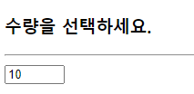
min="1" max="20" 이므로 아무리 내려도 1 밑으로는 내려가지 않고, 아무리 올려도 20을 넘길 수 없다.    
step="2" 이므로 2단위로 수를 조정할 수 있다. 최저숫자인 1부터 2씩 조정하므로 최대 19까지 선택 가능하다.    
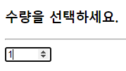    
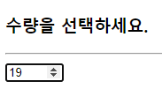    
* range    
원형버튼을 움직여 수를 조절할 수 있으나 구체적인 숫자는 표시되지 않는다.    
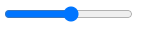    
    


### 예시 11 week
```html
	<h3>오늘은 올해의 몇 번째 주일까요?</h3>
	
	<hr>
	
	<input type="week">
```
실행 시 다음과 같은 창이 출력된다.    
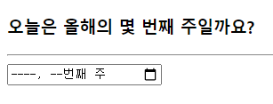    
클릭하면 달력이 출력되고, 날짜를 선택하면 일년 52 주 중 몇 번째 주인지 알 수 있다.    
오늘은 2021년의 16번째 주이다.
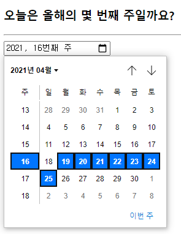     

### 예시 12 email
* required : 필수 입력 내용. 입력되지 않을 경우 오류가 발생한다.

```html
	<h3>이메일 주소를 입력하세요.</h3>
	
	<hr>
	<form action="http://www.daum.net">
		<input type="email" required>
		<input type="submit" value="전송">
	</form>
```
이메일 주소를 입력하는 창이 열린다.    
현재로선 전송 버튼을 눌러도 실제로 데이터가 전송되지 않고, action에 지정된 사이트로만 페이지가 이동된다.	    
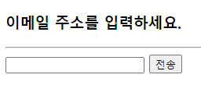	   
required 설정이 되어 있으므로, 입력하지 않고 바로 전송 버튼을 누르면 다음과 같이 작성하라는 안내창이 뜬다.    	
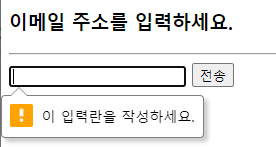	  

### 예시 13 fieldset & legend
* fieldset 태그 : HTML 태그들을 하나로 그룹화하는 역할을 하는 태그.
* legend 태그 : fieldset 태그에 제목을 부여하는 태그.

```html
	<fieldset>
		<legend>필수 입력 사항</legend>
		<ul>
			<li>이  름 : <input type="text"></li>
			<li>아이디 : <input type="text" size="20" 
				placeholder="6자 이상 20자 미만 공백 없이"></li>
			<li>이메일 : <input type="email"></li>
			<li>연락처 : <input type="text"></li>
			<li>
				<input type="submit" value="가입하기">&nbsp;&nbsp;&nbsp;
				<input type="reset" value="취소">
			</li>
		</ul>
	</fieldset>
	
	<fieldset>
		<legend>선택 입력 사항</legend>
		<ul>
			<li>
				<input type="checkbox" name="hobby" value="운동">운동
				<input type="checkbox" name="hobby" value="여행">여행
				<input type="checkbox" name="hobby" value="독서">독서
				<input type="checkbox" name="hobby" value="잠자기">잠자기
				<input type="checkbox" name="hobby" value="숨쉬기">숨쉬기
			</li>
			<li>
				<input type="radio" name="gender" value="여자">여자
				<input type="radio" name="gender" value="남자">남자
			</li>
		</ul>
	</fieldset>
```
fieldset 태그 안에 넣은 태그들이 하나의 박스 안에 담겨 출력된다.    
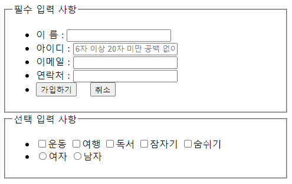    

### 예시 14 audio & video
* audio 태그 : 음악 파일을 실행할 수 있는 태그.   
* video 태그 : 동영상 파일을 실행할 수 있는 태그.
* autoplay loop : 처음 재생 이후론 무한 반복된다.

```html
	<audio src="audio/simpsons.mp4"
		controls autoplay loop></audio>
		
	<hr>
		
	<video src="audio/simpsons.mp4"
		controls autoplay loop></video>
```
음악 파일과 동영상 파일을 재생하거나 다운로드 받을 수 있다.    
autoplay loop 코드가 있으므로 처음 재생 버튼을 누른 이후로는 자동으로 반복 재생된다.    
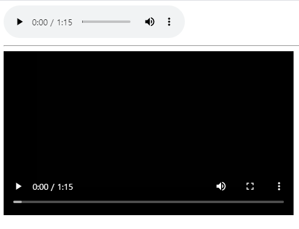    
동영상의 경우 PIP모드도 제공한다. 놀랍다.    
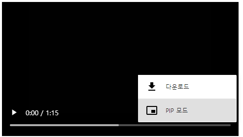    


### 시맨틱 태그의 태그 종류
- 시맨틱(semantic) : 의미가 있는 태그라는 뜻. 
- HTML5에 도입된 시맨틱 태그는 개발자와 브라우저에게 의미가 있는 태그를 제공한다. 태그의 이름만 보고 어느 영역에 삽입된 코드인지 파악할 수 있도록 하는 역할을 한다.

1. header 태그 : 브라우저의 상단에 존재하는 태그. 회사의 로고, 회원가입, 로그인 버튼들을 나타내는 태그.

2. footer 태그 : 브라우저의 하단에 존재하는 태그. 일반적으로 저작권, 회사의 주소에 대한 정보를 나타내는 태그.

3. article 태그 : 일반적으로 웹 문서의 본문에 해당하는 내용을 작성하는 태그.

4. section 태그 : 문서의 일반적인 영역을 설정하는 태그. article 태그 사용이 가능하다.

5. aside 태그 : 문서의 별도 컨텐츠 영역, 보통 광고나 기타 링크 등의 사이드 바를 설정하는 태그.

6. nav 태그 : 다른 페이지 링크를 제공하는 영역. 보통 메뉴(home, content 등등) 설정 시 사용한다.


