# 0. 제이쿼리(JQuery)?
바스크립트 언어를 간편한게 사용할 수 있도록 단순화시킨 오픈 소스 기반의 자바스크립트 라이브러리.  
제이쿼리는 자바스크립트 DOM을 좀 더 쉽게 작업하기 위한 라이브러리 덩어리.
제이쿼리를 이용하면 문서 객체 모델(DOM)과 이벤트에 관한 처리를 손쉽게 구현할 수 있다.
	
* 제이쿼리를 사용하는 이유
	- 제이쿼리는 주요 웹 브라우저의 구버전을 포함한 대부분의 브라우저에서 지원된다.
	- 동적으로 HTML DOM을 손쉽게 조작할 수 있으며, CSS 스타일도 간단히 적용 가능하다.
	- 생산성 있게 아주 짧고 간결하게 코딩이 가능하여 불필요한 소스를 줄일 수 있다.
	- 애니메이션 효과나 대화형 처리를 간단하게 적용할 수 있다.
	- 같은 동작을 하는 프로그램을 더욱 짧은 코드로 구현할 수 있다.
	- 다양한 플러그인과 참고할 수 있는 문서가 많이 존재한다.
	- 오픈 라이센스를 적용하여 누구나 자유롭게 이용할 수 있다.
	      
# 1. 제이쿼리 사용 방법
1. 제이쿼리 라이브러리를 다운을 받아서 사용하는 방법
	- https://code.jquery.com/ 에서 라이브러리를 다운로드 받아 프로젝트에 복사 붙여넣기한다. `<head>` 태그 안에서 다음과 같이 선언한다. 
	- `<script type="text/javascript" src="js/jquery-3.6.0.js"></script>`
		
2. 인터넷을 이용하여 파일을 연동시켜 사용하는 CDN 방식을 이용하는 방법 
	* (CDN : Content Delivery Network - 사용자가 요청한 컨텐츠를 사용자와 가장 가까운 곳에 위치한 서버에게 전달해 주는 방식)
	* `<script type="text/javascript" src="https://code.jquery.com/jquery-3.6.0.js"></script>`

# 2. 제이쿼리를 이용하여 DOM을 조작하는 방법
제이쿼리 라이브러리를 먼저 연동 후 코드를 작성한다.  


## * 2.1. 제이쿼리 동작 방법
* 형식) $("선택자").동작함수("속성", "값");
1. `JQuery(document).ready(function() {	});`
2. `JQuery(function(){ 	});`
3. `$(document).ready(function() {		});` (표준)
4. `$(function() {	});`
	
```javascript
// h2 태그의 글자색을 빨강으로 변경
$(document).ready(function(){
	$("h2").css("color", "red");
})
```
* `$` : `window.jQuery = window.$ = jQuery;`


같은 태그에 동작사항을 추가하고 싶으면 아래에 이어 작성 후,  
가장 마지막 문장 위에 세미콜론(`;`)을 붙이면 된다.    

```javascript
$(document).ready(function(){
	$("h2").css("color", "red")
	       .css("border", "3px solid blue");
	       .css("background-color", "yellow");
})
```


## 2.2. 선택자 사용 방법
1. 직접 선택자
	- 전체 선택자 `$("*")` : 모든 요소(태그)를 선택한다.
		- 예) `$("*").css("border", "1px solid red");`
	- 아이디 선택자 `$("#아이디이름")` : id 속성에 지정된 값을 가진 요소를 선택한다.
		- 예) `$("#title").css("background-color", "gray");`
	- 클래스 선택자 `$(".클래스이름")` : class 속성에 지정된 값을 가진 요소를 선택한다.
		- 예) `$(".content").css("background-color", "blue");`
	- 요소 선택자 `$("요소(태그)명")` : 지정된 요소(태그)명과 일치하는 요소들만 선택한다.
		- 예) `$("h1").css("border", "1px solid red");`
	- 그룹 선택자 `$("선택1, 선택2, ... , 선택n")` : 선택1, 선택2, ... , 선택n 에 지정된 모든 요소를 한번에 선택한다.
		- 예) `$("h1, h2").css("color", "blue");`
	    
2. 인접 관계 선택자
	- 부모 요소 선택자 `$("요소 선택").parent()` : 선택한 요소의 부모 요소를 선택한다.
		- 예) `$(".second").parent().css("border", "1px solid red");`
	- 상위 요소 선택자 `$("요소 선택").parents()` : 선택한 요소의 상위 요소들 모두를 선택한다.
	- 하위 요소 선택자 `$("요소선택  하위요소")` : 선택한 요소에 지정한 하위 요소를 선택한다.
		- 예) `$(".wrap li").css("color", "blue");`
	- 자식 요소 선택자 `$("요소선택 > 자식요소")` : 선택한 요소를 기준으로 자식 관계에 지정한 요소만 선택한다.
		- 예) `$(".wrap > li").css("color", "red");`
	- 자식 요소들 선택자 `$("요소선택").children()` : 선택한 요소의 모든 자식 요소(자식의 자식, 그 자식의 자식까지 등 그 밑의 모든 관계)를 선택한다.
	- 형제(이전) 선택자 `$("요소선택").prev()` : 선택한 요소의 바로 이전 요소를 선택한다.
		- 예) `$(".content").prev().css("color", "tomato");`
	- 형제(이전) 요소들 선택자 `$("요소선택").prevAll()` : 선택한 요소의 바로 이전 요소 모두를 선택한다.
	- 지정 형제(이전) 요소들 선택자 `$("요소선택").prevUntil("요소명")` : 선택한 요소로부터 지정한 요소 이전까지의 요소 선택한다.
	- 형제(다음) 요소 선택자 `$("요소선택").next()` : 선택한 요소의 다음 요소를 선택한다.
	- 형제(다음) 요소들 선택자 `$("요소선택").nextAll()` : 선택한 요소의 다음 요소 모두를 선택한다.
		- 예) `$(".content").next().css("border", "1px solid blue");`
		- 예) `$(".content").nextAll().css("color", "blue");`
	- 형제 요소들 선택자 `$("요소 선택").siblings()` : 선택한 요소를 제외하고 선택한 형제의 모든 요소를 선택한다. 
		- 예) `$(".content").siblings().css("color", "red");`


## 2.3. 제이쿼리 탐색 선택자
제이쿼리 탐색 선택자를 이용하면 직접 선택자를 이용해 선택한 요소 중 원하는 요소를 한 번 더 탐색해서 정확히 선택할 수 있는 장점이 있다.
* 탐색 선택자의 종류
	1. 위치 탐색자 : 선택한 요소 중 위치를 기준으로 선택한다.
	2. 속성 탐색 선택자 : 요소의 지정된 속성을 기준으로 선택한다.
	3. 콘텐츠 탐색 선택자 : 요소 내에서 콘텐츠의 포함 여부를 따져서 선택한다.
	4. 필터링 선택자 : 선택한 요소를 한 번 더 필터링하여 선택한다.

### 2.3.1. 위치 탐색자
1. 첫번째 요소 선택 : 전체 요소 중에서 첫번째 요소만 선택한다.
	* 형식) `$("요소선택:first")`, `$("요소선택").first()`
		- 예) `$(".menu li:first").css("color", "red");`
		- 예) `$(".menu li").first().css("color", "red");`
2. 마지막 요소 선택 : 전체 요소 중에서 마지막 요소만 선택한다.
	* 형식) `$("요소선택:last")`, `$("요소선택").last()`
		- 예) `$(".menu li:last").css("color", "blue");`
		- 예) `$(".menu li").last().css("color","blue");`
3. 짝수 번째(홀수 인덱스) 요소 선택 : 전체 요소 중에서 짝수 번째(홀수 인덱스) 요소만 선택한다.
	* 형식) `$("요소 선택:odd")`
	* 예) `$(".menu li:even").css("background-color", "while");`
4. 홀수 번째(짝수 인덱스) 요소 선택 : 전체 요소 중에서 홀수 번째(짝수 인덱스) 요소만 선택한다.
	* 형식) `$("요소 선택:even")`
	* 예) `$(".menu li:odd").css("background-color", "lightgray");`
5. 전체 요소 중 특정 숫자 번째 요소만 선택
	* 형식) `$("요소선택:nth-child(숫자)")`
	* 예) `$("li:nth-child(2)").css("color", "red");`
6. 전체 요소 중 특정 배수의 요소만 선택
	* 형식) `$("요소선택:nth-child(숫자n)")`
	* 예) `$("li:nth-child(3n)").css("color", "blue");`
	* 예) `$("li:nth-child(3n+1)").css("color", "green");`
	


### 2.3.2. 탐색 선택자
1. eq(index) 선택자 : 지정한 인덱스가 참조하는 요소만 선택한다.
	* 예) `$("li:eq(3)").css("background-color", "pink");`
2. lt(index) 선택자 : 지정한 인덱스보다 작은(less then) 요소만 선택한다.
	* 예) `$("li:lt(3)").css("background-color", "yellow");`
3. gt(index) 선택자 : 지정한 인덱스보다 큰(grater then) 요소만 선택한다. 
	* 예) `$("li:gt(3)").css("background-color", "skyblue");`


### 2.3.3. 속성 탐색 선택자 
속성 탐색 선택자는 요소의 지정된 속성을 기준으로 선택한다.
1. 요소[속성] : 속성이  있는 요소 가져오기 .
	* 예) `$("a[title]").css("border", "1px solid red");`
2. 요소[속성=값] : 속성과 값이 일치하는 요소 가져오기.
	* 예) `$("a[href='http://www.naver.com']").css("background-color", "pink");`
3. 요소[속성^=값] : 값으로 시작하는 요소 가져오기.
	* 예) `$("a[href^='mailto']").css("background-color", "aqua");`
4. 요소[속성$=값] : 값으로 끝나는 요소 가져오기.
	* 예) `$("a[href$='net']").css("background-color", "lightgray");`
5. 요소[속성*=값] : 값을 포함하는 요소 가져오기.
	* 예) `$("a[href*=daum]").css("border", "1px solid red");`
6. `요소[속성=값][속성=값]` : and 조건으로 조건 2개의 속성과 값을 모두 만족하는 요소 가져오기.
	* 예) `$("a[href^='mailto'][href$='net']").css("background-color", "green");`


## 2.4. 요소 조작 메서드 
요소 조작 메서드는 요소를 생성, 복사, 삭제, 속성 변환과 관련된 메서드를 제공한다.
<<<<<<< HEAD

### 2.4.1. 속성 조작 메서드
* `html()` : 선택한 요소에 포함되는 하위 요소를 불러오거나 새 요소로 바꿀 때 사용한다.

```javascript
// h1태그의 요소내용을 불러와 alert 창으로 출력
alert($("h1").html());	

// h1태그의 요소를 "" 안에 작성한 내용으로 변경
$("h1").html("<a href='#'>HTML 메서드</a>");	
```


* `text()` :  선택한 요소 내의 텍스트를 불러오거나 텍스트를 바꿀 때 사용한다.

```javascript
// h1태그의 텍스트를 불러와 alert 창으로 출력
alert($("h1").text());

// h1태그의 텍스트 내용을 "텍스트 메서드"로 변경
$("h1").text("텍스트 메서드");
```


* `attr("속성")` / `attr("속성", "값")` : 선택한 요소에 새 속성을 추가하거나, 기존의 속성을 변경할 때 사용한다.
```javascript
$(".wrap img").attr("width", "200");
$(".text").text($(".wrap img").attr("src"));
```

* `removeAttr("속성")` : 선택한 요소에서 기존의 속성을 삭제할 때 사용한다.
```javascript
$(".wrap img").removeAttr("width");
``` 


* `addClass()` : 선택한 요소에 클래스 선택자를 생성할 때 사용한다.
```javascript
$("#p1").addClass("p1_class");
```

* `removeClass()` : 선택한 요소에 지정된 클래스 선택자를 삭제할 때 사용한다.
```javacsript
$("#p1").removeClass("p1_class");
```
	
	
* `val()` / `val(값)` : 입력 요소에 있는 value 값을 가져오거나 변경할 때 사용한다.

```javascript
// id="user_name" 인 요소의 value값을 alert로 출력
alert($("#user_name").val());

// id="user_name" 인 요소의 value값을 id="my_name"인 요소에 지정
$("#my_name").val($("#user_name").val());
```


### 2.4.2. 수치 조작 메서드


### 2.4.3. 요소 편집 메서드

요소 편집 메서드는 선택한 요소를 복제하거나 새 요소를 생성하는 메서드이다.  
복제하거나 새로 생성한 요소를 의도한 위치로 삽입하고 선택한 요소를 삭제하는 기능을 한다.  

* `before()` : 선택한 요소 이전 위치에 새 요소를 추가하는 메서드.
	* 형식) `$("요소선택").before("새 요소")`
* `after()` : 선택한 요소 다음 위치에 새 요소를 추가하는 메서드.
	* 형식) `$("요소선택").after("새 요소")`

```javascript
// class="myList" 앞에 새로운 내용 추가
$(".myList").before("<li>새로운 내용 추가1</li>");

// class="myList" 뒤에 새로운 내용 추가
$(".myList").after("<li>새로운 내용 추가2</li>");
```


* `append()` : 선택한 요소의 마지막 위치에 새 요소를 추가하는 메서드.
	* 형식) `$("요소선택").append("새 요소")`
* `appendTo()` : 선택한 요소의 마지막 위치에 새 요소를 추가하는 메서드.
	* 형식) `$("새 요소").appendTo("요소 선택")`
* `prepend()` : 선택한 요소의 맨 앞 위치에 새 요소를 추가하는 메서드.
	* 형식) `$("요소선택").prepend("새 요소")`
* `prependTo()` : 선택한 요소의 맨 앞 위치에 새 요소를 추가하는 메서드.
	* 형식) `$("새 요소").prependTo("요소선택")`


```javascript
// class="myList"의 앞과 뒤에 각각 새로운 내용 1, 2를 추가
$(".myList").append("<li>새로운 내용1</li>");
$(".myList").prepend("<li>새로운 내용2</li>");

// 이렇게 작성해도 된다.
$("<li>새로운 내용1</li>").appendTo(".myList");
$("<li>새로운 내용2</li>").prependTo(".myList");
```


* `insertBefore()` : 선택한 요소의 이전 위치에 새 요소를 추가하는 메서드.
	* 형식) `$("새 요소").insertBefore("요소선택")`
* `insertAfter()` : 선택한 요소의 다음 위치에 새 요소를 추가하는 메서드.
	* 형식) `$("새 요소").insertAfter("요소선택")`
* `clone()` : 선택한 요소를 복사하는 메서드.
	* 형식) `$("요소선택").clone(true or false)`
	- `true` : 하위 요소까지 모두 복사.
	- `false` : 선택한 요소만 복사.
	

```javascript
// class="myList" 이전 위치에 새로운 내용 추가
$("<li>새로운 내용</li>").insertBefore(".myList");

// class="myList"를 복사해서 my_clone이라는 변수에 저장
let my_clone = $(".myList").clone();

// 복사한 요소를 class="myList" 다음 위치에 추가
$(my_clone).insertAfter(".myList");
```


* `empty()` : 선택한 요소의 하위 내용들을 모두 삭제하는 메서드. 선택한 요소 자체는 삭제되지 않는다.
	* 형식) `$("요소선택").empty()`
* `remove()` : 선택한 요소를 삭제하는 메서드. 
	* 형식) `$("요소선택").remove()`
	
```javascript
// class="line_1"인 요소의 하위 내용만 삭제. 
$(".line_1").empty();

// class="line_2"의 요소를 모두 삭제. 아예 사라진다.
$(".line_2").remove();
```

	


* `replaceWith()` : 선택된 요소만 새 요소로 교체하는 메서드.
	* 형식) `$("요소선택").replaceWith("새 요소")`
* `replaceAll()` : 선택 요소 전체를 새 요소로 교체하는 메서드.
	* 형식) `$("요소선택").replaceAll("새 요소")`

```javascript
// <h2>태그로 작성된 내용을 <h3>태그로 작성된 내용으로 교체
$("h2").replaceWith("<h3>replaceWith() 메서드</h3>");

// <p>태그로 작성된 모든 내용을 <h2> 태그의 "replaceAll"으로 내용 변경
$("<h2>내용변경</h2>").replaceAll("p");
```


## 3. 기타
### 3.1. 속성으로 노드를 찾기
	- `$("E[A]")` : 속성 A를 포함한 모든 E 노드 찾기
	- `$("E[A=V]")` : 속성 A의 값이 V인 모든 E 노드 찾기
	- `$("E[A^=V]")` : 속성 A의 값이 V로 시작하는 모든 E 노드 찾기
	- `$("E[A$=V]")` : 속성 A의 값이 V로 끝나는 모든 E 노드 찾기
	- `$("E[A*=V]")` : 속성 A의 값이 V를 포함하고 있는 모든 E 노드 찾기

```javascript
// 클래스가 적용된 모든 노드를 찾아 border 속성 변경
$("[class]").css("border", "3px solid red");

// 클래스 이름에 test라는 단어가 포함된 모든 노드를 찾아 border 속성 변경
$("[class*=test]").css("border", "3px solid red");
```


### 3.2. 찾은 노드 다루기

```javascript
// 문서에서 div 태그 노드가 몇 개인지 확인
// let divs = $("div");
alert("div 갯수 >>> " + $("div").length);
```


### 3.3 순차적으로 찾은 노드 접근하기
형식)
```javascript
$("요소선택").each(function(index) {
	let 변수 = $(this);
})
```

```javascript
let li_list = $("ul.menu li");
li_list.each(function(index){
	console.log("index >>> " + index);
});
```


### 3.4. 찾은 노드 중에서 특정 노드에 접근하기 
ul.menu li 에서 나온 결과값에 있는 항목 중에 select 클래스가 적용된 노드를 찾아서 "3px solid red" 로 적용한다.
* 형식) $("요소선택").filter("선택자")
	
```javascript
let li_list = $("ul.menu li");
li_list.filter(".select").css("border", "3px solid red");

```

### 3.5. 찾은 노드의 자손(자식포함) 노드 중 특정 노드 찾기
* 형식) $("요소선택").find("선택자")
	
```javascript
// content 아이디 중 test1이라는 클래스가 적용된 노드를 찾아서 "3px solid red" 로 적용.
$("#content").find(".test1").css("border", "3px solid red");
```


### 3.6. 모든 자식 노드 찾기
* 형식) $("요소선택").children()
	
```javascript
// content 아이디 중 test1이라는 클래스가 적용된 노드를 찾아서 "3px solid red" 로 적용.
$("#sample_page").children().css("border", "3px solid red");
```


### 3.7. 특정 자식 노드만 찾기
* 형식) $("요소선택").children("선택자")
	
```javascript
$("#sample_page").find(".test1").css("border", "3px solid red");
```


※` children()` : 바로 다음 하위 자식 중에서 노드를 찾음.    
※ `find()` : 바로 다음 하위 자식 노드 뿐만 아니라 모든 자손 노드에서 찾음.
	

# 4. 이벤트 Event

## 4.1. 이벤트 종류
1. 마우스 이벤트 : 사용자가 마우스 버튼을 눌렀을때 발생하는 이벤트.
2. 키보드 이벤트 : 사용자가 키보드를 눌렀을 때 발생하는 이벤트. 이 때 눌린 키에 대한 정보가 이벤트에 담긴다.
3. 태그요소 고유 이벤트 : 요소마다 발생하는 고유의 이벤트.
4. 사용자 정의 이벤트 : 개발자가 직접 만들어 사용하는 이벤트.

* 이벤트 형식) 
	1. `$("요소선택").on("이벤트이름", 이벤트리스너)`
	2. `$("요소선택").이벤트이름(이벤트리스너)` 

```javascript
// 버튼을 누르면 "환영합니다."라는 alert 창이 열리는 이벤트
$(function() {
	$(".btn").on("click", function() {
		alert("환영합니다.");
	});
});
```

<p align="center"></p>


## 4.2. 이벤트 목록
blur, change, load, unload, resize, scroll, select, submit, click, dblclick, mousedown, mouseup, mousemove, mouseover, mouseout, mouseenter, mouseleave, focus, keydown, keupress, keyup....
	
```javascript
// id="menu"의 li태그를 클릭할 때마다 
// 해당 태그의 html 정보를 alert 창으로 출력
$(".menu li").on("click", function() {
	alert($(this).html());
});
```

<p align="center">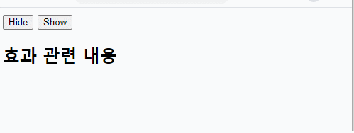</p>
	
	
	

```javascript
// 버튼을 클릭하면 p태그의 배경색이 노란색이 되는 이벤트
$(".btn1").click(function() {
	$("p").css("background-color", "yellow");
});

// 버튼을 더블클릭하면 p태그에 보더가 생기는 이벤트
$(".btn2").dblclick(function() {
	$("p").css("border", "2px solid red");
});
```

<p align="center">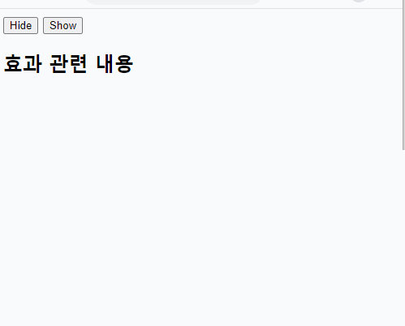</p>


## 4.3. 마우스 이벤트
* `mouseout()` : `$("요소선택").mouseout(function() {.....});`

* `mouseover()` : `$("요소선택").mouseover(function() {.....});`

* `hover()` 

```javascript
$("요소선택").hover (
	function() {.....}), ==> 마우스가 올라갔을 때 실행
	function() {.....}); ==> 마우스가 벗어났을 때 실행
)
```	        
	        	
	        	
```javascript
// 버튼에 마우스가 올라가면 p태그의 배경색을 핑크로 바꾸는 이벤트
$(".btn1").on("mouseover", function() {
	$("p").css("background-color", "pink");
});
	
// 버튼에서 마우스가 내려오면 p태그의 배경색을 라이트그레이로 바꾸는 이벤트
$(".btn1").on("mouseout", function() {
	$("p").css("background-color", "lightgray");
});
		
// 마우스가 버튼을 오르내릴때마다 발생하는 이벤트
$(".btn2").hover(
	function() {  // 마우스가 올라갔을 때 이벤트 실행
		$("p").css("border", "2px solid red");
	},			
	function() {  // 마우스가 벗어났을 때 이벤트 실행
		$("p").css("background-color", "yellow");
	});
});
```

<p align="center"></p>


- `mouseenter()` : 선택한 요소의 경계 범위 내에 마우스가 올라갔을 때 이벤트 발생.
	* 형식) $("요소선택").mouseenter(function() {...});
- `mouseleave()` : 선택한 요소의 경계 범위 내에서 마우스가 떠나갔을 때 이벤트 발생.
	* 형식) $("요소선택").mouseleave(function() {...});
			
```javascript
// 마우스가 올라가면 배경색이 파란색이 된다.
$(".wrap").on("mouseenter", function() {
	$("p").css("background-color", "blue");
})
	
// 마우스가 떠나면 배경색이 노란색이 된다.	
$(".wrap").mouseleave(function() {
	$("p").css("background-color", "yellow");
})
```

<p align="center">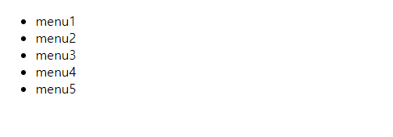</p>


* `mousemove()` : 선택한 요소의 영역에서 마우스를 움직일 때마다 이벤트 발생.
	* 형식) $("요소선택").mousemove(function() {...})

```javascript
// $(document) : 현재 문서
// e : 매개변수
$(document).on("mousemove", function(e) {
	let x = e.pageX	// 마우스의 x 좌표값을 구함
	let y = e.pageY	// 마우스의 y 좌표값을 구함
	$("h2").text("x : " + x + ", y : " + y);
});
```

<p align="center">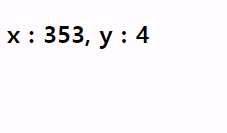</p>


## 4.4. 키보드 이벤트
- `keypress()` : 선택한 요소에서 키보드를 눌렀을 때 이벤트 발생. 문자 키를 제외한 키 코드값을 반환한다.
	* 형식) $("요소선택").keypress(function() {...})
- `keydown()` : 선택한 요소에서 키보드를 눌렀을 때 이벤트 발생.
	* 형식) $("요소선택").keydown(function() {...})
- `keyup()` : 선택한 요소에서 키보드에서 손을 떼었을 때 이벤트 발생.
	* 형식) $("요소선택").keyup(function() {...})
	
	
```javascript
$("#user_id").on("keypress", function(e) {
	$(".txt2").text(e.keyCode);	// 아스키코드로 반환
});
		
// 키보드를 누르면 누른 값이 아스키코드로 반환되고,배경색이 노란색이 된다.
$("#user_id").on("keydown", function(e) {
	$(".txt1").text(e.keyCode);
			
	// this : 현재 태그 (#user_id)
	$(this).css("background-color", "yellow");
});
		
// 키보드를 떼면 배경색이 토마토색이 된다.
$("#user_id").on("keyup", function(e) {
	$(this).css("background-color", "tomato");
});
```

<p align="center">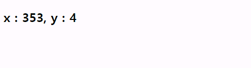</p>
	
	
## 4.5. 기타 자주 사용되는 이벤트 메서드
- `change()` : 선택한 입력 요소에 값이 새 값으로 변경되고 포커스가 다른 요소로 이동이 되었을 때 이벤트 발생.
	
```javascript
$(".site").on("change", function() {
	$(".txt").text($(this).val());	
});
```

<p align="center">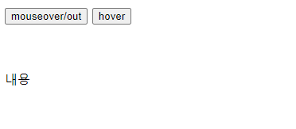</p>


# 5. Animation 애니메이션

## 5.1. 효과 관련 메서드
- `hide()` : 노출되어 있는 요소를 숨기는 기능.
	* 형식) $("요소선택").hide(효과속도(ms), 콜백함수)
- `show()` : 숨겨져 있던 요소를 노출시키는 기능.
	* 형식) $("요소선택").show(효과속도(ms), 콜백함수)
	
* 콜백함수 : 효과가 완료되면 실행되는 함수. 생략가능.
			
```javascript
// 버튼을 누르면 h2태그가 숨겨지는 애니메이션
$(".btn1").click(function() {
	$("h2").hide(500, function() {
		alert("숨김이 완료되었습니다.");
	});
});
		
// 버튼을 누르면 숨겨져있던 h2가 나타나는 애니메이션
$(".btn2").click(function() {
	$("h2").show(1000, function() {
		alert("노출이 완료되었습니다.");
	});
});
```

<p align="center">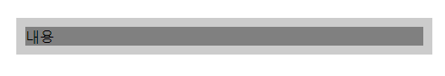</p>


* `toggle()` : 선택한 요소가 보이면 숨기고, 숨겨져 있으면 보이게 하는 기능.
	* 형식) $("요소선택").toggle(효과속도, 콜백함수)
	
```javascript
// 버튼을 누르면 이미지가 보이면 숨기고 숨겨져 있으면 보이는 애니메이션
$(".btn").click(function() {
	$("img").toggle(1000)
});
```

<p align="center"></p>


* `fadeIn()` : 숨겨져 있던 요소가 점점 불투명해지면서 노출되는 기능.
	* 형식) $("요소선택").fadeIn(효과속도, 콜백함수)
* `fadeOut()` : 노출되어 있던 요소가 점점 사라지는(투명해지는) 기능.
	* 형식) $("요소선택").fadeOut(효과속도, 콜백함수)
* `fadeToggle()` : 노출이 되어 있던 요소는 점점 사라지고, 사라져 있던 요소는 점점 선명해지는 기능.
	* 형식) $("요소선택").fadeToggle(효과속도, 콜백함수)

```javascript
// 버튼을 누르면 이미지가 점점 투명해지는 애니메이션
$(".btn1").click(function() {
	$("img").fadeOut(500);
});
		
// 버튼을 누르면 이미지가 점점 선명해지는 애니메이션
$(".btn2").click(function() {
	$("img").fadeIn(500)
});
		
// 버튼을 누르면 있던 이미지는 투명해지고, 없던 이미지는 선명해지는 애니메이션
$(".btn3").click(function() {
	$("img").fadeToggle(500)
});
```
	
<p align="center">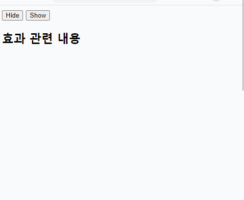</p>


* `fadeTo()` : 선택한 요소를 지정한 투명도의 값까지만 숨기는 기능. 투명도는 0부터 1사이의 값까지만 입력할 수 있다.
	* 형식) $("요소선택").fadeTo(효과속도, 투명도, 콜백함수)

```javascript
$(".btn1").click(function() {
	$("img").fadeTo(1000, 0.25) // 투명도 0.25
});
		
$(".btn2").click(function() {
	$("img").fadeTo(1000, 0.5)	// 투명도 0.5
});
		
$(".btn3").click(function() {
	$("img").fadeTo(1000, 0.75)	// 투명도 0.75
});
		
$(".btn4").click(function() {
	$("img").fadeTo(1000, 1)		// 투명도 1
});
```

<p align="center">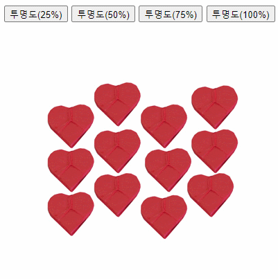</p>


- `slideUp()` : 선택한 요소를 숨길 때 사용하는 메서드.
	* 형식) $("요소선택").slideUp(효과속도, 콜백함수)
- `slideDown()` : 숨겨져있는 요소를 나타낼 때 사용하는 메서드.
	* 형식) $("요소선택").slideDown(효과속도, 콜백함수)
- `slideToggle()` : 요소가 나타나 있으면 숨기고, 숨겨져 있으면 나타내는 메서드.
	* 형식) $("요소선택").slideToggle(효과속도, 콜백함수)
	
```javascript
$(".btn1").click(function() {
	$("img").slideUp(1000);
});
	
$(".btn2").click(function() {
	$("img").slideDown(1000);
});

$(".btn3").click(function() {
	$("img").slideToggle(1000);
});
```
	

<p align="center">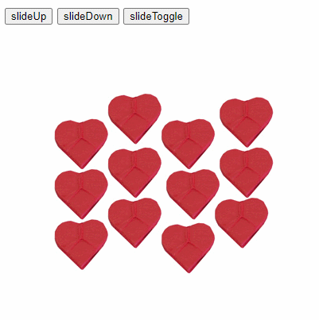</p>


- `animate()` : 선택한 요소에 다양한 동작(motion) 효과를 적용하는 메서드.
	* 형식) $("요소선택").animation({애니메이션 속성}, 효과속도, 콜백함수)
	* 애니메이션 속성 : 모션으로 적용할 속성을 CSS(스타일)을 이용하여 입력한다.
	* 효과속도 : ms(1/1000) 또는 "slow", "normal", "fast"로도 가능하다.

```javascript
// 3초동안 좌측에서부터 250px 이동 후, 콜백함수로 alert창 호출.
$("h1").animate({marginLeft: "250px"}, 3000, function() {
	alert("도착 완료");
});
		
// 3초동안 좌측에서부터 250px 이동.
$("h2").animate({marginLeft: "250px", width: "100px", opacity: 0.25}, 3000);
		
// 콜백함수에 다시 애니메이션을 넣을 수 있다.
// 2초동안 좌측에서부터 250px 멀어진 후, 다시 1초동안 우측으로 100px 이동.
$("h3").animate({marginLeft: "250px"}, 2000, function() {
	$("h3").animate({marginLeft: "100px"}, 1000);
});
```

<p align="center">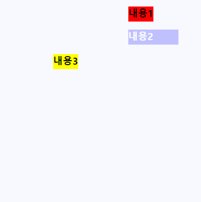</p>


- `stop()` : 선택한 요소에 효과 또는 애니메이션이 적용된 효과를 정지시키는 메서드. 
	* 형식) $("요소선택").stop()
- `delay()` : 선택한 요소에 효과 또는 애니메이션이 족용된 효과를 지연시키는 메서드.
	* 형식) $("요소선택").delay(지연시간).애니메이션 효과 메서드();
	

```javascript
$("h1").animate({marginLeft: "250px"}, 3000);
		
$("h2").delay(2000).animate({marginLeft: "250px"}, 1000);
		
$(".stop").click(function() {
	$("h1").stop;	// h1 태그 동작 정지
	$("h2").stop;	// h2 태그 동작 정지
}); 
```


#### [예] 글자크기와 글자체를 변경해보자.

```javascript
// 초기값 설정
let size = 14;

// 1. 글자 크기의 버튼을 클릭했을 때 이벤트 발생
// id="zoom"인 태그 내의 button 태그를 클릭했을 때
$(".zoom button").click(function() {
	let btn_index = $(".zoom button").index(this);
	
	if(btn_index === 0) {		// "+" 버튼을 클릭한 경우
		size++;	// size(크기)가 1씩 증가
		$("#txt_wrap").css("font-size", size+"px");
	}else if(btn_index === 2){	// "-" 버튼을 클릭한 경우
		size--;	// size(크기)가 1씩 감소
		$("#txt_wrap").css("font-size", size+"px");
	}else {						// "0" 버튼을 클릭한 경우
		size = 14;
		$("#txt_wrap").css("font-size", size+"px");
	}
});
		
// 2. 글자체를 선택했을 때 이벤트 발생
$("#fs").change(function(){
	$("#txt_wrap").css("font-family",  $(this).val());
});
```

<p align="center">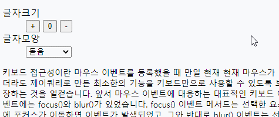</p>

