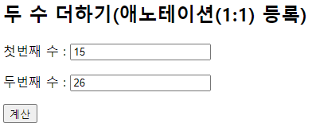
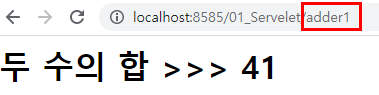
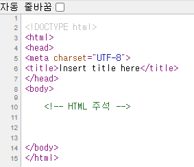

#JSP

# 웹 프로그래밍
- 웹 프로그래밍이란? ==> 웹 어플리케이션을 만드는 행위.
- 웹 어플리케이션이란? ==> 웹을 기반으로 동작하는 프로그램을 말한다.
- 웹 이란? ==> 인터넷 서비스의 형태를 말한다.
- 인터넷이란? ==> 하나 이상의 네트워크가 연결되어 있는 형태를 말한다.
- 웹 서버? ==> 각 클라이언트에게 서비스를 제공하는 컴퓨터를 말한다. 웹 서버는 정적인 컨텐츠(HTML, CSS, JS)를 제공하는 서버.
- 웹 어플리케이션 서버(WAS)? ==> DB 조회나, 어떤 로직을 처리해야 하는 동적인 컨텐츠를 제공하는 서버를 말한다. 
- 클라이언트? ==> 네트워크로 서버에 접속한 후 서버로부터 서비스를 제공받는 컴퓨터를 말한다.
- HTTP 프로토콜? ==> Hyper Text Transfer Protocol의 약자로 www 서비스를 제공하는 통신규약을 말함. HTML을 비롯해서 이미지, 동영상, XML 문서 등 다양한 데이터를 주고 받을 때 사용하는 일종의 규칙임. 즉, 웹 서버와 클라이언트는 이 프로토콜을 이용해서 정보를 주고 받는다.
- 동적 웹 프로그래밍? ==> 클라이언트의 요청이 있을 때마다 데이터베이스에 접근해서 실시간 정보를 클라이언트에게 제공하는 기능을 처리하는 방식을 말한다.


# CGI 방식과 어플리케이션 서버 방식의 차이점
- 동시에 여러 명의 접속자가 접속을 하여 프로그램을 실행하는 경우
	* CGI 방식은 클라이언트의 요청에 독립된 프로세스를 생성하기 때문에 점유하는 메모리가 많아져 시스템의 부하를 주게 된다. 요청이 발생할 때마다 매번 메모리에 프로그램을 로딩하기 때문에 동시 접속자 수가 많아질수록 이에 비례하여 프로그램 실행을 위한 메모리도 증가하게 된다.
		* 주로 사용되는 언어 : C++
	* 어플리케이션 서버 방식은 동시에 여러 명의 접속자가 동일한 프로그램의 처리를 요청하여도 한 개에 해당하는 메모리만 사용하기 때문에 즉, 스레드 방식으로 처리하기 때문에 CGI 방식에 비해서 메모리 사용량이 적다.
		* 주로 사용되는 언어 : ASP, PHP, JSP 


---------------------------------------------------------
# Servlet 서블릿
- 서버 쪽에서 실행되면서 클라이언트의 요청에 따라 동적으로 서비스를 제공하는 자바 클래스. 
- 서블릿은 자바로 작성되어 있으므로 자바의 일반적인 특징을 모두 가지고 있다.
- 서블릿은 서버에서 실행되다가 웹 브라우저에서 요청을 하면 해당 기능을 수행한 후 웹 브라우저에 결과를 전송한다.
- 서버에서 실행이 되기 때문에 보안과 관련된 기능도 훨씬 안전하게 수행이 가능하다.


## 1. Servlet Life Cycle(서블릿 생명 주기)
* `init()` : 단 한 번만 호출된다.
	- 서블릿이 서비스하기 위해 필요한 초기화 작업을 수행을 한다.  
* `service()` : `init()` 메서드가 `service()` 메서드를 호출한다.
	- 사용자의 요청에 따라 스레드 단위로 실행되는 메서드. (여러번 실행)
	- 각각 `service()` 메서드를 통해서 `doGet()`, `doPost()` 메서드가 호출된다.
	- 파라미터인 HttpServletRequest와 HttpServletResponse를 통해서 사용자의 요청을 처리한다.
* `destroy()` : 서블릿이 종료 요청이 오면 한 번만 호출되는 메서드.
	- 서블릿이 종료되면서 정리할 작업이 있으면 `destroy()` 메서드를 오버라이딩(재정의) 해서 구현한다.
                 
                                    
## 2. Sevlet 동작 과정
- 클라이언트가 요청을 하면 요청하는 서블릿이 메모리에 로딩이 되어 있는지 확인한다.
- 최초의 요청이면 `init()` 메서드를 호출하여 요청하는 클래스의 인스턴스(객체)를 메모리에 로딩한다.
- 그런 다음 `doGet()`이나 `doPost()` 메서드를 호출하여 서비스를 한다.
- 클라이언트가 다시 동일한 서블릿을 요청을 하면 톰캣은 요청하는 서블릿이 메모리에 로딩이 되어 있는지 확인한다.
- 이번에는 메모리에 로딩이 되어 있는 것이 확인이 되므로 바로  `doGet()`이나 `doPost()` 메서드를 호출한다.
    
    
## 3. JSP에서 사용되는 동작 방식 - 2가지
1. Servlet 방식
	- 웹 개발을 위한 표준이 되는 클래스.
	- 웹 브라우저의 요청을 스레드 방식으로 처리하는 기술을 말한다..
	- 서버 쪽에서 실행되면서 클라이언트의 요청에 따라 동적으로 서비스를 제공하는 자바 클래스.
	- 처리해야 할 일들을 기술하는 곳.
	- 서블릿은 일반 자바 프로그램과 다르게 독자적으로 실행되지 못하고 톰캣과 같은 서버에서 실행된다.
	- 서블릿의 특징.
		* 서버 쪽에서 실행되면서 기능을 수행한다.
		* 기존의 정적인 웹 프로그램의 문제점을 보완하여 동적인 여러 가지 기능을 제공한다.
		* **스레드 방식으로 실행된다.** (중요!!)
		* 클라이언트의 요구를 처리하는 기능은 최초 한 번만 메모리로 로딩된다.
		* 클라이언트가 동일한 기능을 요구하면 기존에 사용한 기능을 재사용.
		* 자바로 만들어져서 자바의 특징(객체 지향)을 가지고 있다.
		* 보안 기능을 적용하기 쉽다.
		* 웹 브라우저에서 요청 시 기능을 수행한다.
	- 즉, 서블릿의 기본 기능 - 3가지
		1) 클라이언트로부터 요청을 받는다.
		2) 데이터베이스 연동과 같은 비지니스 로직을 수행한다.
		3) 처리된 결과를 클라이언트에게 돌려준다.
2. JSP 방식    
	- Java Server Page의 약자로 자바 Servlet 기술을 확장시켜 웹 환경  상에서 100% 순수한 자바만으로 개발하기 위한 기술을 말한다. Servlet을 한 차원 더 확장시킨 버전.
	- 동적인 페이지를 생성하기 위한 서버 측 스트립트 언어.
	- 디자이너 입장에서 화면의 수월한 기능 구현과 개발 후 화면의 편리한 유지관리를 목적으로 도입.

## 4. 서블릿의 요청과 응답
* 요청과 관련된 API : javax.servlet.http.HttpServletRequest 인터페이스
* 응답과 관련된 API : javax.servlet.http.HttpServletResponse 인터페이스
1. 클라이언트가 서블릿에 요청을 하면 먼저 톰캣 서버가 해당 요청을 받는다.
2. 그런 다음 사용자의 요청이나 응답에 대한 HttpServletRequest 객체와 HttpServletResponse 객체를 만들게 된다.
3. 그리고 난 후 Servlet의 doGet() 메서드나 doPost() 메서드를 호출하면서 이 객체들을 전달한다.
4. 톰캣이 사용자의 요청에 대한 정보를 모든 HttpServletRequest 객체의 속성으로 담아 메서드로 전달한다. 따라서 각 HttpServletRequest에서 제공하는 메서드들은 매개변수로 넘어온 객체들을 이용하여 사용자가 전송한 데이터를 받아오거나 응답을 할 수 있는 것이다.

  
## 5. 서블릿에서 클라이언트의 요청을 얻는 방법(중요!!)
- HttpServletRequest 클래스에서 `<form>` 태그로 전송된 데이터를  받아 오는데 사용되는 메서드.
	* `getParameter(String name)` => `<form>` 태그의 `name` 속성에 들어간 변수명을 받아서 사용한다. 반환형은 String 타입.
 	* `getParameterValues(String name)` ==> `<form>` 태그의 같은 `name`에 대하여 여러 개의 값을 얻을 때 사용한다. 반환형은 String[] 배열 타입.
 	
#### [예] 체크박스 데이터를 요청할 때
체크박스는 중복으로 선택이 가능하므로 입력한 데이터 값도 복수가 될 수 있다. 따라서 체크박스 데이터를 받아올 때는 배열로 받아와야 한다.   
이 때 `getParameterValues()`를 사용한다. 반환형은 String[] 배열 타입이다.     

```java
// 1단계 : 페이지에서 넘어온 데이터들을 처리해 주자.

String[] major = request.getParameterValues("major");
	
// 2단계 : 웹 브라우저에 요청한 결과를 화면에 보여 주자.
out.println("전공과목 : ");
	
// 배열로 저장된 전공과목 출력
for(int i=0; i<major.length; i++) {
	out.println(major[i] + "&nbsp;&nbsp;&nbsp;");
}
```
            
            
## 6. 서블릿에서 요청 받은 내용을 처리하여 클라이언트에 보내는 방법.
1. HttpServletResponse 객체를 이용하여 응답한다.
2. `doGet()`이나 `doPost()` 메서드 안에서 처리한다.
3. javax.servlet.http.HttpServletResponse 객체를 이용한다.
4. `setContentType()` 메서드를 이용하여 클라이언트에게 전송할 데이터의 종류(MIME-TYPE)를 지정한다.
5. 클라이언트(웹 브라우저)와 서블릿의 통신은 자바 I/O의 스트림을 이용한다.

  
## 7. 웹 브라우저에서 서블릿으로 데이터를 전송하는 방법 
1. get 방식
2. post 방식


### 7.1. get 방식
- 서블릿에 데이터를 전송할 때는 데이터가 url 뒤에 name=value 형태로 전송된다.
- 여러 개의 데이터를 전송할 때는 '&'로 구분하여 전송.
- 보안이 취약하다.
- 전송할 수 있는 데이터는 최대 255자.
- 기본 전송 방식이고 사용이 쉽다.
- 웹 브라우저에 직접 입력해서 전송할 수도 있다.
- 서블릿에서는 `doGet()` 메서드에서 전송된 데이터를 처리한다.   


#### [예] get 방식

```jsp
// jsp 파일 작성

<body>
	<h2>두 수 더하기</h2>
	<%-- 입력된 데이터를 서블릿 매핑 이름이 adder인 서블릿으로 전송하라는 의미 --%>
	<form action="adder" method="get">
		<%-- 텍스트 박스에 입력된 첫번째 숫자를 num1이라는 변수에 저장하여
			서블릿으로 전송하라는 의미 --%>
		<p>첫번째 수 : <input type="text" name="num1"></p>
		<p>두번째 수 : <input type="text" name="num2"></p>
		<input type="submit" value="계산">
	</form>
</body>    
``` 
 
```java
// servlet 파일 작성 
protected void doGet(HttpServletRequest request, HttpServletResponse response) throws ServletException, IOException {
	// form 태그에서 method="get"인 경우 실행되는 메서드
	// request : 첫번째 매개변수. 사용자(client)의 요청에 대한 정보를 처리.
	// response : 두번째 매개변수. 요청 정보에 대한 처리 결과를 클라이언트에 응답 처리.
	
	// 1단계 : 클라이언트에서 넘어온 데이터를 받기 - 사용자가 전송한 데이터를 받기
	int num1 = Integer.parseInt(request.getParameter("num1"));
	int num2 = Integer.parseInt(request.getParameter("num2"));
	
	// 응답 시 한글 처리
	response.setContentType("text/html; charset=UTF-8");
	
	// 2단계 : 처리한 결과를 클라이언트 웹 브라우저에 출력하는 작업.
	PrintWriter out = response.getWriter();
	
	out.println("<html>");
	out.println("<head></head>");
	out.println("<body>");
	out.println("<h1>두 수의 합 >>> " + (num1 + num2) + "</h1>");
	out.println("</body>");
	out.println("</html>");
}
```


<p align="center"></p>
<p align="center"></p>
    


### 7.2. post 방식
- 서블릿에 데이터를 전송할 때는  TCP/IP 프로토콜 데이터의 head 영역에 숨겨진 채 전송된다.
- 보안에 유리한다.
- 전송 데이터의 용량이 무제한.
- 처리 속도가 get 방식보다 느리다.
- 서블릿에서는 doPost() 메서드에서 전송된 데이터를 처리한다.
	

#### [예] post 방식     
```jsp
// jsp 작성

<h2>두 수 더하기(web.xml 등록)</h2>
<%-- 입력된 데이터를 서블릿 매핑 이름이 adder인 서블릿으로 전송하라는 의미 --%>
<form action="adder1" method="post">
	<%-- 텍스트 박스에 입력된 첫번째 숫자를 num1이라는 변수에 저장하여
		서블릿으로 전송하라는 의미 --%>
	<p>첫번째 수 : <input type="text" name="num1"></p>
	<p>두번째 수 : <input type="text" name="num2"></p>
	<input type="submit" value="계산">
</form>
```

```xml
// web.xml 작성

<servlet>
<servlet-name>abc</servlet-name>
<servlet-class>com.sist.Adder1Servlet</servlet-class>
</servlet>
<servlet-mapping>
<servlet-name>abc</servlet-name>
<url-pattern>/adder1</url-pattern>
</servlet-mapping>
</web-app>
```

     
```java
// servlet 작성

protected void doPost(HttpServletRequest request, HttpServletResponse response) throws ServletException, IOException {
	// method="post"인 경우 처리하는 메서드
	
	// method="post"인 경우에는 한글 깨짐 현상 발생.
	// 한글이 깨지지 않게 설정을 해야 한다.
	request.setCharacterEncoding("UTF-8");
	
	// 1단계 : 클라이언트에서 넘어온 데이터를 받자. - 사용자가 전송한 데이터 받기
	int su1 = Integer.parseInt(request.getParameter("num1"));
	int su2 = Integer.parseInt(request.getParameter("num2"));
	
	// 응답 시 한글 처리
	response.setContentType("text/html; charset=UTF-8");
	
	// 2단계 : 처리된 내용을 응답하여 웹 브라우저에 출력하는 작업
	PrintWriter out = response.getWriter();
	
	out.println("<html>");
	out.println("<head></head>");
	out.println("<h1>두 수의 합 >>> " + (su1 + su2) + "<h1>");
	out.println("</body>");
	out.println("</html>");
}
```

주소창에 데이터가 표시되지 않아 보안에 유리하다.  
<p align="center></p>
<p align="center"></p>

     
-------------------------------------
### * JSP 주석
* `<%-- --%>` : JSP의 주석. 소스코드 보기에 노출되지 않는다.

```jsp
<!-- HTML 주석 -->
	
<%-- JSP 주석 : 소스코드보기에 노출되지 않는다. --%>
```

<p align="center"></p>


### * 한글 인코딩
* `method="post"` 일 때는 반드시 한글 인코딩 처리를 해야 **입력한 값이 한글일 때** 정상적으로 출력된다.

```java
request.setCharacterEncoding("UTF-8");
```

* **페이지에 작성된 한글**을 정상적으로 출력하기 위해선 다음 코드를 사용한다. 

```java
response.setContentType("text/html; charset=UTF-8");
```


---------------------------------------------
# JSP 

## 1. 지시어(디렉티브) 
디렉티브는 JSP 페이지에 대한 설정 정보를 지정하는 공간을 의미한다.
1. `<%@ page %>` : JSP 페이지에 대한 정보를 지정하는 공간.
	- 어떻게 처리해야 하는지, 전달하기 위한 내용도 담고 있는 공간.
	- 클라이언트의 요청에 JSP 페이지가 실행될 때 필요한 정보를 JSP 컨테이너(톰캣)에 알려주는 역할을 한다.
2. `<%@ include %>` : 현재 페이지에 다른 문서(JSP, HTML)를 가져와서 내용을 컴파일 할 때 사용되는 디렉티브.
	* 형식) <%@ include file="포함할 파일의 url" %>
	- include 지시어를 사용한 JSP 페이지가 컴파일되는 과정에서 include 되는 JSP 페이지의 소스 내용을 그대로 포함해서 컴파일을 진행한다.
	- 즉, 복사&붙여넣기 방식으로 두 개의 파일이 하나의 파일로 구성된 후 같이 컴파일이 된다.
3. `<%@ taglib %>` : 사용할 태그 라이브러리 지정
	- EL / JSTL 언어 사용 시 적용되는 디렉티브(추후 수업 진행 예정)
	
	
### 1.1. 페이지 지시어
`<%@ page language="java" contentType="text/html; charset=UTF-8" pageEncoding="UTF-8"%>`
- language="java" : 해당 JSP 페이지에서 사용되는 언어(java).
- contentType : 문서의 타입. JSP 페이지의 내용을 어떤 형태로 출력할 지를 웹 브라우저에게 알려주는 역할.
- charset : 문자(한글) 설정(UTF-8, EUC-KR)
- import : 다른 패키지에 있는 클래스를 가져다 사용할 때 지정.
- session : HttpSession 속성의 사용 여부를 지정.
	* 형식) <%@ page session="true" %>
- isErrorPage : 에러 페이지인지의 여부를 지정.
- errorPage : 에러가 발생했을 때 보여 줄 에러 페이지를 지정.
- pageEncoding="UTF-8" : 현재 페이지의 문자(한글) 설정.


### 1.2. JSP 페이지의 구성 요소 
1. 스크립틀릿 : 가장 일반적으로 JSP 페이지에서 많이 쓰이는  스크립트 요소. 주로 프로그래밍의 로직을 기술할 때 많이 사용된다. JSP 페이지에서 자바 코드가 작성되는 공간.
	* 형식) <% 자바 코드; %>

```jsp
<% 
	Calendar cal = Calendar.getInstance();
	  	
	int year = cal.get(Calendar.YEAR);
	int month = cal.get(Calendar.MONTH)+1;
	int day = cal.get(Calendar.DAY_OF_MONTH);
%>
```


2. 표현식 : 일반적으로 JSP 페이지에서 자바의 System.out.println()과 유사하게 사용된다. 데이터를 출력할 때 주로 사용.
	* 형식) <%=변수명, 수식 %>
	
```jsp
<%=year%>년  <%=month%>월 <%=day %>일
```


3. 선언문 : 일반적으로 JSP 페이지에서 자바의 멤버변수 또는 멤버 메서드를 선언할 때 사용된다.
	* 형식) <%! 변수 선언 및 메서드 선언; %> 
	
```jsp
<%
	public int plus(int a, int b){
		return a + b;
	}
%>

<h3>7 + 5 = <%=plus(7, 5) %></h3>	// 웹 페이지에 출력
```


