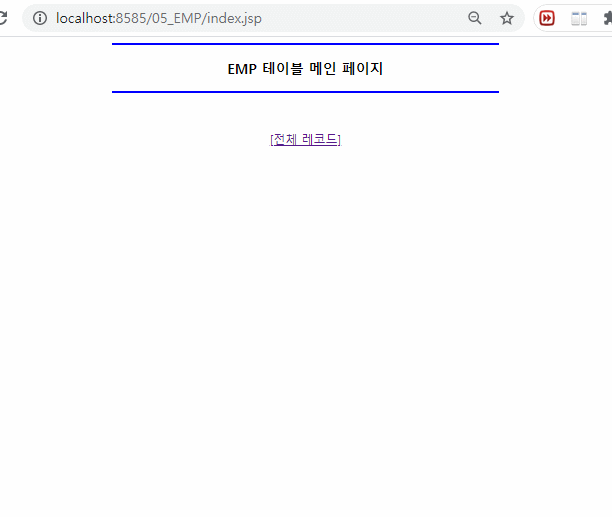
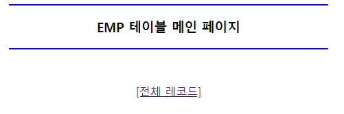
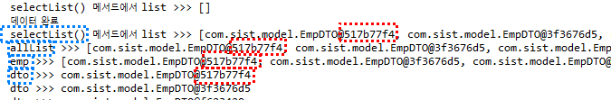
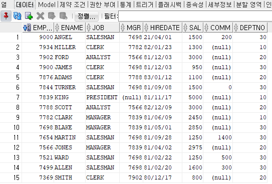
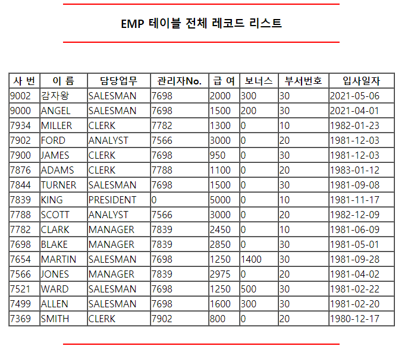
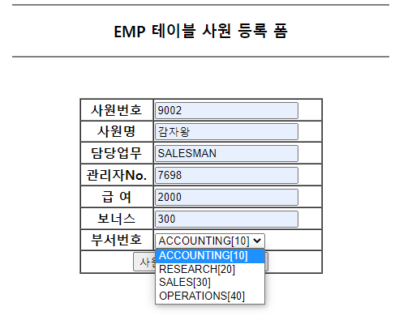
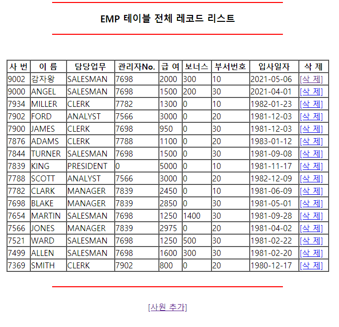
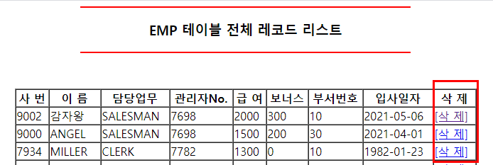
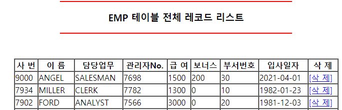

# JSP와 DB 연동

<p align="center"></p>

# 1. DB의 emp테이블을 웹 페이지에 출력하기
1. EmpDTO : DB emp테이블과 동일한 변수를 생성.
2. EmpDAO : DB 접속(연동) 객체 클래스. selectList() 메서드 포함.
3. index.jsp : 기본적인 화면을 구성.
	- [전체 레코드] 클릭시 select 서블릿으로 이동.
4. select 서블릿 
	- empDAO의 생성자 호출 → DB 연결.
	- empDAO의 selectList() 메서드 호출 → DB emp 테이블의 데이터를 EmpDTO 클래스에 저장(list).
	- 저장된 데이터(list)를 키값과 함께 select.jsp 로 페이지 이동.
5. select.jsp
	- 저장된 데이터(list)를 키 값을 통해 넘겨 받아 웹 페이지에 출력.


## EmpDTO.java
* DTO(Data Transfer Object) : 데이터 전송 객체
	- 기본적으로 DB 상의 테이블의 컬럼과 동일하게 멤버변수 구성.

- private로 변수를 선언하고, getter와 setter를 통해 접근하도록 한다.

```java
public class EmpDTO {
	
	private int empno;			// 사원 번호
	private String ename;			// 사원 이름
	private String job;			// 담당 업무
	private int mgr;			// 관리자 사원번호 
	private String hiredate;		// 입사 일자
	private int sal;			// 사원 급여
	private int comm;			// 사원 보너스
	private int deptno;			// 사원 부서번호
	
	public int getEmpno() {
		return empno;
	}
	public void setEmpno(int empno) {
		this.empno = empno;
	}
	public String getEname() {
		return ename;
	}
	public void setEname(String ename) {
		this.ename = ename;
	}
	public String getJob() {
		return job;
	}
	public void setJob(String job) {
		this.job = job;
	}
	public int getMgr() {
		return mgr;
	}
	public void setMgr(int mgr) {
		this.mgr = mgr;
	}
	public String getHiredate() {
		return hiredate;
	}
	public void setHiredate(String hiredate) {
		this.hiredate = hiredate;
	}
	public int getSal() {
		return sal;
	}
	public void setSal(int sal) {
		this.sal = sal;
	}
	public int getComm() {
		return comm;
	}
	public void setComm(int comm) {
		this.comm = comm;
	}
	public int getDeptno() {
		return deptno;
	}
	public void setDeptno(int deptno) {
		this.deptno = deptno;
	}
	
}
```


## index.jsp
- 기본 화면 설정
- [전체 레코드] 클릭시 `/select` 를 통해 select 서블릿으로 이동한다.
- `href="<%=request.getContextPath() %>/select"` = "현재 프로젝트명/select" 를 주소값으로 설정하는 것과 같다.
	* 예) 현재 주소 : http://localhost:8080/example/test.jsp 
	* 예) `"<%=request.getContextPath() %>/select"` = http://localhost:8080/example/select
	* `select.jsp`와 같이 확장자명이 붙지 않으면 서블릿으로 이해한다.	

```jsp
<body>

	<div align="center">
		<hr width="50%" color="blue">
			<h3>EMP 테이블 메인 페이지</h3>
		<hr width="50%" color="blue">
		<br><br>
		
		<a href="<%=request.getContextPath() %>/select">[전체 레코드]</a>
	</div>

</body>
```
* `request.getContextPath()` : 현재 프로젝트명을 반환하는 메서드.


<p align="center"></p>


## select 서블릿 
- service 메소드만 체크하여 서블릿을 생성하였다.


```java
@WebServlet("/select")
public class SelectServlet extends HttpServlet {
	private static final long serialVersionUID = 1L;
       
    
	public SelectServlet() {
		super();
    	}

	protected void service(HttpServletRequest request, HttpServletResponse response) throws ServletException, IOException {

		// DB에 접속을 해서 EMP 테이블의 전체 리스트를 가져오는 작업(비지니스 로직)
		// 가져온 전체 리스트를 View page로 넘겨주는 작업
		// EmpDAO 객체의 `dao` 라는 참조변수를 생성하여 `selectList()` 메서드를 호출한다.
		EmpDAO dao = new EmpDAO();
		
		// DB EMP 테이블에서 전체 리스트를 조회하는 작업
		// `selectList()` 메서드 호출 결과 `list`의 주소값이 `allList`에 저장된다.
		// 이 때, `dao.selectList()`로 리턴되는 값이 `List<EmpDTO>` 형태이므로 동일하게 지정한다.		
		List<EmpDTO> allList = dao.selectList();
		
		// call by reference로 호출되는 형태를 확인하기 위해 주소값을 출력해본다.
		System.out.println("allList >>> " + allList);
		
		// 페이지 이동 시 데이터를 같이 이동시키자.
		// `allList`를 `request.setAttribute()`를 활용하여 `"List"`라는 키에 저장한다.
		request.setAttribute("List", allList);
		
		// 페이지 이동
		// 저장한 키&데이터와 함께 `select.jsp`로 페이지 이동한다.
		RequestDispatcher rd = request.getRequestDispatcher("select.jsp");
		rd.forward(request, response);	// 실질적으로 페이지 이동				
	}
}
```


## EmpDAO.java
* DAO(Data Access Object) : 데이터 접근 객체 ==> DB에 접속(연동)하는 객체.
	- DAO란 데이터베이스에 접속해서 데이터 추가, 수정, 삭제, 조회 등의 작업을 수행하는 클래스.
	- 일반적으로 JSP 또는 Servlet에서 위의 작업들을 같이 사용할 수 있지만 유지보수, 코드의 모듈화를 위해서 DAO 클래스를 따로 만들어서 사용한다.


```java
public class EmpDAO {
	
	Connection con = null;				// DB와 연결하는 객체
	PreparedStatement pstmt = null; 		// DB에 SQL문을 전송하는 객체
	ResultSet rs = null;				// SQL문을 실행 후 결과값을 가지고 있는 객체
	String sql = null;				// 쿼리문을 저장할 객체
	
	// 기본 생성자를 통해 오라클DB와 연결한다.
	public EmpDAO() {	// 기본 생성자
		
		String driver = "oracle.jdbc.driver.OracleDriver";
		String url = "jdbc:oracle:thin:@localhost:1521:XE";
		String user = "web";
		String password = "1234";
		
		try {
			// 1단계 : 오라클 드라이버 로딩
			Class.forName(driver);
			
			// 2단계 : DB(오라클)와 연결
			con = DriverManager.getConnection(url, user, password);			
			
		} catch (Exception e) {
			e.printStackTrace();
		}
	} // 기본 생성자 end

	// DB EMP 테이블에서 전체 리스트를 조회하는 메서드
	public List<EmpDTO> selectList() {
	
		// 부모 객체를 활용하여 자식 객체를 생성한다.(다형성) 
		List<EmpDTO> list = new ArrayList<EmpDTO>();	
		
		// call by reference로 호출되는 형태를 확인하기 위해 주소값을 출력해본다.
		System.out.println("selectList() 메서드에서 list >>> " + list);		
					
		try {
			// empno를 기준으로 하여 내림차순으로 emp 목록을 전체 출력하는 sql문을 작성한다.
			sql = "select * from emp order by empno desc";
			pstmt = con.prepareStatement(sql);
			rs = pstmt.executeQuery();
			
			while(rs.next()) {
			
				// dto 참조변수를 만들어 db의 데이터를 EmpDTO에 저장한다.
				EmpDTO dto = new EmpDTO();
				
				dto.setEmpno(rs.getInt("empno"));
				dto.setEname(rs.getString("ename"));
				dto.setJob(rs.getString("job"));
				dto.setMgr(rs.getInt("mgr"));
				dto.setHiredate(rs.getString("hiredate"));
				dto.setSal(rs.getInt("sal"));
				dto.setComm(rs.getInt("comm"));
				dto.setDeptno(rs.getInt("deptno"));
				
				// list에 dto의 주소값을 저장한다.
				list.add(dto);
			}
			
			// open 객체 닫기
			rs.close(); pstmt.close(); con.close();	
			
		} catch (Exception e) {
			e.printStackTrace();
		}
		System.out.println("데이터  완료");
		
		// call by reference로 호출되는 형태를 확인하기 위해 주소값을 출력해본다.
		System.out.println("selectList() 메서드에서 list >>> " + list);
		
		// list를 호출한 곳으로 반환한다. 
		return list;		
	} // selectList() 메서드 end	
}
```


## select.jsp
- EmpDAO의 list의 주소값  
	= select 서블릿의 allList의 주소값  
	= select.jsp의 emp의 주소값  
	= select.jsp body태그 내 dto의 주소값 
- 참조변수를 활용하여 주소값을 넘겨주었으므로 모두 같은 주소값을 공유한다.
- 따라서 하나의 데이터가 변경되어도 모든 데이터가 동일하게 변경된다.


각각의 주소값을 출력했을 때 아래와 같이 출력된다.  
길어서 생략했지만 동일한 주소값이 반복되어 출력됨을 알 수 있다.  
<p align="center"></p>


```jsp
<%
	// select 서블릿에서 보낸 allList의 주소값를 List를 키값으로 하여 emp로 저장한다.
	// allList에는 EmpDAO의 list의 주소값이 저장되어있으므로, 
	// EmpDAO의 list의 주소값을 emp에 저장하는 것과 같다.
	List<EmpDTO> emp = (List<EmpDTO>) request.getAttribute("List");
	
	// call by reference로 호출되는 형태를 확인하기 위해 주소값을 출력해본다.
	System.out.println("emp >>> " + emp);
%>
<!DOCTYPE html>
<html>
<head>
<meta charset="UTF-8">
<title>Insert title here</title>
</head>
<body>

	<div align="center">
		<hr width="50%" color="red">
		<h3>EMP 테이블 전체 레코드 리스트</h3>
		<hr width="50%" color="red">
		<br> <br>

		<table border="1" cellspacing="0" width="650">
			<tr>
				<th>사  번</th> <th>이  름</th> <th> 담당업무</th> <th>관리자No.</th>
				<th>급  여</th> <th>보너스</th> <th>부서번호</th> <th>입사일자</th>				
			</tr>
			<%
				if(emp.size() != 0) {	// 데이터가 있는 경우
					// 데이터 수만큼 반복해서 출력
					for(int i=0; i<emp.size(); i++) {
						// dto 참조변수에 emp 각각의 주소값 저장
						EmpDTO dto = emp.get(i);
						
						// call by reference로 호출되는 형태를 확인하기 위해 주소값을 출력해본다.
						System.out.println("dto >>> " + dto);
			%>
					
			<tr>
				<%-- dto에 저장된 주소값을 통하여 데이터 호출 --%>
				<td><%=dto.getEmpno() %></td>
				<td><%=dto.getEname() %></td>
				<td><%=dto.getJob() %></td>
				<td><%=dto.getMgr() %></td>
				<td><%=dto.getSal() %></td>
				<td><%=dto.getComm() %></td>
				<td><%=dto.getDeptno() %></td>
				<td><%=dto.getHiredate().substring(0, 10) %></td>
			</tr>
	
			<% } // for문 end
				}else { // 데이터가 없는 경우				
			%>
			<tr>
				<td colspan="8 align="center">
					<h3>검색된 레코드가 없습니다.</h3>
				</td>
			</tr>
			<%}%>
		</table>
	</div>

</body>
</html>
```


DB의 emp 테이블  
<p align="center"></p>
JSP로 연동하여 웹 페이지로 출력한 emp 테이블  
<p align="center"></p>
	
	

# 2. DB의 emp테이블에 새로운 레코드 추가하기
1. EmpDTO 클래스 : DB emp 테이블과 동일한 변수 생성.
2. deptDTO 클래스 : DB dept 테이블과 동일한 변수 생성.
3. EmpDAO 클래스 : DB 접속(연동) 객체 클래스. selectList() insertEmp() 메서드 포함.
4. index.jsp : 기본적인 화면을 구성.
	- [전체 레코드] 클릭시 select 서블릿으로 이동.
5. select 서블릿 
	- empDAO의 생성자 호출 → DB 연결.
	- empDAO의 selectList() 메서드 호출 → DB emp 테이블의 데이터를 EmpDTO 클래스에 저장(list).
	- 저장된 데이터(list)를 키값과 함께 select.jsp 로 페이지 이동.
6. select.jsp
	- 저장된 데이터(list)를 키 값을 통해 넘겨 받아 웹 페이지에 출력. 
	- [사원 추가] 클릭 시 insert 서블릿으로 이동.
7. insert 서블릿
	- empDAO의 생성자 호출 → DB 연결.
	- empDAO의 insertEmp() 메서드 호출 → DB emp 테이블에 데이터를 추가한 후 empDTO 클래스에 저장(list).
	- 저장된 데이터(list)를 키 값과 함께 insertForm.jsp 로 페이지 이동.
8. insertForm.jsp
	- 저장된 데이터(list)를 키 값과 함께 넘겨 받아 저장.
	- 웹 페이지에서 데이터 입력 후 [사원 등록] 클릭 시 insertOK 서블릿으로 이동.
9. insertOK 서블릿
	- insertForm 에서 넘어 온 데이터를 DB에 저장.
	- DB에 데이터 추가 성공 시 select 서블릿을 호출하여 데이터가 추가된 테이블 조회.
	- DB에 데이터 추가 실패 시 실패 메시지 출력 후 이전 페이지로 이동.


## select.jsp
- [사원 추가] 를 누르면 insert 서블릿으로 이동한다.

```jsp
<a href="<%=request.getContextPath() %>/insert">[사원 추가]</a>
```


## InsertServlet 
- service 메서드로 서블릿을 생성하였다.
- EmpDAO의 deptList() 메서드를 호출하여 리턴값으로 list의 주소값을 받고 insertForm.jsp 로 페이지 이동한다.

```java
@WebServlet("/insert")
public class InsertServlet extends HttpServlet {
	private static final long serialVersionUID = 1L;       
    
	public InsertServlet() {
		super();	
	
	protected void service(HttpServletRequest request, HttpServletResponse response) throws ServletException, IOException {
		// 사원 추가폼으로 넘어가기 전에 관리자 리스트와 부서번호 리스트를 
		// DB에서 조회하여 사원 추가폼으로 데이터를 넘겨준다.
		EmpDAO dao = new EmpDAO();
		
		// 부서 테이블 전체 리스트 메서드 호출
		// EmpDAO의 deptList() 메서드를 호출하여 받은 리턴값(주소값)을 List 참조변수인 deptList에 저장한다.
		List<DeptDTO> deptList = dao.deptList();
		
		// 주소값을 "dept"라는 키와 함께 저장한다.
		request.setAttribute("dept", deptList);
		
		// 페이지 이동
		// 저장된 주소값을 키와 함께 insertForm.jsp 페이지로 이동한다.
		RequestDispatcher rd = request.getRequestDispatcher("insertForm.jsp");
		rd.forward(request, response);
		
	} // service 메서드 end
}
```


## EmpDAO.java
- deptList() 메서드에서 DB dept 테이블의 데이터를 DeptDTO에 저장한다.
- 저장된 주소값을 list로  InsertServlet 로 반환한다.

```java
// dept 테이블의 전체 리스트를 조회하는 메서드
public List<DeptDTO> deptList() {
	List<DeptDTO> deptList = new ArrayList<DeptDTO>();
			
	try {
		// dept 테이블을 deptno을 기준으로 내림차순으로 호출하는 sql문 작성
		sql = "select * from dept order by deptno";
		pstmt = con.prepareStatement(sql);		
		rs = pstmt.executeQuery();
			
		// 다음 커서에 데이터가 있는 동안 반복 while문
		while(rs.next()) {
		
			// DeptDTO 객체의 참조변수 dto 생성 
			DeptDTO dto = new DeptDTO();
				
			// 참조변수 dto의 주소값에 DB dept 테이블의 데이터를 각각 저장
			dto.setDeptno(rs.getInt("deptno"));
			dto.setDname(rs.getString("dname"));
			dto.setLoc(rs.getString("loc"));
				
			// deptList에 dto 변수 추가하여 주소값을 넘겨준다.
			deptList.add(dto);				
		}
			
	// open 객체 닫기
	rs.close(); pstmt.close(); con.close();
	} catch (Exception e) {
		e.printStackTrace();
	}
		
	// deptList의 주소값을 메서드를 호출한 곳(InsertServlet)으로 리턴한다.
	return deptList;
} // deptList() 메서드 end
```


## insertForm.jsp
- InsertServlet 에서 "dept"를 키로 하여 list의 주소값을 넘겨 받아 dept에 저장한다.
- dept는 select 태그에서 선택목록으로 구현한다.
- 웹 페이지에서 dept를 포함하여 데이터를 입력 후 [사원등록]을 하면 insertOK 서블릿으로 이동한다.


```jsp
<%
	// InsertServlet 에서 "dept"를 키로 하여 list의 주소값을 넘겨 받는다.
	// 원래 Object 타입으로 받으므로 형변환
	List<DeptDTO> dept = (List<DeptDTO>) request.getAttribute("dept");
%>
<!DOCTYPE html>
<html>
<head>
<meta charset="UTF-8">
<title>Insert title here</title>
</head>
<body>

	<div align="center">
		<hr width="50%" color="gray">
		<h3>EMP 테이블 사원 등록 폼</h3>
		<hr width="50%" color="gray">
		<br> <br>

		<%-- 웹 페이지에서 데이터를 입력한 후 사원등록을 하면 insertOK 서블릿으로 이동 --%>
		<form method="post" action="<%=request.getContextPath()%>/insertOK">
			<table border="1" cellspacing="0" width="300">
				<tr>
					<th>사원번호</th>
					<td><input type="text" name="num"></td>
				</tr>
				<tr>
					<th>사원명</th>
					<td><input type="text" name="name"></td>
				</tr>
				<tr>
					<th>담당업무</th>
					<td><input type="text" name="job"></td>
				</tr>
				<tr>
					<th>관리자No.</th>
					<td><input type="text" name="mgr"></td>
				</tr>
				<tr>
					<th>급 여</th>
					<td><input type="text" name="sal"></td>
				</tr>
				<tr>
					<th>보너스</th>
					<td><input type="text" name="comm"></td>
				</tr>
				<tr>
					<th>부서번호</th>
					<td><select name="deptno">
							<%
								if (dept.size() == 0) { // 데이터가 없는 경우
							%>
							<option value="">::: 부서번호 없음 :::</option>
							<%
								} else { // 데이터가 있는 경우
									for (int i = 0; i < dept.size(); i++) {
										DeptDTO dto = dept.get(i);
							%>
							<option value="<%=dto.getDeptno()%>">
								<%=dto.getDname()%>[<%=dto.getDeptno()%>]
							</option>
							<%
									}
								}
							%>
					</select></td>
				</tr>

				<tr>
					<td colspan="2" align="center">
					<input type="submit" value="사원등록"> 
						&nbsp;&nbsp;&nbsp; 
					<input type="reset" value="다시작성">
					</td>
				</tr>
			</table>
		</form>
	</div>

</body>
</html>
```


## insertOK 서블릿
- insertForm 에서 넘어 온 데이터를 DB에 저장.
- DB에 데이터 추가 성공 시 select 서블릿을 호출하여 데이터가 추가된 테이블 조회.
- DB에 데이터 추가 실패 시 실패 메시지 출력 후 이전 페이지로 이동.


```java
@WebServlet("/insertOK")
public class InsertOKServlet extends HttpServlet {
	private static final long serialVersionUID = 1L;
       
	    public InsertOKServlet() {
		super();
	    }

	protected void service(HttpServletRequest request, HttpServletResponse response) throws ServletException, IOException {
		// 사원등록 폼 페이지에서 넘어온 데이터를 DB에 저장하는 작업
		// 1. 한글 인코딩 작업
		request.setCharacterEncoding("UTF-8");
		
		// 2. 사원등록 폼에서 넘어온 데이터들을 받아야 한다.
		int empno = Integer.parseInt(request.getParameter("num").trim());
		String ename = request.getParameter("name").trim();
		String job = request.getParameter("job").trim();
		int mgr = Integer.parseInt(request.getParameter("mgr").trim());
		int sal = Integer.parseInt(request.getParameter("sal").trim());
		int comm = Integer.parseInt(request.getParameter("comm").trim());
		int deptno = Integer.parseInt(request.getParameter("deptno"));
		
		EmpDTO dto = new EmpDTO();
		dto.setEmpno(empno);
		dto.setEname(ename);
		dto.setJob(job);
		dto.setMgr(mgr);
		dto.setSal(sal);
		dto.setComm(comm);
		dto.setDeptno(deptno);
		
		EmpDAO dao = new EmpDAO();
		
		// EmpDAO의 insertEmp() 메서드를 호출하여 res 변수에 저장
		int res = dao.insertEmp(dto);
		
		response.setContentType("text/html; charset=UTF-8");
		
		PrintWriter out = response.getWriter();
		
		if(res > 0) { // 사원 추가가 성공한 경우
			// select 서블릿 호출
			response.sendRedirect("select");
		}else {	// 사원 추가가 실패한 경우
			out.println("<script>");
			out.println("alert('사원 추가 실패!')");
			out.println("history.back()");	// 이전 페이지로 이동하라는 명령어.
			out.println("</script>");
		} // if문 end	
	} // service문 end
}
```


## EmpDAO의 insertEmp() 메서드

```java
// EMP 테이블에 사원을 등록(추가)하는 메서드
public int insertEmp(EmpDTO dto) {
	// 메서드 결과를 저장할 변수 선언
	int result = 0;				
		
	try {
		// emp 테이블의 속성 순서대로 레코드를 삽입하는 sql문 작성
		sql = "insert into emp values(?, ?, ?, ?, sysdate, ?, ?, ?)";
		
		// sql문을 DB에 연결
		pstmt = con.prepareStatement(sql);
		
		// sql문의 ? 순서대로 웹 페이지에 입력된 데이터 저장
		pstmt.setInt(1, dto.getEmpno());
		pstmt.setString(2, dto.getEname());
		pstmt.setString(3, dto.getJob());
		pstmt.setInt(4, dto.getMgr());
		pstmt.setInt(5, dto.getSal());
		pstmt.setInt(6, dto.getComm());
		pstmt.setInt(7, dto.getDeptno());
			
		result = pstmt.executeUpdate();
			
		// open 객체 닫기
		pstmt.close(); con.close();
			
	} catch (Exception e) {
		e.printStackTrace();
	}
	
	return result;
} // insertEmp() 메서드 end
```


<p align="center"></p>
<p align="center"></p>	


# 3. DB의 emp테이블에서 레코드 삭제하기
1. EmpDTO 클래스 : DB emp 테이블과 동일한 변수 생성.
2. deptDTO 클래스 : DB dept 테이블과 동일한 변수 생성.
3. EmpDAO 클래스 : DB 접속(연동) 객체 클래스. selectList() insertEmp() deleteEmp() 메서드 포함.
4. index.jsp : 기본적인 화면을 구성.
	- [전체 레코드] 클릭시 select 서블릿으로 이동.
5. select 서블릿 
	- empDAO의 생성자 호출 → DB 연결.
	- empDAO의 selectList() 메서드 호출 → DB emp 테이블의 데이터를 EmpDTO 클래스에 저장(list).
	- 저장된 데이터(list)를 키값과 함께 select.jsp 로 페이지 이동.
6. select.jsp
	- 저장된 데이터(list)를 키 값을 통해 넘겨 받아 웹 페이지에 출력. 
	- [삭 제] 클릭 시 delete 서블릿으로 이동.
7. delete 서블릿
	- select.jsp 에서 삭제하기로 선택된 사번(empno)의 데이터를 넘겨 받는다.
	- empDAO의 생성자 호출 → DB 연결.
	- empDAO의 deleteEmp() 메서드 호출 → DB emp 테이블에 선택된 사번(empno)의 전체 레코드 삭제.
	- DB의 레코드 삭제 성공 시 elect 서블릿을 호출하여 데이터가 삭제된 테이블 조회.
	- DB의 레코드 삭제 실패 시 실패 메시지 출력 후 이전 페이지로 이동.


## select.jsp
- [삭 제] 클릭 시 delete 서블릿으로 이동.

```jsp
<body>

	<div align="center">
		<hr width="50%" color="red">
		<h3>EMP 테이블 전체 레코드 리스트</h3>
		<hr width="50%" color="red">
		<br> <br>

		<table border="1" cellspacing="0" width="650">
			<tr>
				<th>사  번</th> <th>이  름</th> <th> 담당업무</th> <th>관리자No.</th> 
				<th>급  여</th> <th>보너스</th> <th>부서번호</th> <th>입사일자</th>
				<th>삭 제</th>
			</tr>
			<%
				if(emp.size() != 0) {	// 데이터가 있다면
					// 데이터 수만큼 반복해서 출력
					for(int i=0; i<emp.size(); i++) {
						EmpDTO dto = emp.get(i);
						System.out.println("dto >>> " + dto);
					%>
					
					<tr>
						<td><%=dto.getEmpno() %></td>
						<td><%=dto.getEname() %></td>
						<td><%=dto.getJob() %></td>
						<td><%=dto.getMgr() %></td>
						<td><%=dto.getSal() %></td>
						<td><%=dto.getComm() %></td>
						<td><%=dto.getDeptno() %></td>
						<td><%=dto.getHiredate().substring(0, 10) %></td>
						<td>
							<%-- ? : get 방식 --%>
							<%-- /delete?no=<%=dto.getEmpno()%> : 해당 레코드의 사번(empno)의 delete 서블릿 실행 --%>
							<%-- 사번(empno)의 값을 get 방식으로 delete 서블릿으로 넘겨준다. --%>
							<%-- 이 때 no가 변수가 되므로, delete 서블릿에서 no 변수를 받으면 된다. --%>
							<a href="<%=request.getContextPath() %>/delete?no=<%=dto.getEmpno()%>">[삭 제]</a>
						</td>
					</tr>
	
					<% } // for문 end
				}else {
					// 데이터가 없는 경우
					%>
					<tr>
						<td colspan="9" align="center">
							<h3>검색된 레코드가 없습니다.</h3>
						</td>
					</tr>
				<%}%>
			</table>
			<br>
			<hr width="50%" color="red">
			<br>
			<a href="<%=request.getContextPath() %>/insert">[사원 추가]</a>
	</div>

</body>
```


## delete 서블릿
- select.jsp 에서 삭제하기로 선택된 사번(empno)의 데이터를 넘겨 받는다.
- empDAO의 생성자 호출 → DB 연결.
- empDAO의 deleteEmp() 메서드 호출 → DB emp 테이블에 선택된 사번(empno)의 전체 레코드 삭제.
- DB의 레코드 삭제 성공 시 elect 서블릿을 호출하여 데이터가 삭제된 테이블 조회.
- DB의 레코드 삭제 실패 시 실패 메시지 출력 후 이전 페이지로 이동.


```java
@WebServlet("/delete")
public class DeleteServlet extends HttpServlet {
	private static final long serialVersionUID = 1L;
       
    public DeleteServlet() {
        super();
    }

	protected void service(HttpServletRequest request, HttpServletResponse response) throws ServletException, IOException {
		// [삭 제]라는 글자 클릭 시 사원번호를 가져와 DB에서 
		// 사원번호에 해당하는 사원정보를 삭제하는 작업.
		
		// select.jsp에서 get방식으로 넘겨받은 no변수를 empno 변수에 저장한다.
		int empno = Integer.parseInt(request.getParameter("no"));
		
		EmpDAO dao = new EmpDAO();
		int res = dao.deleteEmp(empno);
		
		response.setContentType("text/html; charset=UTF-8");
		PrintWriter out = response.getWriter();
		
		if(res > 0) { // 사원 삭제가 성공한 경우
			response.sendRedirect("select");
		}else { // 사원 삭제가 실패한 경우
			out.println("<script>");
			out.println("alert('사원 삭제 실패!')");
			out.println("history.back()");
			out.println("</script>");
		} // if문 end
	} // service문 end
}
```


## EmpDAO의 deleteEmp() 메서드
- EMP 테이블에서 사원번호에 해당하는 사원을 삭제하는 메서드

```java
public int deleteEmp(int empno) {
	int result = 0;	
		
		try {
			sql = "delete from emp where empno = ?";
			pstmt = con.prepareStatement(sql);
			
			pstmt.setInt(1, empno);
			
			result = pstmt.executeUpdate();
			
			// open 객체 닫기
			pstmt.close(); con.close();
		} catch (SQLException e) {
			// TODO Auto-generated catch block
			e.printStackTrace();
		}
		
	return result;
} // deleteEmp() 메서드 end
```


<p align="center"></p>
<p align="center"></p>
