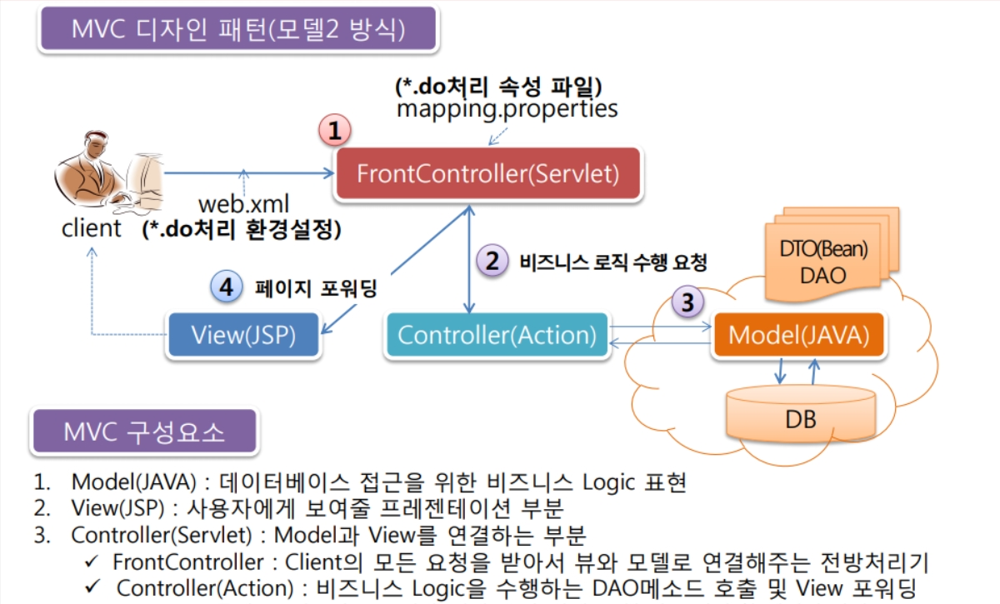
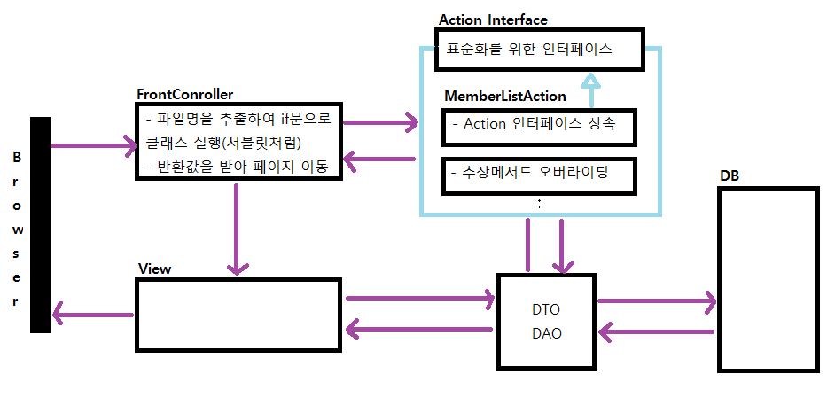

# MVC2 패턴

<p align="center"></p>

## 서블릿 매핑(n:1)
모든 서블릿을 FrontController 하나로 통합한 것과 동일한 형태를 띤다.

1. xml 파일 소스에 서블릿을 매핑(n:1)한다.

```xml
<servlet>
	<servlet-name>FrontController</servlet-name>
	<servlet-class>com.member.controller.FrontController</servlet-class>
</servlet>
  
  <!-- .do 라는 경로는 모두 FrontController 라는 서블릿으로 이동 시켜라. -->
<servlet-mapping>

	<!-- 서블릿 이름은 위에서 작성한 것과 동일해야 한다. -->
	<servlet-name>FrontController</servlet-name>
	<url-pattern>*.do</url-pattern>
</servlet-mapping>
```


2. web.xml 파일에 작성한 패키지 아래 FrontController 클래스를 생성한다.
3. 서블릿 파일과 동일하게 형식을 구성한다.

```java
public class FrontController extends HttpServlet {
	
	private static final long serialVersionUID = 1L;

	protected void service(HttpServletRequest request, HttpServletResponse response) {
		
	}
}
```


4. service 메서드 안에서 한글 인코딩 처리를 한다.

```java
request.setCharacterEncoding("UTF-8");
response.setContentType("text/html; charset=UTF-8");
```


5. 파일명을 받아온다.

```java
// getRequestURI() : "/프로젝트명/파일명(*.do)" 라는 문자열을 반환하는 메서드.
String uri = request.getRequestURI();
System.out.println("uri >>> " + uri);		// uri >>> /11_Member_MVC2/select.do
		
// getContextPath() : 현재 프로젝트명을 문자열로 반환하는 메서드.
String path = request.getContextPath();
System.out.println("path >>> " + path);		// path >>> /11_Member_MVC2
		
String command = uri.substring(path.length() + 1);
ystem.out.println("command >>> " + command); // command >>> select.do
```


6. src 패키지 com.member.action 패키지를 생성하고 그 아래 Action.java 라는 인터페이스를 생성한다.

```java
package com.member.action;

import javax.servlet.http.HttpServletRequest;
import javax.servlet.http.HttpServletResponse;

public interface Action {

	// 추상메서드
	 public String execute(HttpServletRequest request, HttpServletResponse response);
}
```


7. com.member.action 패키지 아래 MemberListAction.java 라는 클래스를 생성한다. Action 인터페이스를 상속받는다.

```java
public class MemberListAction implements Action {
 
	@Override
	public String execute(HttpServletRequest request, HttpServletResponse response) {
		// member 테이블에서 회원 전체 리스트를 조회하여 view page로 이동시키는 작업
		MemberDAO dao = MemberDAO.getInstance();
		dao.getMemberList();
		
		return null;
	}
}
```


8. memberDAO 에서 DB 커넥션풀을 작성하고  MemberListAction.java에서 선언한 getMemberList() 메서드를 생성한다.

9. MemberListAction.java 클래스 반환값을 FrontController에서 받아서 페이지 이동 처리한다.

```java
Action action = null;
		
if(command.equals("select.do")) {
	// 비즈니스 로직만 실행
	// MemberListAction 클래스에서 서블릿 역할
	action = new MemberListAction();
	String path1 = action.execute(request, response);
			
	RequestDispatcher rd = request.getRequestDispatcher(path1);
	rd.forward(request, response);
}
```


--------------------------------------------------------
# 전체 코드

<p align="center"></p>

## 0. index.jsp
```jsp
<body>

	<div align="center">
		<hr width="50%" color="blue">
			<h3>MEMBER10 테이블 메인 페이지</h3>
		<hr width="50%" color="blue">
		<br><br>
		
		<a href="<%=request.getContextPath() %>/select.do">[전체 회원 목록]</a>
	</div>

</body>
```


## 1. web.xml

```xml
<?xml version="1.0" encoding="UTF-8"?>
<web-app xmlns:xsi="http://www.w3.org/2001/XMLSchema-instance" xmlns="http://xmlns.jcp.org/xml/ns/javaee" xsi:schemaLocation="http://xmlns.jcp.org/xml/ns/javaee http://xmlns.jcp.org/xml/ns/javaee/web-app_4_0.xsd" id="WebApp_ID" version="4.0">
  <display-name>11_Member_MVC2</display-name>
  <welcome-file-list>
    <welcome-file>index.html</welcome-file>
    <welcome-file>index.htm</welcome-file>
    <welcome-file>index.jsp</welcome-file>
    <welcome-file>default.html</welcome-file>
    <welcome-file>default.htm</welcome-file>
    <welcome-file>default.jsp</welcome-file>
  </welcome-file-list>
  
  <!-- 서블릿 매핑(n:1) -->
  <servlet>
  	<servlet-name>FrontController</servlet-name>
  	<servlet-class>com.member.controller.FrontController</servlet-class>
  </servlet>
  
  <servlet-mapping>
  	<servlet-name>FrontController</servlet-name>
  	<url-pattern>*.do</url-pattern>
  </servlet-mapping>

</web-app>
```


## 2. FrontController.java

```java
package com.member.controller;

import java.io.IOException;

import javax.servlet.RequestDispatcher;
import javax.servlet.ServletException;
import javax.servlet.http.HttpServlet;
import javax.servlet.http.HttpServletRequest;
import javax.servlet.http.HttpServletResponse;

import com.member.action.*;

public class FrontController extends HttpServlet {
	
	private static final long serialVersionUID = 1L;

	protected void service(HttpServletRequest request, HttpServletResponse response) throws ServletException, IOException {
		// 한글 인코딩 처리
		request.setCharacterEncoding("UTF-8");
		response.setContentType("text/html; charset=UTF-8");
		
		// getRequestURI() : "/프로젝트명/파일명(*.do)" 라는 문자열을 반환하는 메서드.
		String uri = request.getRequestURI();
		System.out.println("uri >>> " + uri);
		
		// getContextPath() : 현재 프로젝트명을 문자열로 반환하는 메서드.
		String path = request.getContextPath();
		System.out.println("path >>> " + path);
		
		String command = uri.substring(path.length() + 1);
		System.out.println("command >>> " + command);
		
		Action action = null;
		
		if(command.equals("select.do")) {
			// 비즈니스 로직만 실행
			// MemberListAction 클래스에서 서블릿 역할
			action = new MemberListAction();
			String path1 = action.execute(request, response);
			
			RequestDispatcher rd = request.getRequestDispatcher(path1);
			rd.forward(request, response);
		}
	}
}
```


## 3. Action.java

```java
package com.member.action;

import javax.servlet.http.HttpServletRequest;
import javax.servlet.http.HttpServletResponse;

public interface Action {

	// 추상메서드
	 public String execute(HttpServletRequest request, HttpServletResponse response);
}
```


## 4. MemberListAction.java
```java
package com.member.action;

import java.util.List;

import javax.servlet.RequestDispatcher;
import javax.servlet.http.HttpServletRequest;
import javax.servlet.http.HttpServletResponse;

import com.member.model.MemberDAO;
import com.member.model.MemberDTO;

public class MemberListAction implements Action {
 
	@Override
	public String execute(HttpServletRequest request, HttpServletResponse response) {
		// member 테이블에서 회원 전체 리스트를 조회하여 view page로 이동시키는 작업
		MemberDAO dao = MemberDAO.getInstance();
		List<MemberDTO> memberList = dao.getMemberList();
		
		// DB에서 가져온 전체 회원 리스트를 view page로 이동시키자.
		request.setAttribute("List", memberList);
		
		return "view/member_list.jsp";
	}
}
```


## 5. MemberDAO

```java
package com.member.model;

import java.sql.Connection;
import java.sql.PreparedStatement;
import java.sql.ResultSet;
import java.sql.SQLException;
import java.util.ArrayList;
import java.util.List;

import javax.naming.Context;
import javax.naming.InitialContext;
import javax.sql.DataSource;

public class MemberDAO {

	Connection con = null;				// DB 연결하는 객체.
	PreparedStatement pstmt = null;		// DB에 SQL문을 전송하는 객체.
	ResultSet rs = null;				// SQL문을 실행 후 결과값을 가지고 있는 객체.
	
	String sql = null;					// 쿼리문을 저장할 객체.

	
	// public은 객체를 불러올 때마다 heap영역에 객체를 생성하게 되어 메모리 차지가 많음 => 메모리 낭비
	// private 접근지정자 => 싱글턴 방식으로 ProductDAO 객체를 만드는 방식
	// 1단계 : 싱글턴 방식으로 객체를 만들기 위해서는 우선적으로 기본생성자의 접근 제어자를
	//       private로 선언을 해줘야 함. (외부접근 x, 내부에서 객체를 만들어줘야함)
	
	// 2단계 : 정적 멤버로 선언을 해야 함. => static으로 선언을 해야한다는 의미.
	private static MemberDAO instance = null;
	
	// 3단계 : 외부에서 객체 생성을 하지 못하게 접근을 제어 - private 기본 생성자를 만듦.
	private MemberDAO() { }
	
	// 4단계 : 기본 생성자 대신에 싱글턴 객체를 return을 해주는 getInstance() 메서드를
	//       만들어서 여기에 접근하게 하는 방법. => 정적 인스턴스를 만들어서 가져다 씀
	public static MemberDAO getInstance() {	// 반환 타입이 MemberDAO
		if(instance == null) {
			instance = new MemberDAO();		// 객체생성(주소값 가지고있음) => method 영역에 생성
		}
		return instance;
	} // getInstance() 메서드 end
	
	
	// DB 연동하는 작업을 진행하는 메서드 - DBCP(Connection Pool) 방식으로 연결 진행
	public void openConn() {
		
		try {
			// 1단계 : JNDI 서버 객체 생성
			Context	ctx  = new InitialContext();	// Context(javax.lang)
			
			// 2단계 : lookup() 메서드를 이용하여 매칭되는 커넥션을 찾는다.
			DataSource ds = (DataSource)ctx.lookup("java:comp/env/jdbc/myoracle");	// DataSource(javax.sql) => object타입이라 형변환 필요
			
			// 3단계 : DataBase 객체를 이용하여 커넥션 객체를 하나 가져온다.
			con = ds.getConnection();
			
		} catch (Exception e) {
			// TODO Auto-generated catch block
			e.printStackTrace();
		} 
		
	} // openConn() 메서드 end
	
	public List<MemberDTO> getMemberList() {
		List<MemberDTO> list = new ArrayList<MemberDTO>();
		openConn();
		sql = "select * from member10 order by num desc";
		try {
			pstmt = con.prepareStatement(sql);
			rs = pstmt.executeQuery();
			
			while(rs.next()) {
				MemberDTO dto = new MemberDTO();
				
				dto.setNum(rs.getInt("num"));
				dto.setMemid(rs.getString("memid"));
				dto.setMemname(rs.getString("memname"));
				dto.setPwd(rs.getString("pwd"));
				dto.setAge(rs.getInt("age"));
				dto.setMileage(rs.getInt("mileage"));
				dto.setJob(rs.getString("job"));
				dto.setAddr(rs.getString("addr"));
				dto.setRegdate(rs.getString("regdate"));
				
				list.add(dto);
			}
			
			// open 객체 닫기
			rs.close(); pstmt.close(); con.close();
		} catch (SQLException e) {
			// TODO Auto-generated catch block
			e.printStackTrace();
		}
		
		return list;
		
	} // getMemberList() end	
}
```


## 6. MemberDTO

```java
package com.member.model;


// Member10 테이블의 컬럼과 동일하게 멤버변수 구성
public class MemberDTO {
	private int num;		// 회원 번호
	private String memid;	// 회원 아이디
	private String memname;	// 회원 이름
	private String pwd;		// 회원 비밀번호
	private int age;		// 회원 나이
	private int mileage;	// 회원 마일리지
	private String job;		// 회원 직업
	private String addr;	// 회원 주소
	private String regdate; // 회원 가입일
	
	public int getNum() {
		return num;
	}
	public void setNum(int num) {
		this.num = num;
	}
	public String getMemid() {
		return memid;
	}
	public void setMemid(String memid) {
		this.memid = memid;
	}
	public String getMemname() {
		return memname;
	}
	public void setMemname(String memname) {
		this.memname = memname;
	}
	public String getPwd() {
		return pwd;
	}
	public void setPwd(String pwd) {
		this.pwd = pwd;
	}
	public int getAge() {
		return age;
	}
	public void setAge(int age) {
		this.age = age;
	}
	public int getMileage() {
		return mileage;
	}
	public void setMileage(int mileage) {
		this.mileage = mileage;
	}
	public String getJob() {
		return job;
	}
	public void setJob(String job) {
		this.job = job;
	}
	public String getAddr() {
		return addr;
	}
	public void setAddr(String addr) {
		this.addr = addr;
	}
	public String getRegdate() {
		return regdate;
	}
	public void setRegdate(String regdate) {
		this.regdate = regdate;
	}	
}
```
