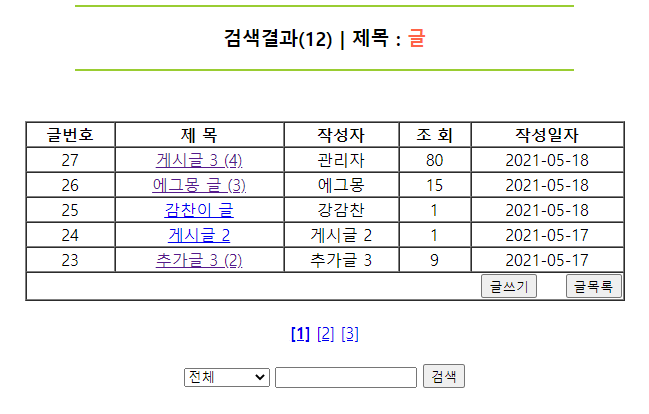

# 검색 결과창 하단에 이동할 페이지 넣기
 
<p align="center"></p>


어제는 게시글에 이동할 페이지를 넣어보았다.  
이번에는 검색 결과창 하단에 [1][2][3] ... 과 같이 클릭하면 해당 페이지로 넘어가는 페이징을 해 보자.  
기본적으로 게시글 페이징과 크게 다르지 않으므로 동일한 부분은 생략한다.  
변수와 메서드만 잘 설정해주면 된다.  


## 0. board_list.jsp : 검색창 생성하기
전체(제목+내용+작성자), 제목, 내용, 제목+내용, 작성자 5가지로 분류를 두어 검색창을 만들었다.  
select 태그에 name을 주고 option마다 value 값을 주면, submit 할 때 "name이 가진 값은 value" 와 같은 형태로 전송된다.  
입력된 값은 form 태그의 action에 따라 "프로젝트명/board_searh.do"로 함께 이동된다.


검색할 분류는 find_field, 검색할 내용은 find_text에 저장했다.  

```jsp
<form method="post" action="<%=request.getContextPath() %>/board_search.do">
	<select name="find_field">
		<option value="all">전체</option>
		<option value="title">제목</option>
		<option value="content">내용</option>
		<option value="title_content">제목+내용</option>
		<option value="writer">작성자</option>
	</select>
	<input type="text" name="find_text" size="15">
	<input type="submit" value="검색">
</form>
```


## 1. FrontController : 중간다리
경로를 "*.do"로 지정하였으므로, 지난번에 서블릿에 설정한 결과에 따라 중간 다리인 FrontController를 거친다.  
파일명이 "board_search.do"와 일치하므로 액션 클래스가 새롭게 생성되고, 클래스의 메서드가 실행된다.  
모든 과정이 끝나면 지정한 viewPage(view/board_search.jsp)로 자동으로 이동될 것이다.  

```java
if(command.equals("board_search.do")) {
	action = new BoardSearchAction();
	action.execute(request, response);
	viewPage = "view/board_search.jsp";
}
```


## 2. BoardSearchAction : 본격적인 검색 함수 & 페이징 작업
이 클래스에선 크게 두 가지 작업이 이루어진다.  
사실 두 작업이 번갈아 이루어지지만, 보기 편하게 둘로 나누어 정리해보려 한다.  

1. 검색 결과창에 반영될 페이징 밑작업하기
2. 페이지에 맞는 검색 결과 데이터를 DB에서 가져오기


### 2.1. 검색 결과창에 반영될 페이징 밑작업하기

1) 페이징 작업에 활용될 변수를 선언한다.

```java
int rowsize = 5; // 한 페이지당 보여질 게시물의 수
int block = 3; // 아래에 보여질 페이지의 최대 수 예) [1][2][3] / [4][5][6]
int totalRecord = 0;// DB상의 게시물 전체 수
int allPage = 0; // 전체 페이지 수
int page = 0; // 현재 페이지 변수

if (request.getParameter("page") != null) {
	page = Integer.parseInt(request.getParameter("page"));
} else {
	page = 1; // 처음으로 검색 결과가 생성된 경우
}
// 해당 페이지에서 시작 번호
int startNo = (page * rowsize) - (rowsize - 1);

// 해당 페이지에서 마지막 번호
int endNo = (page * rowsize);

// 해당 페이지의 시작 블럭
int startBlock = (((page - 1) / block) * block) + 1;

// 해당 페이지의 마지막 블럭
int endBlock = (((page - 1) / block) * block) + block;
```

2) DB상 검색 결과 전체 게시물 수를 확인한다.
BoardDao 객체의 메서드 getSearchListCount()를 호출하여 전체 게시물 수를 저장한다.  

```java
// 2) DB상 검색 결과 전체 게시물 수를 확인
int totalRecord = dao.getSearchListCount(find_field, find_text);
```

전체 게시물 수를 바탕으로 전체 페이지 수(블럭 수)를 구한다.
마지막 블럭 수가 허수로 존재할 경우를 대비하여 최대 전체 페이지 수까지 지정도 해둔다.    

```java
// Math.ceil() : 나머지가 있으면 무조건 올림하는 메서드
allPage = (int) (Math.ceil(totalRecord / (double) rowsize)); 

if (endBlock > allPage) { // 마지막 블럭 수를 최대 전체 페이지 수까지로 지정.
	endBlock = allPage;
}
```


### 2.2. 겸색 결과 데이터를 DB에서 가져오기
1) 데이터를 가져오기 전, 우선 넘어 온 파라미터 값들을 저장한다.

```java
// 1) 파라미터 저장
String find_field = request.getParameter("find_field");
String find_text = request.getParameter("find_text");
```


2) 검색결과에 해당하는 게시물을 DB에서 모두 가져온다.  
find_field, find_text, page, rowsize 4가지를 인수로 두어 검색 게시물 리스트를 DB에서 불러온다.  
네 가지 변수가 어떻게 활용되는 지는 아래에서 자세하게 설명할 것이다.  


보이는 페이지(page)에서 출력될 게시물의 수가 정해져 있으므로(rowsize),  
해당 범위에 맞는 검색 결과(find_field, find_text)를 가져오기 위한 것으로 우선 알아 두자.   

```java
// 2) DB에서 검색 결과 가져오기
int page = 0;

if (request.getParameter("page") != null) {
	page = Integer.parseInt(request.getParameter("page"));
} else {
	page = 1; // 처음으로 검색결과가 생성된 경우
}
		
int rowsize = 5;

List<BoardDTO> pageList = dao.getSearchBoardList(find_field, find_text, page, rowsize);
```


3) 작업한 값을 키로 저장해서 view page로 넘긴다.

페이징 작업 결과과 DB에서 넘어온 데이터를 모두 키로 저장한다.  

DB에서 데이터를 가져왔다고 find_field, find_text의 역할이 끝나지 않는다.  
view page에서 화면 출력하거나 페이지 이동시 쓰이므로 잊지 말고 반드시 Attribute에 저장하자.  


```java
3) 작업한 값을 키로 저장하기 
request.setAttribute("find_field", find_field);
request.setAttribute("find_text", find_text);

request.setAttribute("page", page);
request.setAttribute("rowsize", rowsize);
request.setAttribute("block", block);
request.setAttribute("totalRecord", totalRecord);
request.setAttribute("allPage", allPage);
request.setAttribute("startNo", startNo);
request.setAttribute("endNo", endNo);
request.setAttribute("startBlock", startBlock);
request.setAttribute("endBlock", endBlock);
request.setAttribute("List", pageList);
```


## BoardDAO : getSearchListCount()
분류한 5가지 중 하나만 대표로 가져왔다. 조건에 들어가는 문자열과 pstmt가 받는 개수만 달라질 뿐 방식은 동일하다.   
if문으로 분류의 종류를 확인하고 쿼리문을 작성하여 DB에서 검색된 게시글의 총 개수를 가져와 리턴한다.  

```java
public int getSearchListCount(String find_field, String find_text) {
	int count = 0;
	
	openConn();	// 싱글톤&커넥트풀 방식으로 DB에 연결
	
	if (find_field.equals("all")) {
		sql = "select count(*) from board where board_title like ? or board_cont like ? or board_writer like ?";

		try {
			pstmt = con.prepareStatement(sql);
			pstmt.setString(1, "%" + find_text + "%");
			pstmt.setString(2, "%" + find_text + "%");
			pstmt.setString(3, "%" + find_text + "%");

			rs = pstmt.executeQuery();

			if (rs.next()) {
				count = rs.getInt(1);
			}

			rs.close(); pstmt.close(); con.close();

		} catch (SQLException e) {
				// TODO Auto-generated catch block
				e.printStackTrace();
		}

		return count;
} 
```


## BoardDAO : getSearchBoardList()
page와 rowsize를 인수로 받아 해당 페이지에서의 시작 번호와 마지막 번호를 정한다.  
정해진 시작 번호부터 마지막 번호까지의 검색 내용만을 DB에서 가져와 list로 저장해 리턴한다.  
이 메서드가 한 번 실행될 때 리턴되는 게시글 수가 한 블록에서 출력되는 게시글 수가 된다.  


분류한 5가지 중 하나만 대표로 가져왔다. 조건에 들어가는 문자열과 pstmt가 받는 개수만 달라질 뿐 방식은 동일하다.   

```java
public List<BoardDTO> getSearchBoardList(String find_field, String find_text, int page, int rowsize) {
	List<BoardDTO> list = new ArrayList<BoardDTO>();

	// 해당 페이지에서 시작 번호
	int startNo = (page * rowsize) - (rowsize - 1);

	// 해당 페이지에서 마지막 번호
	int endNo = (page * rowsize);

	openConn();

	if (find_field.equals("all")) {
	sql = "select * from (select row_number() over(order by board_no desc) rnum, b.* from board b where board_title like ? or board_cont like ? or board_writer like ?) where rnum >= ? and rnum <= ?";
		
	try {
		pstmt = con.prepareStatement(sql);
				
		pstmt.setString(1, "%" + find_text + "%");
		pstmt.setString(2, "%" + find_text + "%");
		pstmt.setString(3, "%" + find_text + "%");
		pstmt.setInt(4, startNo);
		pstmt.setInt(5, endNo);

		rs = pstmt.executeQuery();

		while (rs.next()) {
			BoardDTO dto = new BoardDTO();
			dto.setBoard_no(rs.getInt("board_no"));
			dto.setBoard_writer(rs.getString("board_writer"));
			dto.setBoard_title(rs.getString("board_title"));
			dto.setBoard_cont(rs.getString("board_cont"));
			dto.setBoard_pwd(rs.getString("board_pwd"));
			dto.setBoard_hit(rs.getInt("board_hit"));
			dto.setBoard_regdate(rs.getString("board_regdate"));
			dto.setBoard_c_count(rs.getInt("board_c_count"));

			list.add(dto);
		}
		rs.close(); pstmt.close(); con.close();

		return list;
	} catch (SQLException e) {
		// TODO Auto-generated catch block
		e.printStackTrace();
}
```

두어번 정리하니 쿼리문이 정상 작동했다. 수업 때 보니 작성된 쿼리문과 동일하게 진행되어 내심 뿌듯했다.  
row_number()와 over()의 사용법을 어느 정도 파악했다.  
역시 자꾸 해봐야 는다.  


## board_search.jsp : 검색 결과가 출력되는 페이지
페이지에 데이터를 가져와 출력하는 것 자체는 게시판 작성과 동일하여 하단에 페이징 작업하는 부분만 들고 왔다.  
게시판 페이징과의 차이점은 클릭시 넘어가는 변수가 늘었다는 점이다.  
페이지 변수만으로 원하는 웹 페이지를 조회할 수 있었던 게시판과는 달리, 검색 결과창은 당연하게도 검색 분류(find_field)와 검색 내용(find_text)도 필요로 한다.  
따라서 page 변수와 함께 find_field, find_text 변수도 url로 작성하여 넘긴다.   


```jsp
<c:if test="${page > block }">
	<a href="board_search.do?page=1&find_field=${find_field }&find_text=${find_text }">[처음]</a>
	<a href="board_search.do?page=${startBlock - 1 }&find_field=${find_field }&find_text=${find_text }">◀</a>
</c:if>
		
<c:forEach begin="${startBlock }" end="${endBlock }" var="i">
	<c:if test="${i == page }">
		<b><a href="board_search.do?page=${i }&find_field=${find_field }&find_text=${find_text }">[${i }]</a></b>
	</c:if>
			
	<c:if test="${i != page }">
		<a href="board_search.do?page=${i }&find_field=${find_field }&find_text=${find_text }">[${i }]</a>
	</c:if>
</c:forEach>
		
<c:if test="${endBlock < allPage }">
	<a href="board_search.do?page=${endBlock + 1 }&find_field=${find_field }&find_text=${find_text }">▶</a>
	<a href="board_search.do?page=${allPage }&find_field=${find_field }&find_text=${find_text }">[마지막]</a>
</c:if>
```


하나 더 신경썼던 부분은 상단 출력문.  

<p align="center"></p>

선택한 검색 분류나 작성한 검색 내용에 따라 출력되는 문구가 달라진다.  
기초적인 코드지만 아직 EL코드가 익숙하지 않아 정상출력되는 것을 보니 무척 뿌듯했다.  


검색 결과 수는 페이징 작업 전의 게시판 검색 결과 수와 동일하게 작성했었는데(${list.size() }),  
페이징 처리 후에는 한 페이지에 담기는 게시물 수만 저장되다보니 totalRecord 변수를 가져오게 되었다.  
오히려 더 명쾌해졌다!  

```jsp
<hr width="50%" color="yellowgreen">
	<h3>검색결과(${totalRecord }) | 
			
		<c:if test="${find_field == 'all' }">
			<c:set var="field" value="전체"></c:set>
		</c:if>
		
		<c:if test="${find_field == 'title' }">
			<c:set var="field" value="제목"></c:set>
		</c:if>
				
		<c:if test="${find_field == 'content' }">
			<c:set var="field" value="내용"></c:set>
		</c:if>
		
		<c:if test="${find_field == 'title_content' }">
			<c:set var="field" value="제목+내용"></c:set>
		</c:if>
		
		<c:if test="${find_field == 'writer' }">
			<c:set var="field" value="작성자"></c:set>
		</c:if>
				
	${field } : <span style="color:tomato">${find_text }</span></h3>
<hr width="50%" color="yellowgreen">
```


