# 자바스크립트(JavaScript)?
- 자바스크립트는 HTML 페이지와 어울어져서 웹 페이지 내의 여러 가지 요소를 다이나믹하게 제어하는 기술.
- 자바스크립트는 개발자가 만든 문서에 방문자가 방문하여 어떤 동작을 취했을 때, 그 동작에 대응하여 반응이 일어날 수 있도록 해 주는 언어.
- 자바스크립트는 웹 브라우저에서 사용하기 위해서 만들어진 프로그래밍 언어. 이 언어는 90년대부터 주로 웹 브라우저 상에서  UI를 동적으로 보여주기 위해서 사용을 해 왔다.
- 기존에는 브라우저에서만 사용해 왔던 언어인데, 이제는 단순히 웹 페이지에서만 국한되지 않고 서버 쪽에서도 사용되는 언어로 발전되고 있다. 


* 서버 쪽 주요 언어: JSP, ASP, PHP, Spring 등등
* 클라이언트 측 주요 언어
	- HTML : 홈페이지를 구현하기 위한 뼈대가 되는 핵심적인 기술인 마크업 언어.
	- 자바스크립트 : 로컬 브라우저에서 실행되는 인터프리터 방식의 프로그래밍 언어.
	- CSS : HTML은 뼈대이고, 자바스크립트가 기능이라면, CSS는 꾸미기 위한 옷의 기능.
	- JQuery : 자바스크립트의 코드가 길어지면 사용이 복잡해지는 단점을 파격적으로 개선한 자바스크립트 기반의 라이브러리.
                              
                              
## 자바스크립트 언어의 특징
1. 자바스크립트는 인터프리터 언어이다.
	- 코드가 작성된 순서대로 윗줄부터 순차적으로 구문을 분석하여 실행을 한다.
 	-  코드에 문제가 생기면 에러가 발생한 행 이전까지만 구문을 분석하여 실행을 하고, 에러가 발생한 다음 줄 부터는 구문을 분석하지 않는다.
2. 자바스크립트는 클라이언트 스트립트 언어이다.
	- 자바스크립트는 서버에서 실행되는 것이 아니라, 사용자(방문자) 컴퓨터에서 실행이 된다. 따라서 서버의 부하를 줄여줄 수 있다.
3. 객체 기반 언어이다.
	- 자바스크립트는 객체를 기반으로 한 언어이다. 다양한 객체가 존재하며, 그에 해당하는  다양한 기능(메서드-함수)들이 존재한다.
4. 공개된 언어이다.
	- 최근에 자바스크립트의 활용 범위가 넓어지면서 이미 개발된 코드를 단순히 복사하고 붙여 넣는 것이 아니라 검색을 하면 다양한 소스들이 오픈이 되어 있다.
5. 다양한 라이브러리를 활용할 수 있다.
	- 자바스크립트의 대표적인 라이브러리 언어는 제이쿼리(JQuery). 자바스크립트를 이용하여 다양한 기능들을 쉽게 구현할 수 있도록 만들어 놓은 함수들의 집합을 이용하면 쉽게 구현이 가능하다.


# 자바 스크립트의 기초
`<head>` 태그 안에 `<script>` 태그를 열고 그 안에 내용을 입력하여 사용한다.  
```javascript
<script type="text/javascript">
	// 스크립트 내용 입력
</script>
```


### * 주석 처리
기본적으로 java와 비슷하다.

```javascript
// 한 줄 주석

/*
	여러 줄 주석
*/
```


## 자바 스크립트에서 데이터를 출력시키는 방법 3가지
1. console.log()를 이용하는 방법
2. document.write()를 이용하는 방법
3. alert()를 이용하는 방법


### 1. console.log()를 이용하는 방법
`console.log()`는 콘솔 창에 로그를 출력하는 명령어로, 주로 디버깅 시에 필요한 정보를 출력할 때 사용한다. ==> 전문 디버깅 도구.  
크롬과 사파리 브라우저에서만 사용 가능하다.

```html
console.log("Hello, JavaScript");
```

`<body>`태그에 아무 내용을 작성하지 않았으므로 깨끗한 창이 열리지만  
<p align="center">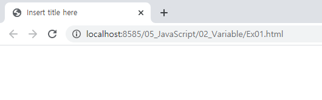</p>  


개발자모드(F12)로 보면 콘솔창에 입력된 데이터가 잘 출력되어 있다.
<p align="center">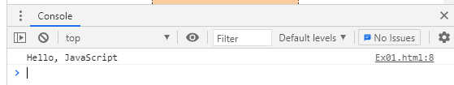</p>  


`console.log()`는 `html`태그 밖, `head`태그 안, `body`태그 안에서 선언이 가능하다.  
다만 관례상 `head` 태그 안에서 사용하는 것을 권장한다.  

```html
<!DOCTYPE html>

	<script type="text/javascript">

		console.log("html 태그 밖에서 선언했습니다.");
	
	</script>

<html>
<head>
<meta charset="UTF-8">
<title>Insert title here</title>
<script type="text/javascript">

	// 관례상 head 태그 안에서 사용하는 것을 권장.
	console.log("head 태그 안에서 선언했습니다.");

</script>
</head>
<body>

	<script type="text/javascript">
	
		console.log("body 태그 안에서 선언했습니다.");	
	
	</script>

</body>
</html>
```

마찬가지로 창에는 아무것도 출력되지 않지만,  
개발자모드의 콘솔창에서 각각의 태그에서 입력한 데이터가 출력되었음을 알 수 있다.  
<p align="center">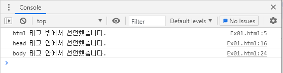</p>  


### 2. document.write()를 이용하는 방법
`<script>`태그에서 선언하면 자동으로 HTML 문서의 body 영역에 괄호 안의 내용을 출력하는 함수.  
자동 줄바꿈이 안 되므로 html 태그인 `<br>`를 괄호 안에 넣어 활용한다.  

```javascript
document.write("document.write()를 이용하는 방법<br>");
document.write("자바 스크립트");
```
`<br>`을 넣었더니 줄바꿈이 잘 적용되었다.  
<p align="center">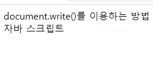</p> 


이외에도 html 문법을 괄호 안에 넣어 다양하게 활용 가능하다.

```javascript
document.write("<h4 style='color: red;'>document.write()와 html문법</h4><br>");
```

<p align="center">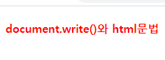</p> 


테이블도 만들 수 있다.
```javascript
let tab = "<table border='1' cellsapcing='0'>";
tab += "<tr>";
tab += "<td>"+(num1+num2)+"</td><td>"+(num1-num2)+"</td>"+
		"<td>"+(num1*num2)+"</td><td>"+(num1/num2)+"</td>";
tab += "</tr>";
tab += "</table>"
	
document.write(tab);
```

<p align="center"></p> 


### 3. alert()를 이용하는 방법.
`alert()`는 알림창(경고창)의 형식으로 데이터를 출력한다.

```javascript
alert("alert()를 이용하는 방법");
```
실행하면 아래와 같이 새 창에 바로 알림창이 열린다.  
<p align="center">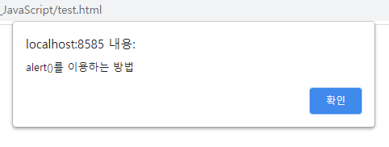</p> 


### * 디버깅 
개발 시 문법적으로 전혀 문제가 없어도 어떤 경우에는 정상적으로 동작하고, 어떤 경우에는 동작이 제대로 안 되는 경우가 발생한다. 프로그램에서는 이런 것을 논리적인 오류인 버그라고 부르고, 버그를 찾아 없애는 작업을 디버깅이라고 한다.


## 외부에 있는 자바스크립트 파일을 불러와서 실행하는 방법 
```html
<script type="text/javascript" src="../js/console.js"></script>
```


## 자바 스크립트에서의 입출력 대화상자 3가지 
1. 알림창(경고창) `alert` : 특정 정보를 사용자에게 메시지 창으로 알려주기 위해 주로 사용한다.
	- `window.alert("알림 내용 또는 경고 내용");`
	- `alert("알림 내용 또는 경고 내용");`
		
2. 확인창 `confirm` : `window.confirm("문자열");` `confirm("문자열");`
3. 입력창 `prompt` : `window.prompt("문자열", 초기값);` `prompt("문자열", 초기값);`


### 1. 알림창(경고창) `alert`
특정 정보를 사용자에게 메시지 창으로 알려주기 위해 주로 사용한다.

```javascript
alert("alert()를 이용하는 방법");
```
실행하면 아래와 같이 새 창에 바로 알림창이 열린다.  
<p align="center"></p> 


### 2. 확인창 `confirm`
확인창은 `확인` 버튼과 `취소`버튼을 선택할 수 있는 창이다.
* `확인` : `true` 반환.
* `취소` : `false` 반환.

```javascript
let type = confirm("현재는 오전인가요?");
	
console.log(type);
console.log(typeof type);
```

실행시 다음과 같이 `확인` 또는 `취소`를 선택할 수 있는 확인창이 자동 실행된다.  
<p align="center">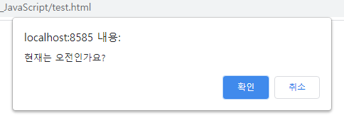</p> 


이중 `확인`을 선택하면 `true`값이,
<p align="center">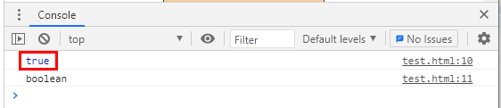</p> 


`취소`를 선택하면 `false`값이 반환된다.
<p align="center"></p> 


### 3. 입력창 `prompt`
입력창은 키보드로부터 데이터를 입력받는 방법이다.  
입력값은 모두 `string`타입, 즉 문자열로 저장된다.  
문자열 이외의 자료형으로 활용하기 위해서는 변환이 필요하다.  
* `parseInt()` : 문자열을 정수로 바꿔주는 코드

```javascript
let height = prompt("키를 입력하세요.");
	
console.log(typeof height);	

// 적정 표준 몸무게를 알아보자.
// 적정 표준 몸무게 : (키 - 100) * 0.9
let standWeight = (parseInt(height) - 100) * 0.9;
	
document.write("당신의 적정 몸무게는 " + standWeight + "kg입니다.<br>");
```
`prompt`는 입력값을 모두 문자열로 받으므로,  
연산작성시 `parseInt()` 코드를 활용해 정수형으로 바꾸었다.


실행하면 입력이 가능한 입력창이 자동으로 실행된다.  
요구하는 값을 입력하고 `확인`을 누르면
<p align="center">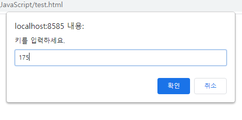</p> 


기존에 작성한 연산에 따른 적정 표준 몸무게를 출력한다.
<p align="center"></p> 


개발자모드로 확인하면 입력값은 `170`으로 정수였음에도 `string`타입으로 저장된 걸 알 수 있다.
<p align="center">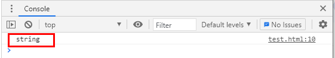</p> 


## 자바 스크립트의 변수	 
### 1. 변수
데이터를 저장하는 공간. 데이터가 변할 수 있다.
	* 물건을 보관했다가 필요할 때 다시 꺼내 사용하는 일종의 창고라고 생각하면 된다. 보관하는 내용이 물건 대신 데이터라는 점.
	* 특히 자바스크립트는 변수에 숫자와 문자 뿐만 아니라 함수와 클래스까지 저장이 가능하다.
* 형식1) `var 변수명 = 값;`	
	* 동일한 변수명이 생성가능하여 문제가 발생할 수 있므로 권장하지 않는다.
	* `var`의 의미 : 자바스크립트에서 변수 선언을 의미하는 키워드.
* 형식2) `let 변수명 = 값;` 
	* ES6 버전 이후부터 권장하는 변수 선언 방식.
	
```javascript
var name = "가가가";
console.log(name);
	
var name = "나나나";
console.log(name);
```

동일한 변수명 `name`에 각기 다른 두 값이 모두 입력되어 정상 출력된다.   
지금은 괜찮지만 코드가 길어지고 함수가 복잡해지면 문제가 발생할 수 있으므로 사용을 자제하는 것이 좋다.   
<p align="center">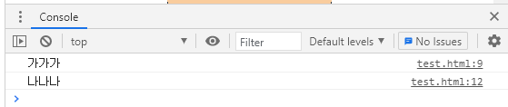</p> 


```javascript
let name = "다다다";
onsole.log(name);
	
let name = "라라라";
console.log(name);
```
반면에 `let` 변수는 동일한 변수명 사용시 error가 발생하여, 동일한 변수명을 사용할 수 없다.  
<p align="center">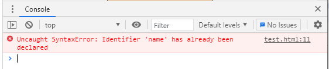</p> 

		
### 2. 상수
데이터를 저장하는 공간으로, 한 번 초기화된 상수의 데이터는 변할 수 없다.
* 형식) `const 상수명 = 값;`

```javascript
const num = 47;
document.write(num);
```
상수가 선언되어 브라우저에도 잘 출력된다.
<p align="center"></p> 
	

이때 상수의 값을 변경해보면 어떻게 될까?
```javascript
num = 150; 
document.write(num + "<br>");
```

위에서 선언한 `47`만 그대로 출력되고, 변경한 `150`은 출력되지 않는다.  
<p align="center"></p>  


개발자모드로 확인해보면 error 발생했음을 알 수 있다.  
당연하지만 상수의 값은 변경할 수 없으므로, 강제로 변경시 error가 발생한다.
<p align="center">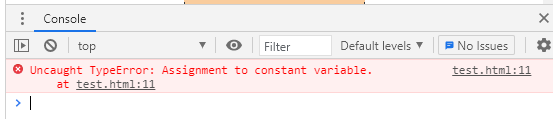</p> 
		
				
		
### * 자바스크립트에서의 자료형
- 숫자형`number` : 숫자를 표현하는 자료형. 숫자 안에서도 정수, 실수로 구분이 되는데 자바스크립트에서의 숫자 자료형은 그 종류들을 하나로 총괄한다. 십진수와 실수형은 일반적으로 사용하는 숫자. 하지만 16진수는 글자색이나 배경색을 나타낼 때 주로 사용한다.
	* 예) `var age = 30;` (정수 10진수)
	*	`var color = 0xF00;` (빨간색)
- 문자형(string) : 작은 따옴표 또는 큰 따옴표를 양 끝에 두고, 그 안에 한 글자 이상의 기호 또는 숫자가 있는 자료형을 문자형이라고 한다.
	* 예) `var name = "홍길동";`
- 논리형`boolean` : 참`true` 또는 거짓`false` 두 가지 값을 가지는 자료형.
- typeof 연산자 : 해당 변수의 자료형을 알려주는 연산자.
- 함수형`function`
- 클래스`class`
- 클래스 인스턴스`class instance`
- `undefined` : 일반적으로 변수를 만든 후 초기화하지 않은 상태를 말한다.
	* 예) `var data;`
	* `alert("data >>> " + data);`
- `null` : 아무것도 참조하고 있지 않다는 의미. 주로 객체를 담을 변수를 초기화할 때 많이 사용된다.
- `NaN` : Not A Number. 즉, 숫자가 아닌 데이터를 숫자처럼 사용할 때 나타난다.
	

### * 변수명 작성 규칙
1. 영문 대/소문자, 숫자, _ 또는 $ 만을 사용할 수 있다.
2. 변수명의 첫 글자로는 숫자가 오면 안 된다.
3. 변수명은 대소문자를 구분함. 예) `SUM`과 `sum`은 다른 변수명으로 인식.
4. 변수명 작성 시 소문자로 시작한다.
5. 공백이 들어가면 안 된다.
6. 변수명을 사용 시 되도록 의미를 부여해서 작성하는 것이 좋다.
7. 자바스크립트 예약어를 사용할 수 없다. 예) `document`, `do`, `for`, `var` 등
8. 두 단어 이상을 결합해서 변수명을 사용하는 경우 낙타봉 표기법(camelCase)을 권장한다. 예) `resultOfHap`


## 자바 스크립트의 연산자
### * 기본 연산자 `+` `-` `*` `/`
기본적으로 java의 연산자와 동일하다.


### * 대입 연산자 `=`


### * 관계(비교) 연산자 `>=` `>` `<=` `<` `==` `!=` `===`
java의 연산자와 동일하나 자바 스크립트에서는 `==`의 사용법이 달라졌으며, `===`가 새롭게 등장하였다.
* `==` : 동등연산자로 비교 대상 값의 자료형이 다른 경우 강제로 형을 바꾼 뒤에 비교한다. 따라서 좌항과 우항의 자료형은 상관없이 **내용만 같으면** `true`값을 반환하고, 내용이 틀리면 `false` 값을 반환한다.
* `===` : 일치연산자로 좌항과 우항의 내용과 자료형이 정확하게 같을 때 true, 다르면 false 반환한다. 즉, 내용뿐만 아니라 자료형까지 비교하여 결과를 반환한다.

```javascript
let su1 = "1000";	// 문자열
let su2 = 1000;		// 숫자
	
document.write(su1 + " == " + su2 + " >>> " + (su1 == su2) + "<br>");	
```

각기다른 자료형에 동일한 데이터를 넣어 비교하여 `==` 연산자로 비교하니  
아래와 같이 `true`값이 반환되었다.  
<p align="center">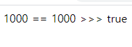</p> 
참고로 java에서는 `false`값을 반환한다.  


그렇다면 자료형까지 함께 비교하기 위해서는 어떻게 해야 할까?    
이 때는 `===` 연산자를 사용해야 한다.  

```javascript
let su1 = "1000";	// 문자열
let su2 = 1000;		// 숫자

document.write(su1 + " === " + su2 + " >>> " + (su1 === su2) + "<br>");
```

위의 결과와 다르게 좌항과 우항의 자료형이 다르므로 `false`값을 반환한다.
<p align="center">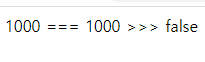</p>

   
