# BOM(Browser Object Model : 브라우저 객체 모델) 
BOM은 브라우저 내에 내장된 객체를 의미한다.  
BOM 객체의 최상위 내장 객체는 `window` 객체로, 생략가능하다.  
 
## window 객체
* `window` 객체의 주요 메서드
	- `open()` : 새로운 창을 띄우고자 할 때 사용하는 메서드.
	- `alert()` : 경고 창을 띄울 때 사용하는 메서드.
	- `prompt()` : 질의/응답 창을 띄울 때 사용하는 메서드.
	- `confirm()` : 확인/취소 창을 띄울 때 사용하는 메서드.
	- `moveTo()` : 창의 위치를 이동시킬 때 사용하는 메서드.
	- `resizeTo()` : 창의 크기를 변경시킬 때 사용하는 메서드.
	- `setInterval()` : 일정 간격으로 지속적으로 실행문을 실행시킬 때 사용하는 메서드.
	- `setTimeout()` : 일정 간격으로 한번만 실행문을 실행시킬 때 사용하는 메서드.
	

## screen 객체
사용자의 모니터 정보(속성)를 제공해 주는 객체. 
 * `screen` 객체의 주요 속성  
	- `screen.width` : 화면의 너비값을 반환하는 속성.
	- `screen.height` : 화면의 높이값을 반환하는 속성.
	- `screen.availWidth` : 작업표시줄을 제외한 화면의 너비값을 반환하는 속성.
	- `screen.availHeight` : 작업표시줄을 제외한 화면의 높이값을 반환하는 속성.
	- `screen.colorDepth` : 사용자 모니터가 표현 가능한 컬러 bit를 반환하는 속성.


```javascript
document.write("화면 너비 >>> " + screen.width + "<br>");
document.write("화면 높이 >>> " + screen.height + "<br>");
document.write("작업표시줄을 제외한 화면 너비 >>> " + screen.availWidth + "<br>");
document.write("작업표시줄을 제외한 화면 높이 >>> " + screen.availHeight + "<br>");
document.write("표현가능한 컬러 bit >>> " + screen.colorDepth + "<br>");
```

실제 컴퓨터 해상도와 일치하는 가로너비와 세로높이가 출력된다.  
<p align="center"></p>


화면 높이와 작업표시줄을 제외한 화면 높이를 비교해보면 작업표시줄의 높이는 40px임을 짐작해볼 수 있다.      
<p align="center">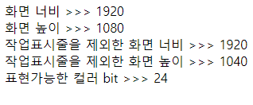</p>


## location 객체
`location` 객체는 자바스크립트가 실행되고 있는 현재 브라우저의 주소창에 표시된 주소 값에 관련된 내용을 다룬다. 사용자 브라우저의 주소 창의 url에 대한 정보(속성)와 새로고침 기능을 제공하는 객체.  
* `location` 객체의 주요 속성 및 메서드
	- `location.href` : 브라우저 창의 url 값을 반환하는 속성.
	- `location.reload()` : 브라우저 창의 새로고침이 일어나게 하는 메서드.

```javascript
document.write("url 정보 >>> " + location.href);
```

현재 브라우저의 url 값이 그대로 출력되었다.
<p align="center">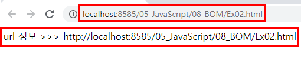</p>


## history 객체
`history` 객체는 브라우저가 페이지를 변경한 이력이 클라이언트에 저장되어 있는 객체이다. 사용자가 방문한 사이트 중 이전에 방문한 사이트와 다음 방문한 사이트로 다시 돌아갈 수 있는 속성과 메서드를 제공한다.

* `history` 객체의 속성과 메서드
	- `length` : 방문 기록에 저장된 목록의 개수를 반환하는 속성. 
	- `history.back()` : 이전에 방문한 웹 페이지로 이동하는 메서드.
	- `history.forward()` : 다음에 방문한 웹 페이지로 이동하는 메서드.
	- `history.go(숫자)` : 이동 숫자만큼 페이지로 이동하는 메서드.
		- 숫자가 해당 수만큼 양수이면 앞으로, 음수이면 해당 수만큼 뒤로 이동한다.

다음과 같은 페이지 3개를 만들어 `history` 객체의 메서드를 살펴 보자.   
첫번째 페이지)

```javascript
<body>
	<h1>첫번째 페이지</h1>
	
	<a href="Exam_02.html">두번째 페이지</a>
	
	<hr>
	
	<button onclick="history.back()">이전 페이지</button>
	<button onclick="history.forward()">다음 페이지</button>
</body>
```

<p align="center">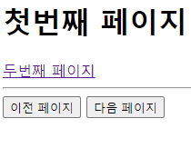</p>


두번째 페이지)

```javascript
<body>
	<h1>두번째 페이지</h1>
	<a href="Exam_03.html">세번째 페이지</a>
	
	<hr>
	
	<button onclick="history.back()">이전 페이지</button>
	<button onclick="history.forward()">다음 페이지</button>	
</body>
```

<p align="center"></p>


세번째 페이지)
세번째 페이지는 `history.go()`메서드를 이용하여 만들었다.  
* `history.go(-1)` : 1번 뒤로 가기
* `history.go(-2)` : 2번 뒤로 가기 (= 앞으로)

```javascript
<body>
	<h1>세번째 페이지</h1>
	<a href="Exam_01.html">첫번째 페이지</a>
	
	<hr>

	<button onclick="history.go(-1)">이전 페이지</button>
	<button onclick="history.go(-2)">다음 페이지</button>
</body>
```

<p align="center">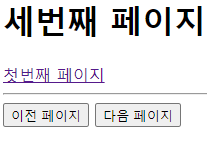</p>


다음과 같이 실행된다. 
<p align="center">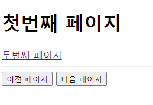</p>


# DOM(Document Object Model : 문서 객체 모델)
DOM은 웹 화면에 보이는 요소를 조작하기 위한 기능으로 가득 찬 라이브러리 덩어리로, 웹 브라우저가 HTML 페이지에 접근하는 방법을 정의한 API이다.  


DOM에서 제공하는 일반적인 기능은 여러 개의 DOM 객체로 나눠 구성되어 있다. DOM은 정의부분(명세서)와 구현부분으로 나누어져 있다.  
정의부분인 명세서에는  웹 페이지 문서를 조작할 때 지켜야 할 약속(규칙, 규약)이 명시되어 있는 문서일 뿐 실제 동작하는 구현 소스코드는 전혀 존재하지 않는다. 텅 빈 상자와도 같다. 이 명세서를 만드는 곳이 바로 웹 관련 표준을 정의하는 협회인 W3C이다. 구현부분은 바로 브라우저 내부에 존재한다.  


브라우저 제작사(IE, Chrome, Firefox, Safari)는 DOM에 명시되어 있는 인터페이스에 맞춰 자신들만의 특화된 고유 기술을 이용해 독자적으로 기능을 구현한다.
- IDL(Interface Definition Language) : DOM의 정의부분을 만들 때 사용하는
    인터페이스 정의 전용 언어이다. 프로그래밍 언어 중 하나이며, 고유의 문법이 있다. (참고 : http://www.w3.org/TR/DOM-Level-2-HTML/html.html#ID-22445964) 그렇다고 IDL을 배우는 것은 아니고, 그냥 DOM 문서는 인터페이스 정의 문서로 되어 있다는 정도만 알고 있으면 된다.
    
		
눈에 보이진 않지만 사실 브라우저에 출력된 웹 페이지는 온통 DOM 객체로 구성되어 있다. DOM 객체는 텍스트와 이미지, 하이퍼링크, 폼 엘리먼트 등의 각 문서 엘리먼트를 나타낸다. 자바스크립트 코드에서는 동적인 HTML을 만들어내기 위해 DOM 객체에 접근하여 조작할 수 있다.  
- 문서 객체 : 자바스크립트에서 이용할 수 있는 객체.


* 노드 : HTML 웹 페이지 구성 요소의 가장 작은 단위. 
	- 문서를 이루는 모든 요소를 통합해서 부르는 용어. 즉, HTML 페이지의 각 요소(태그)들. 주석도 노드에 속한다.
	- 브라우저는 이런 노드로 가득찬 웹 페이지를 읽어들여 해석한 후, 각 노드에 접근해 제어할 수 있는 DOM 객체를 생성한다.
* 요소(element) : `<시작태그>텍스트</끝태그>`
* 텍스트 노드 : 요소 안에 있는 글자. `innerHTM`L과 관계가 있다.
	- 노드, 스타일, 속성, 이벤트, 위치 및 크기들을 다룰 수 있는 다양한 기능이 포함되어 있다.
	- DOM 객체가 생성되는 순서를 자세히 살펴 보면, 웹브라우저는 가정 먼저 최상위에 해당하는 `HTMLDocument` 클래스의 객체를 생성한다. 이후에 생성되는 모든 DOM 객체는 `HTMLDocument` 객체의 자식 객체로 만들어진다. 
	- 보통 DOM 방식은 트리 구조이다. 브라우저가 웹 페이지를 처리하는 과정을 살펴보면 먼저 브라우저는 문서 정보에 쉽게 접근하고 조작하고자 HTML 웹 페이지를 읽은 후 파싱 단계를 거친다. 이 후 DOM 객체로 변환(트리구조) 후 화면에 출력을 한다.
	- 예) 웹 페이지에 `` 태그 노드가 있다면 브라우저에 의해 `HTMLImageElement`라는 DOM 객체가 생성된다. 이 객체는 다른 DOM 객체와는 다르게 이미지를 읽어들이는 특별한 기능이 있어서 실행 시에 "test.jpg" 라는 외부 이미지 파일을 읽어 들이게 된다. 즉, 문서 상의 노드는 "브라우저이군. 이 노드를 보고 알맞은 DOM 객체를 생성해 주세요." 라는 의미일 뿐, 모든 작업은 이제 브라우저에서 만들어낸 DOM 객체로 처리하게 된다.

	 
* 브라우저가 웹 페이지를 처리하는 과정
	1. 웹 페이지 읽기 : 먼저 브라우저는 HTML 페이지를 읽는다.
	2. 파싱 단계 : 이어서 파싱(parsing) 단계를 거쳐서 웹 페이지 내용을 해석한다.
		- 이 때 작성한 마크업 태그와 1:1 매칭이 되는 DOM 클래스 객체를 생성한다. 이렇게 생성된 객체는 저마다 고유한 기능을 하게 된다.
		- 좀 더 자세하게 설명을 한다면 웹 브라우저가 HTML 페이지를 읽은 후 파싱 단계에서 `div` 태그를 만나게 되면 `HTMLDivElement` 라는 클래스의 인스턴스(객체)를 생성하게 되고, `img` 태그를 만나면 `HTMLImageElement` 라는  클래스의 인스턴스를 생성하게 된다는 의미이다.
		- 정리를 한다면 HTML 페이지에 작성하는 마크업은 웹브라우저에게 알려주는 일종의 DOM 클래스의 메타 정보이다. 브라우저는 이 마크업 태그와 1:1로 매칭되는 DOM 클래스의 객체를 생성해서 보관을 하고 있게 된다.
	3. 출력 : 마지막으로 웹 브라우저는 생성한 DOM 객체를 가지고 우리가 보고 있는 웹 페이지 화면을 만든다.
	  

* Node 객체 : Node 객체는 노드를 조작하기 위한 가장 기본적인 프로퍼티와 메서드가 정의되어 있는 Node 인터페이스를 구현한 객체이다. 
	- Node 객체에서 제공하는 기능을 이용하면 노드 타입을 파악하거나 부모, 형제 그리고 자식 노드를 알아내서 접근하거나, 또는 자식 노드를 추가, 삭제, 교체를 할 수 있다. 
	- 좀 더 자세히 설명을 한다면 Node 객체는 DOM 객체 가운데 가장 최상위 객체이자 모든 하위 노드 객체들이 상속을 받는 객체이다.
	
	  		
* Element 객체 : Element는 노드 중 주석 노드와 텍스트 노드를 제외한 나머지 노드를 통합해서 부르는 용어이다. 
	- Element 객체 역시 노드의 한 종류이며 Element 인터페이스를 구현한 객체임. 또한 Element 객체는 Node 객체의 자식이므로 Node 객체가 가지고 있는 기능을 모두 사용할 수 있다.
	- Element 객체의 주요 기능으로는 태그 이름이 담긴 프로퍼티와 속성(Attribute)을 알아내고 설정하는 기능과 이벤트를 추가하거나 삭제하거나 발생시키는 기능이 있다.
	  	           
	  	    
* HTMLElement 객체 : HTMLElement는 오직 HTML 문서에만 있는 노드를 통합해서 부르는 말이다.
	- HTMLElement 객체에는 Element 객체의 기능 외에도 오직 HTML 페이지의 `p`, `div` 태그와 같은 HTML 태그에서만 쓸 수 있는 공통적인 속성과 기능이 포함이 되어 있다.
	- HTMLElement 객체는 `HTMLDivElement`, `HTMLImageElement`, `HTMLBodyElement`와 같은 객체의 부모 객체이기도 하다.
	  	    

* Document 객체 :  Document 객체 역시 Node 객체의 하위 객체이며 HTML 문서와 xml 문서의 루트 객체로 엘리먼트 노드와 이벤트, 속성 노드, 텍스트 노드, 주석 등의 노드를 생성하는 기능, 그리고 많이 사용하게 될 `id`, `className`, `tagName`으로 특정 노드를 찾는 기능 그리고 여기에 이벤트를 발생시키고 등록시키는 이벤트 기능까지 갖춘 아주 중요한 객체이다.
	  	    

* HTMLDocument 객체 : HTMLDocument 객체는 HTML 문서 전용 Document 객체이다. 
	- body와 같은 HTML 문서 전용 프로퍼티와 메서드가 포함되어 있다. HTML 페이지 로딩 후 파싱 단계에서 만들어진 `html`, `head`, `body` 객체를 비롯해서 페이지에 작성된 태그와 일대일로 매칭되는 모든 Node 객체를 가지고 있는 객체이기도 함. 
	   
	   		
* DOM을 공부하면서 알아야 할 내용
1. 노드 다루기
	- 문서에서 특정 태그 이름을 지닌 노드 찾기
	- 특정 노드의 자식 노드에서 특정 태그 이름을 지닌 노드 찾기
	- 문서에서 특정 클래스가 적용된 노드 찾기
	- 문서에서 특정 id를 가진 노드 찾기
	  		   
	- 자식 노드 찾기
	- 부모 노드 찾기
	- 형제 노드 찾기
	   		   
	- `document.createElement()` 메서드를 사용해서 노드 생성 및 추가하기
	- `HTMLElement.innerHTML` 프로퍼티를 사용해서 노드 생성 및 추가하기
	- `Node.cloneNode()` 메서드를 사용해서 노트 생성 및 추가하기
	- 노드 삭제하기
	- 노드 이동시키기
	   		   
	- 텍스트 노드 생성 및 추가하기
	- 텍스트 노드 내용 변경하기
	   		   
2. 스타일 다루기
	- 스타일 속성값 구하기
	- 스타일 속성값 설정하기
	- 스타일 속성 제거하기
	   		   
3. 속성 다루기
	- 속성값 구하기
	- 속성값 설정하기
	- 속성 제거하기
	   		   
4. 이벤트 다루기
	- 이벤트 리스너 추가하기
	- 이벤트 리스너 삭제하기
	- 이벤트 발생시키기
	- 사용자 정의 이벤트 만들기
	    

#### [예] `document.createElement()` 메서드를 사용해서 노드 생성 및 추가하기 1

```javascript
// 현재 문서의 body 태그를 읽고 난 후에 자바 스크립트를 실행하라는 의미.
window.onload = function() {
	
	// 요소(태그)를 생성하는 방법
	// 형식) createElement(tagName);
	// 형식) createTextNode(text); : 텍스트 노드를 생성하는 메서드
	let h1_element = window.document.createElement("h1");
	
	let textNode = window.document.createTextNode("Hello, DOM!");
	
	// 텍스트 노드를 h1태그에 자식으로 추가
	h1_element.appendChild(textNode);
	
	// 이제 실제로 문서의 body에 h1 요소를 추가하면 된다.
	window.document.body.appendChild(h1_element);
}
```

`<script>` 영역에 트리 구조로 요소를 쌓았다.  
`<body>` 태그에는 아무것도 작성하지 않았음에도 텍스트 노드에 작성한 내용이 `<h1>`태그로 작성되어 출력된다.  
<p align="center"></p>


개발자 모드로 확인하면 `<body>` 태그에 작성한 것과 동일하게 나온다.  
<p align="center">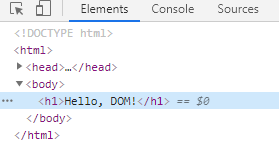</p>


#### [예] `document.createElement()` 메서드를 사용해서 노드 생성 및 추가하기 2 : 이미지 출력하기
`window`는 생략 가능하므로 생략하였다.

```javascript
onload = function() {
	
	// 이미지 태그를 만들어 보자.
	let imgNode = document.createElement("img");
	
	// 이미지 태그에 이미지를 넣으려면 src 속성이 지정되어야 한다.
	imgNode.src = "../images/mango.jpg";
	imgNode.width = "200";
	imgNode.height = "200";
	
	// 해당 이미지 노드를 문서의 본문에 추가하자.
	document.body.appendChild(imgNode);
}
```

src 속성 지정을 아래와 같이 작성해도 동일한 결과가 나온다.  

```javascript
imgNode.setAttribute("src", "../images/mango.jpg");
imgNode.setAttribute("width", 200);
imgNode.setAttribute("height", 200);
```


지정한 사이즈인 200*200 크기의 망고 이미지가 출력되었다.  
<p align="center">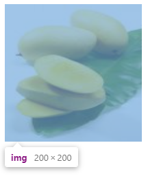</p>


## 문서의 요소를 가져오는 방법 
### 문서의 요소를 가져오는 방법 1 : getElementById(id) 를 이용하는 방법


```javascript
<script type="text/javascript">

	onload = function() {
		let header1 = document.getElementById("header_1");
		
		// 문서 객체의 속성을 변경해 보자.
		header1.innerHTML = "header_1 id를 가진 요소";
		header2.innerHTML = "header_2 id를 가진 요소";
	}
</script>
</head>
<body>
	<h1 id="header_1">Header 1</h1>
	<h1 id="header_1">Header 2</h1>
</body>
```

* `innerHTML` : 해당 텍스트 요소를 변경해준다.


`<body>` 태그에서 'Header 1', 'Header 2'라고 설정하였으나,  
각각 'header_1 id를 가진 요소', 'header_2 id를 가진 요소'로 내용이 변경되었다.
<p align="center">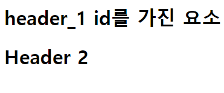</p>


### 문서의 요소를 가져오는 방법 2 : getElementsByTagName(tagName)을 이용하는 방법
* `getElementsByTagName(tagName)` : tagName과 일치하는 요소를 배열로 가져오는 메서드. 즉 tagName이 여러개 있을 경우 사용.

```javascript
<script type="text/javascript">
	onload = function() {

		// header 변수는 h1과 일치하는 요소가 여러 개이므로 배열이 된다.
		let headers = document.getElementsByTagName("h1");
		
		headers[0].innerHtml = "getElementsByTagName() 0";
		headers[1].innerHtml = "getElementsByTagName() 1";		
	}
</script>
</head>
<body>
	<h1>Header1</h1>
	<p>header1 내용</p>
	
	<hr>
	
	<h1>Header2</h1>
	<p>header2 내용</p>
</body>
```

아래와 같이 for문을 이용해서 출력할 수도 있다.
```javascript
for(let i=0; i<headers.length; i++){
	headers[i].innerHTML = "getElementsByTagName() 2"+i;
}
```

기존 출력문)  
<p align="center">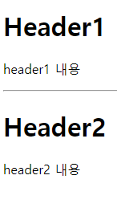</p>

DOM 적용 후)
<p align="center">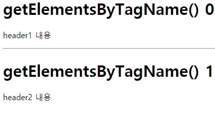</p>


### 문서의 요소를 가져오는 방법 3 : querySelector(선택자)를 이용하는 방법
* `querySelector(선택자)` : 선택자로 가장 처음 선택되는 문서의 요소를 가져오는 메서드.
* `querySelectorAll(선택자)` : 선택자로 선택된 문서의 요소 전체를 배열로 가져오는 메서드.

```javascript
onload = function() {
	let header1 = document.querySelector("#header_1");
	let header1 = document.querySelector("#header_2");
		
	header1.innerHTML = "header_1 id를 가진 요소";
	header1.innerHTML = "header_2 id를 가진 요소";
	}
```

<p align="center">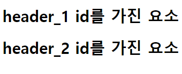</p>


### * 글자의 스타일 바꾸기  

```javascript
onload = function() {
	let header = document.getElementById("header");
		
	// h1 태그의 문서의 요소를 바꾸어 보자.
	header.style.border = "1px solid red";
	header.style.color = "blue";
	header.style.fontStyle = "Italic";
	header.innerHTML = "반갑습니다.";
}
```

<p align="center">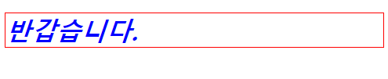</p>


### * 특정 요소를 제거하는 방법
아래와 같이 작성시 id가 "header_2"인 태그는 제거되어 출력되지 않는다.

```javascript
onload = function() {
	let header2 = document.getElementById("header_2");		
		
	document.body.removeChild(header2); 
}
```


### * 이벤트 처리 작업

```javscript
onload = function() {
	document.getElementById("header");
			
	header.onclick = function() {
		alert("글자를 클릭하셨습니다!");		}
}
```

<p align="center">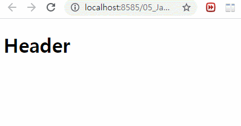</p>


#### [예] 버튼을 클릭했을 때 이벤트 처리

```javascript
<script type="text/javascript">

	document.getElementById("btnChannel1").onclick = function() {
		let myDiv = document.getElementById("myDiv");
		myDiv.style.backgroundColor = "yellow";
		myDiv.style.width = "100px";
			
		document.getElementById("str").style.color = "red";
		}
	}
	
	function go_change() {
		alert("이벤트 예제입니다.");
	}
	
</script>
</head>
<body>

	<div id="myDiv" style="height: 100px;">
		<span id="str">안녕</span>하세요!
	</div>
	
	<input type="button" id="btnChannel1" value="스타일변경1">
	<input type="button" id="btnChannel2" value="스타일변경2" onclick="go_change()">

</body>
```


<p align="center"></p>


#### [예] 복사하기
```javascript
<script type="text/javascript">

	onload = function() {
		let button = document.getElementById("btn");
		button.onclick = function() {
			let text = document.getElementById("text1").value; // text1 에 입력된 값
			
			if(text == "") { // text1에 입력된 값이 없다면
				alert("내용을 입력하세요.");
			}else {
				document.getElementById("text2").value = text; // text2 에 text를 넣어라.
			}		
		}
	}
</script>
</head>
<body>

	<div align="center">
		<h2>[문제] 버튼을 클릭하면 첫번째 테스트 창에 입력된 내용을 
			두번째 텍스트 창으로 복사해 보자.</h2>
			
		<input type="text" id="text1"><br>
		<input type="text" id="text2"><br>
		<input type="button" id="btn" value="복사"><br>
	</div>

</body>
```

<p align="center">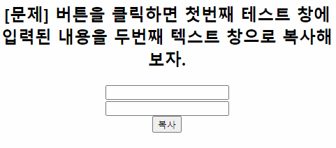</p>


## 자바스크립트 내장 함수
자바스크립트에서 자체적으로 제공해 주는 함수.
* `setInterval()` : 일정한 시간마다 주기적으로 특정한 함수를 호출한다. 반드시 개발자가 종료(clearInterval())를 시켜주어야 한다.
* 형식) `setInterval(호출할 함수 이름, 시간(ms));`


#### [예] 1초마다 글자색 바꾸기

```javascript
<script type="text/javascript">

	let id;	// 전역 변수
	
	function change_go() {	// 1초마다 flashText 호출
		id = setInterval(flashText, 1000);
	}
	
	// target의 글자색이 red면 blue로, blue면 red로 바꾸는 함수
	function flashText() {	
		let target = document.getElementById("target");
		target.style.color = (target.style.color == "red") ? "blue" : "red";
	}
	
	function stop_go() {	// setInterval()종료
		clearInterval(id);
	}
	
</script>
</head>
<body>

	<div id="target">
		<p>여기는 텍스트 영역입니다......</p>	
	</div>
	
	<button onclick="change_go()">시작</button>
	<button onclick="stop_go()">종료</button>

</body>
```


<p align="center"></p>


#### [예] 회원가입 입력창 입력 여부 확인하기
```javascript
<title>유효성 검사</title>
<script type="text/javascript">

	function check() {
	/* 	// 아이디 입력창 입력 여부
		if(document.getElementById("id").value == "") {
			alert("아이디를 입력하세요.");
			document.getElementById("id").focus();
			return false;	// 액션 페이지로의 데이터 전송이 차단됨.
		} */
		
		// form의 name이 f인 곳의 id의 value
		if(f.id.value == "") {
			alert("아이디를 입력하세요.");
			f.id.focus();
			return false;	// 액션 페이지로의 데이터 전송이 차단됨.
		}
		
		// 비밀번호 입력창 입력 여부
		if(document.getElementById("pwd").value == "") {
			alert("비밀번호를 입력하세요.");
			document.getElementById("pwd").focus();
			return false;	// 액션 페이지로의 데이터 전송이 차단됨.
		}
		
		// 이름 입력창 입력 여부
		if(document.getElementById("name").value == "") {
			alert("이름을 입력하세요.");
			document.getElementById("name").focus();
			return false;	// 액션 페이지로의 데이터 전송이 차단됨.
		}
		
		// 주소 입력창 입력 여부
		if(document.getElementById("addr").value == "") {
			alert("주소를 입력하세요.");
			document.getElementById("addr").focus();
			return false;	// 액션 페이지로의 데이터 전송이 차단됨.
		}
	}

</script>
</head>
<body>

	<div align="center">
		<form name="f" action="http://www.google.com" onsubmit="return check()">
			<table border="1" cellspacing="0">
				<tr>
					<th>아이디</th>
					<td> <input type="text" name="id" id="id"></td>
				</tr>
				
				<tr>
					<th>비밀번호</th>
					<td> <input type="password" name="pwd" id="pwd"></td>
				</tr>
				
				<tr>
					<th>이  름</th>
					<td> <input type="text" name="name" id="name"></td>
				</tr>
				
				<tr>
					<th>주  소</th>
					<td> <input type="text" name="addr" id="addr"></td>
				</tr>
				
				<tr>
					<td colspan="2" align="center">
						<input type="submit" value="가입">
						&nbsp;&nbsp;&nbsp;
						<input type="reset" value="취소">
					</td>			
			</table>
		</form>
	</div>

</body>
```

<p align="center">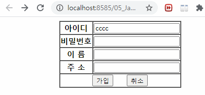</p>

