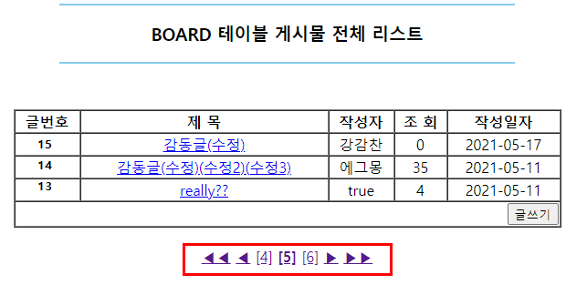
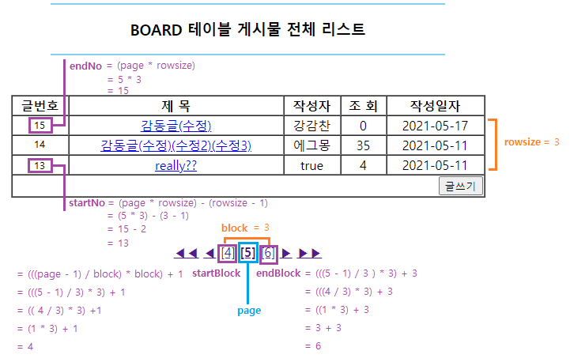

# 하단에 이동할 페이지 넣기
 
<p align="center"></p>

하단에 [1][2][3] ... 과 같이 클릭하면 해당 페이지로 넘어가는 페이징을 해 보자.  


## 0. Action 인터페이스
이번 게시판도 MVC2패턴에 Action 인터페이스를 활용하여 만들어 보았다.  
기존 게시판과의 차이점은, 기존에는 Action 인터페이스에 String 타입을 반환하는 추상메서드를 선언했다면,  
이번 게시판은 반환 타입이 없는 void 추상메서드를 사용했다는 점이다.  


따라서 Action 클래스 작성과 에러코드(Null)에선 자유로워졌지만  
FrontController 서블릿(역할)에서 처리해야 할 코드들이 늘었다.  

```java
public interface Action {

	// 추상 메서드
	public void execute(HttpServletRequest request, HttpServletResponse response) throws IOException;
}
```

이 인터페이스를 앞으로 필요한 웹 페이지를 생성할 때마다 상속받아 사용한다.


## 1. index.jsp
게시판에 들어가기 위한 기본적인 웹 페이지를 작성한다.  


[전체 게시물] 을 클릭하면 "board_list.do"를 FrontController 로 보내 문자열에 맞는 액션클래스를 실행한다.

```jsp
<body>

	<div align="center">
		<hr width="50%" color="blue">
			<h3>BOARD 테이블 메인 페이지</h3>
		<hr width="50%" color="blue">
		<br><br>
		
		<a href="<%=request.getContextPath() %>/board_list.do">[전체 게시물]</a>
	</div>

</body>
```


## 2. FrontController 
1) service 메서드 아래에 기본적으로 request, response 한글 인코딩 처리를 한다.  
request는 웹페이지에서 요청하는 메시지, response는 서버에서 반환하는 메세지의 한글 인코딩을 다룬다.  
이 작업을 하지 않으면 인코딩이 달라 웹 페이지에서 글자가 깨지기도 하므로 꼭 하자.   

```java
// 1) 한글 인코딩 작업
request.setCharacterEncoding("UTF-8");
response.setContentType("text/html; charset=UTF-8");
```


2) uri에서 파일명(*.do)을 구한다.  

```java
// 2) 파일명을 구하는 작업
// getRequestURI() : "/프로젝트명/파일명(*.do)" 라는 문자열을 String 타입으로 반환해 주는 메서드.
String uri = request.getRequestURI();
		
// getContextPath() : 현재 프로젝트명을 String 타입으로 반화해 주는 메서드.
String path = request.getContextPath();
		
String command = uri.substring(path.length() + 1);
```


3) 2)에서 구한 파일명을 if문에 넣어 각각의 Action 클래스의 excute() 메서드를 호출한다.
equals() 메서드를 이용하여 각각의 명령어에 따라 실행된 Action 자식 클래스들을 분류하여 작성한다.  
작업에 따라 페이지 이동이 이루어지면, 이동할 페이지 주소를 "viewPage" 변수에 저장한다.

```java
// 3) 파일명을 대조하여 해당 Action클래스의 excute() 메서드를 호출하는 작업
Action action = null;		// 파일명과 대조하여 해당 Action 클래스(자식클래스로)실행하기 위해 선언.
String viewPage = null;	// 액션 클래스 실행 후 이동할 주소를 지정하기 위해 선언.
		
if(command.equals("board_list.do")) {
	// 파일명이 "board_list.do"일 때 실행되는 Action 자식 클래스.
	action = new BoardListAction();
	
	// 클래스의 excute() 메서드를 호출한다.
	action.execute(request, response);
	
	// 작업이 완료되면 이동할 페이지를 viewPage 변수에 저장한다.
	viewPage = "view/board_list.jsp";
}
```


4) 페이지를 이동한다.
Action 클래스의 excute() 메서드 실행 후 저장된 "viewPage"로 이동한다.   
이 때 request에 저장된 Attribute 값이 있다면 함께 이동된다.  

```java
// 4) 페이지 이동 작업
RequestDispatcher rd = request.getRequestDispatcher(viewPage);
rd.forward(request, response);
```


## 3. BoardListAction 클래스 : 본격적인 페이징 작업
FrontController 에서 대조되어 파일명이 "board_list.do" 일 때 실행되는 클래스다.  
DB상의 게시글 전체 리스트를 조회한다.
여기서 본격적인 페이징 작업을 한다. 게시글 전체 리스트를 볼 때만 하단에 이동할 페이지가 표시되기 때문이다.    

1) 필요한 변수를 선언한다.

<p aling="center"></p>


```java
// 1) 변수 선언
int rowsize = 3;	// 한 페이지당 보여질 게시물의 수
int block = 3;		// 하단에 보여질 페이지의 최대 수 예) [1][2][3] / [4][5][6] (최대 3개씩)
int totalRecord = 0;// DB상의 게시물 전체 수
int allPage = 0;	// 전체 페이지 수
		
int page = 0;		// 현재 페이지 변수
if(request.getParameter("page") != null) {
	// request에 저장된 page 파라미터가 있을 경우 해당 수로 저장
	page = Integer.parseInt(request.getParameter("page"));
}else {
	page = 1;	// 처음으로 "전체 게시물" a 태그를 클릭한 경우 1로 저장
}

// 해당 페이지에서 시작 번호
int startNo = (page * rowsize) - (rowsize - 1);
		
// 해당 페이지에서 마지막 번호
int endNo = (page * rowsize);
		
// 해당 페이지의 시작 블럭 
int startBlock = (((page - 1) / block) * block) + 1;
		
// 해당 페이지의 마지막 블럭
int endBlock = (((page - 1) / block) * block) + block;
```


2) 전체 게시물 수를 확인하는 메서드를 호출한다.
BoardDAO 에서 커넥트풀 방식으로 DB와 연동한 후,  
BoardDAO 의 메서드 getListCount()를 호출하여 전체 게시물 수를 totalRecord 변수에 저장한다.  

```java
// 2) 전체 게시물 수를 확인하는 메서드 호출
BoardDAO dao = BoardDAO.getInstance();
		
// DB상의 전체 게시물의 수를 확인하는 메서드
totalRecord = dao.getListCount();
```


3) 전체 페이지 수를 구한다.
전체 게시물의 수를 한 페이지당 보여질 게시물의 수로 나누면 전체 페이지 수가 나온다.  
이 때, 나머지가 있다면 반드시 페이지 수를 +1 한다.  
게시물 수가 rowsize보다 작더라도(=나머지) 블럭 하나를 차지하기 때문이다.  

```java
// 3) 전체 페이지 수 구하기
// Math.ceil() : 나머지가 있으면 무조건 올림하는 메서드
allPage = (int)(Math.ceil(totalRecord / (double)rowsize)); 
		
// 마지막 블럭 수를 최대 전체 페이지 수까지로 지정.
if(endBlock > allPage) {	
	endBlock = allPage;
}
```


4) 페이지에 해당되는 게시물을 가져오는 메서드를 호출한다.

```java
// 4) 페이지에 해당하는 게시물을 가져오는 메서드 호출
List<BoardDTO> pageList = dao.getBoardList(page, rowsize);
```


5) 페이징 처리 시 작업했던 값들을 view 페이지로 넘긴다.
작업했던 모든 값들을 키로 저장해서 view 페이지로 넘긴다.  
request의 Attribute에 set하면 FrontController에서 view 페이지로 이동하며 함께 넘어간다.  
view 페이지에서 활용되지 않더라도 우선 넘겨두는 것이 좋다고 한다.  

```java
// 5) 작업했던 값들을 키로 저장하여 view 페이지로 넘기기
request.setAttribute("page", page);
request.setAttribute("rowsize", rowsize);
request.setAttribute("block", block);
request.setAttribute("totalRecord", totalRecord);
request.setAttribute("allPage", allPage);
request.setAttribute("startNo", startNo);
request.setAttribute("endNo", endNo);
request.setAttribute("startBlock", startBlock);
request.setAttribute("endBlock", endBlock);
request.setAttribute("List", pageList);
```


## 4. board_list.jsp
위에서 모든 작업이 완료되면 저장된 키 값과 함께 FrontController에서 설정해던 페이지 주소로 이동한다.  
가져온 값들을 웹 페이지에 출력한다.  
게시글 목록 출력은 이전에 다루었으므로 여기선 페이징 출력만 정리한다.  
모두 <body> 태그 안에 작성한다.    

```jsp
<%-- EL언어를 사용하기 위해 taglib을 선언한다. --%>
<%@ taglib prefix="c" uri="http://java.sun.com/jsp/jstl/core" %>

<%-- 현재 페이지가 블럭 수보다 높다면 (예: 현재페이지-5, 블럭 수-3) --%>
<c:if test="${page > block }">
	<%-- ◀◀ 를 누르면 첫 페이지로 이동한다. --%>
	<a href="board_list.do?page=1">◀◀</a>
	
	<%-- ◀를 누르면 현재 페이지의 시작 블록보다 하나 작은 페이지로 이동한다. 
	<%--(예: [4][5][6]일 때, ◀를 클릭 시 [3]으로 이동) --%>
	<a href="board_list.do?page=${startBlock - 1 }">◀</a>
</c:if>
		
<%-- 시작블록부터 마지막블록까지 각각 반복한다. (예: [4][5][6] 각각 작성) --%>
<c:forEach begin="${startBlock }" end="${endBlock }" var="i">

	 <%-- 현재 페이지는 볼드 처리한다. --%>
	<c:if test="${i == page }">
		<b><a href="board_list.do?page=${i }">[${i }]</a></b>
	</c:if>
			
	<%-- 현재 페이지가 아니라면 볼드처리하지 않고 출력한다. --%>
	<c:if test="${i != page }">
		<a href="board_list.do?page=${i }">[${i }]</a>
	</c:if>
</c:forEach>
		
<%-- 마지막 블록이 전체 페이지보다 작으면 (예: 전체페이지-[7] 현재-[4][5][6] 마지막 페이지-[6]) --%>
<c:if test="${endBlock < allPage }">
	<%-- ▶ 클릭 시 마지막 블록보다 하나 큰 페이지로 이동한다. --%>
	<%-- (예: [4][5][6] 일 때 ▶ 클릭 시 [7]로 이동)
	<a href="board_list.do?page=${endBlock + 1 }">▶</a>
	
	<%-- ▶▶ 클릭시 마지막 페이지로 이동한다. --%>
	<a href="board_list.do?page=${allPage }">▶▶</a>
</c:if>
```


