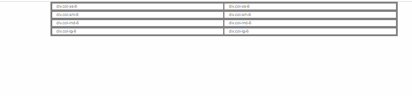
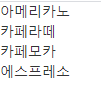
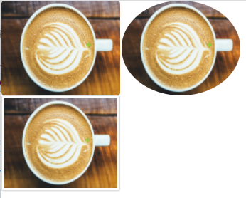
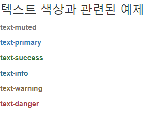
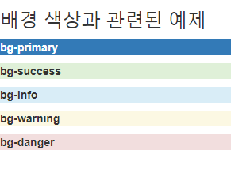

# BootStrap 부트스트랩
부트스트랩은 반응형이며 모바일 우선인 웹프로젝트 개발을 위한 가장 인기있는 HTML, CSS, JS 프레임워크.  
http://bootstrapk.com/  


## 부트스트랩 CDN
```html
<!-- 합쳐지고 최소화된 최신 CSS -->
<link rel="stylesheet" href="https://maxcdn.bootstrapcdn.com/bootstrap/3.3.2/css/bootstrap.min.css">

<!-- 부가적인 테마 -->
<link rel="stylesheet" href="https://maxcdn.bootstrapcdn.com/bootstrap/3.3.2/css/bootstrap-theme.min.css">

<!-- 합쳐지고 최소화된 최신 자바스크립트 -->
<script src="https://maxcdn.bootstrapcdn.com/bootstrap/3.3.2/js/bootstrap.min.js"></script>
```


### 부트스트랩의 그리드 시스템
1. `.col-xs-*` : 항상 가로로 배치
2. `.col-sm-*` : 520 ~ 767px 에서는 화면에 세로로 배치된다.
3. `.col-md-*` : 768 ~ 991px 에서는 화면에 세로로 배치된다.
4. `.col-lg-*` : 992px ~ 화면 가로 너비에서는 화면에 세로로 배치된다.

<p align="center"></p>


### 리스트와 관련된 예제
* `class="list-unstyled`

```html
<ol class="list-unstyled">
	<li>아메리카노</li>
	<li>카페라떼</li>
	<li>카페모카</li>
	<li>에스프레소</li>
</ol>
```

<p align="center"></p>


### 이미지와 관련된 예제
* `class="img-rounded"`
* `class="img-circle"`  
* `class="thumbnail"` 
 
<p align="center"></p>


### 텍스트 색상과 관련된 예제
```html
<h3>텍스트 색상과 관련된 예제</h3>
<p class="text-muted"><b>text-muted</b></p>
<p class="text-primary"><b>text-primary</b></p>
<p class="text-success"><b>text-success</b></p>
<p class="text-info"><b>text-info</b></p>
<p class="text-warning"><b>text-warning</b></p>
<p class="text-danger"><b>text-danger</b></p>
```


<p align="center"></p>


### 배경 색상과 관련된 예제
```html
<h3>배경 색상과 관련된 예제</h3>
<p class="bg-primary"><b>bg-primary</b></p>
<p class="bg-success"><b>bg-success</b></p>
<p class="bg-info"><b>bg-info</b></p>
<p class="bg-warning"><b>bg-warning</b></p>
<p class="bg-danger"><b>bg-danger</b></p>
```

<p align="center"></p>

