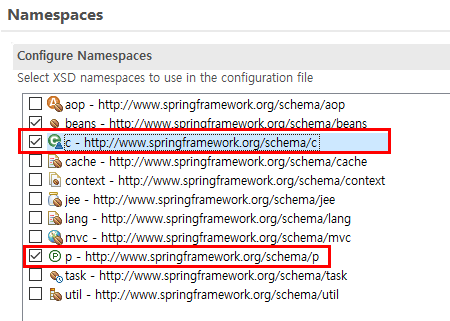
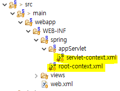
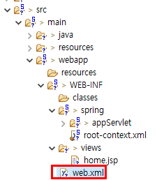
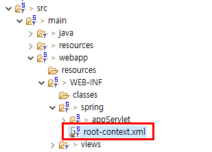

# SPRING

## 1. 스프링 개요
- 선수학습 : `java`, `jsp(servlet)`, 스크립트 언어(`html`, `javascript`, `css`, `jquery`)
- 개념 : 자바 언어를 기반으로 한 애플리케이션을 제작할 때 효율적으로 빠르게 개발할 수 있도록 하는 애플리케이션 프레임워크(프로그래밍 틀).
	
### 1.1. 스프링 프레임워크란?
- 스프링은 엔터프라이즈(기업용) 애플리케이션에서 필요로 하는 여러가지 기능들을 제공하는 프레임 워크.
- Java EE가 제공하는 기능들을 스프링에서도 지원하고 있기 때문에 국내에서는 가장 인기있는 프레임워크로 자리를 잡았다.
- 스프링은 Java EE에서 제공하는 기능 외에 DI나 AOP와 같은 기능을 추가적으로 제공한다.
- Java EE에서 MVC-2 모델 방식도 새로운 애플리케이션을 개발할 때마다 일일이 처음부터 다시 개발해야 하는 단점이 있다. 모든 애플리케이션에서 공통적인 기능등을 처음부터 다시 개발해야 한다는 것은 상당히 비효율적이다.
- 이보다 더 좋은 방법이 바로 스프링이다. 애플리케이션 개발 시에 일반적인 웹 애플리케이션에서 많이 사용하는 기능들은 미리 만들어서 제공하고, 그 외에 필요한 부분만 추가 및 수정하는 방식을 이용하면 된다. 이렇게 하면 훨씬 효율적일 뿐만 아니라 일정한 형식에 따라서 개발을 진행하므로 표준화가 이루어져 생산성도 높일 수 있다.
- 애플리케이션은 규모가 커질수록 각각의 기능들을 개발자가 따로 개발하는 것보다는 표준화된 방법으로 개발하는 것이 상당히 유리하다. 
- 그렇다면 **프레임워크(framework)** 란?
	* 프레임워크(framework)의 사전적 의미는 `어떤 것을 구성하는 구조 또는 뼈대`이다.
	* 소프트웨적 의미로는 "기능을 미리 클래스나 인터페이스 등으로 만들어 제공하는 반제품" 정도로 해석할 수 있다. 
	* 즉, 어느 정도는 완성된 상태로 제공하는 기능이다.
	
	
### 1.2. 스프링 프레임워크의 특징
- 스프링은 경량의 프레임워크이다.
	* 자바의 객체를 담고 있는 컨테이너(IoC 컨테이너).
	* 객체의 생성, 관리, 소멸과 같은 생명주기를 관리한다.
	
	
### 1.3. DI(Dependecy Injection : 의존성 주입)
- DI는 스프링 핵심 개념 중 하나.
- 기존에는 어떤 한 클래스가 다른 클래스의 기능(메서드)을 사용하려면 당연히 개발자가 코드에서 직접적으로 사용할 클래스의 생성자를 호출하여 사용하였다(`new` 키워드 이용). 따라서 사용할 클래스와 사용될 클래스의 관계는 개발자에 의해 직접 코드에서 부여가 되었다.(높은 의존도 - 강한 결합)
- 스프링에서는 객체 사이의 의존 관계를 객체 자신이 아닌 외부(스프링 컨테이너)에서 수행하는 개념이다.
	* 즉, 이런 연관 관계를 개발자가 직접 코딩을 통해서 부여하는 것이 아니라 스프링 컨테이너가 연관 관계를 직접 규정하는 것을 말한다. 그러면 코드에서 직접적인 연관 관계가 발생하지 않으므로 각각의 클래스들의 변경이 자유로워진다.(약한 결합) 따라서 스프링 프레임워크에서는 각 클래스들의 연관 관계를 클래스들 간의 사이에서 맺어지는 것이 아니라, 스프링 프레임워크에서 설정을 통해 맺어줌으로써 클래스들끼리 연관 관계를 맺지 않도록 구현을 해 놓았다.
- 스프링 프레임워크에서의 의존 관계는 설정 파일(`bean.xml`)이나 애노테이션을 이용하여 설정한다.
- 스프링에서 클래스(빈 : `bean`)를 담는 그릇을 스프링 컨테이너라고 한다.
	* 스프링 기반 애플리케이션에서는 스프링 컨테이너에서 객체가 태어나고, 자라고 소멸한다.
	* 스프링 컨테이너는 객체를 생성하고, 서로 엮어 주고, 이들의 전체 생명주기를 관리한다.
	* 스프링 컨테이너는 스프링 프레임워크 핵심부에 위치한다. 스프링 컨테이너는 종속 객체 주입을 이용해서 애플리케이션을 구성하는 컴포넌트를 관리하며, 협력 컴포넌트 간 연관 관계의 형상도 스프링 컨테이너에서 이루어진다.
		
		
### 1.4. 스프링 컨테이너
- 스프링은 객체를 생성하고 각각의 객체를 연결해 주는 조립기 역할을 한다.
- 대표적으로 `GenericXmlApplicationContext` 객체가 조립기 기능을 구현한 클래스이다.
- 조립기에서 생성할 객체가 무엇이고, 각 객체를 어떻게 연결하는지에 대한 정보는 xml 파일에 설정이 되어 있다.
- `GenericXmlApplicationContext` 클래스는 이 xml 파일에 정의된 설정 정보를 읽어와서 객체를 생성하고, 각각의 객체를 연결한 뒤에 내부적으로 보관한다.
- xml을 이용한 스프링 설정을 하다 보면 컨테이너가 생성할 객체를 지정하기 위해 `<bean> 태그`를 사용하는 것을 볼 수 있다.
- 스프링 컨테이너가 생성해서 보관하는 객체를 스프링 빈(`spring bean`) 객체라고 부르며, 일반적으로 자바 객체와 동일하다.
- 스프링 컨테이너는 생성한 빈 객체를 <이름, 빈 객체> 이렇게 쌍을 보관한다.
- 스프링 컨테이너가 보관하고 있는 객체를 사용하고 싶은 경우 빈 객체와 연결되어 있는 이름을 이용해서 객체를 참조하게 된다.

		
### 1.4.1. 스프링 컨테이너의 종류
- `BeanFactory` : 단순히 스프링 컨테이너에서 객체를 생성하고 DI만 처리해 주는 기능만을 제공하는 객체.
	* 하지만 스프링을 사용하는 이유는 단순히 DI만 사용하기 위해서가 아니다. 
	* 스프링을 사용하는 이유는 다양한 부가 기능(트랜잭션 처리, 자바 코드 기반의 스프링 설정, 애노테이션을 이용한 빈 설정,  스프링을 이용한 웹 개발 등) 때문인데 이러한 부가적인 기능을 사용하기 위해서는 `ApplicationContext` 객체를 주로 이용한다.
- `AbstractApplicationContext` : 컨테이너 종료(`close()`)와 같은 기능을 제공하는 객체.
- `GenericXmlApplicationContext` : `AbstractApplicationContext` 객체를 상속받아 만들어진 클래스로, **xml 파일**에서 스프링 빈 설정 정보를 읽어 오는 역할을 한다.
- `GenericXmlApplicationContext` 객체를 생성할 때 파라미터 값으로 "classpath:getsum.xml" 을 전달했는데 이는 클래스 패스에 위치한 xml 파일을 설정 파일로 사용한다는 의미이다.
- `GenericXmlApplicationContext` 객체는 전달 받은 xml 파일에서 설정 정보를 읽어 와서 스프링 빈 객체를 생성하고 프로퍼티 값을 설정한다.
	* 이렇게 생성된 스프링 빈 객체는 `getBean()` 이라는 메서드를 사용해서 구현할 수 있다. 
	* `getBean()` 메서드의 첫번째 파라미터는 구현하고자 하는 스프링 빈 객체의 고유한 id 이름이며, 두번째 파라미터는 그 객체의 클래스 타입을 의미한다.
	

### 1.5. DI(의존성 주입) 하는 방법 2가지
1. setter(설정 메서드)를 이용한 주입
2. constructor(인자생성자)를 이용한 주입

#### [예] 1.5.1. setter(설정 메서드)를 이용한 주입
xml 파일에 setter를 이용하여 주입하는 방법.

```xml
<bean id="mySum" class="com.sist.di01.MyGetSum">
	<!--
		MyGetSum mySum = new MyGetSum();
		mySum.setSu1(200);
		mySum.setSu2(100); 와 동일한 의미-->
	<!-- 속성(setter)을 활용하는 경우 -->
	<property name="su1" value="200"/>
	<property name="su2" value="100"/>
	<property name="getSum">
	
		<!-- bean id="getsum"을 참조(reference)한다. -->
		<!-- 참조클래스가 달라지면 참조태그의 빈만 변경하면 되므로 유지보수가 용이하다. -->
		<ref bean="getsum"/>	
		
	</property>
</bean>
```

#### [예] 1.5.2. constructor(인자생성자)를 이용한 주입
xml 파일에 인자생성자를 이용하여 주입하는 방법.

Exam 클래스에 멤버변수를 선언하고, 인자 생성자를 작성하였다. 

```java
private String msg;
private int number;
private ArrayList<String> position;

public Exam(String msg, int number, ArrayList<String> position) {
	this.msg = msg;
}
```
속성(setter) 이 아닌 인자생성자를 활용하는 경우 `<constructor-arg>` 태그를 이용한다.    
멤버변수가 선언된 순서대로 value 값을 지정한다.    
별도의 타입을 설정하지 않아도 적절한 타입으로 저장된다.    

**1. 방식1**

```xml
<constructor-arg value="안녕하세요. 스프링에 오신 걸 환영합니다."/>
```

**2. 방식2**

```xml	
<constructor-arg>
	<value>100</value>
</constructor-arg>
```

* ArrayList 와 같은 List 계열 : 태그 안에 `<list>` 태그로 원하는 만큼 value 값을 지정한다.

```xml
<!-- ArrayList의 경우 -->
<list>
	<value>3번 타자</value>
	<value>좌익수</value>
</list>
```

* map : 태그 안에 `<map>` 태그를 이용. 원하는 만큼 `<entry>` 태그를 반복한다.

```xml
<map>
	<entry>
		<key> <value>1</value> </key>
		<value>짜장면</value>
	</entry>
</map>
```

#### [예] 1.5.3. 속성(setter)과 인자생성자를 모두 활용하는 방법
* 인자생성자에 인자로 있는 멤버변수 : `<constructor-arg>` 태그로 선언
* 인자생성자에 인자로 없는 멤버변수 : `<property>` 태그로 선언
	
1. 인자생성자 - `<constructor-arg>`

```xml
<constructor-arg value="김현수"/>
<constructor-arg value="33"/>
<constructor-arg>
	<list>
		<value>3번 타자</value>
		<value>좌익수</value>
	</list>
</constructor-arg>
```

2. 속성(setter) - `<property>`

```xml
<property name="weight" value="95"/>
<property name="height" value="185"/>
```

#### [+] Namespaces 를 활용하는 방법
* 네임스페이스(Namespaces) : `<property>` 태그나 `<constructor-arg>` 태그를 사용하다 보면 작성해야 할 xml 문서의 내용이 전반적으로 증가하게 된다. 이를 좀 더 짧게 작성하게 하는 것이 네임스페이스이다.
	- 생성자 주입시에는 c 라는 네임스페이스를 사용한다. 
		* 형식) `c:매개변수이름="값"` 또는 `c:매개변수이름-ref="참조할 객체의 id"`
	- 속성(setter) 주입시에는 p 라는 네임스페이스를 하용한다. 
		* 형식) `p:매개변수이름="값"` 또는 `p:매개변수이름-ref="참조할 객체의 id"`


xml 파일의 하단 탭 중 Namespaces를 선택 - c, p에 체크한다.


<p align="center></p>


체크하면 Source 탭 `<bean>` 태그에 아래와 같은 코드가 추가된다.

```xml
xmlns:c="http://www.springframework.org/schema/c"
xmlns:p="http://www.springframework.org/schema/p"
```

c태그와 p태그를 이용하여 더 간략하게 bean 설정을 할 수 있다.
의미는 다음과 같다.

* c : `<constructor-arg>`
* p : `<property>`

```xml
<bean id="player" class="com.sist.di07.player"
	c:name="김현수" c:age="33" c:position="좌익수" p:weight="95" p:height="15" />
```
		
### 1.6. 의존 관계를 설정하는 방법
1. XML 파일을 이용하여 의존 관계 설정
2. Java 코드를 이용하여 의존 관계 설정 - 애노테이션 이용.
3. XML과 Java를 혼용해서 의존 관계 설정 

- 설정 파일(`bean.xml`)에 들어가는 형식
	* 주로 아래 두 xml 파일에서 설정.
<p align="center"></p>

```xml
<bean>
	- id 속성 : bean의 고유한 이름. 클래스에서 작성한 변수(참조변수) 이름. 중복불가.
	- class 속성 : 스프링 컨테이너에서 객체를 생성할 클래스의 위치(패키지명.클래스명).
</bean> 
```

#### [예] 1.6.1. XML 파일을 이용하여 의존 관계 설정

* **class GetSum**

```java
public class GetSum {
	
	private int num1;
	private int num2;
	
	public int getNum1() {
		return num1;
	}
	public void setNum1(int num1) {
		this.num1 = num1;
	}
	public int getNum2() {
		return num2;
	}
	public void setNum2(int num2) {
		this.num2 = num2;
	}
	
	// 핵심기능(비지니스 로직)
	public void hap(int num1, int num2) {
		System.out.println("더하기 >> " + (num1 + num2));
	}
}
```

* **class MyGetSum**

```java
public class MyGetSum {
	
	private int su1;
	private int su2;
	private GetSum getSum;
	
	public int getSu1() {
		return su1;
	}
	public void setSu1(int su1) {
		this.su1 = su1;
	}
	public int getSu2() {
		return su2;
	}
	public void setSu2(int su2) {
		this.su2 = su2;
	}
	public GetSum getGetSum() {
		return getSum;
	}
	
	// GetSum 타입의 인자가 들어오면 되므로 MyGetSum 타입의 인자도 들어올 수 있다.(다형성)
	public void setGetSum(GetSum getSum) {
		this.getSum = getSum;
	}
	
	// 핵심 기능
	public void sum() {
		this.getSum.hap(su1, su2);
	}
}
```

* **getsum.xml**
	- src/main/resources/getsum.xml
	- Spring Bean Configuration File
	- DI 즉, 주입을 어떻게 할 것인지는 xml 문서에 기입이 되어 있다.
	- 스프링 컨테이너인 `ctx`가 `classpath:getsum.xml` 파일을 보고 DI를 진행한다.
	- getsum.xml 파일은 `resource` 폴더에 들어가 있어야 한다.


```xml
<!-- 
	"com.sist.di01" 패키지에 있는 "GetSum" 클래스를 "getsum"이라는 id로 지정하여 객체(bean)를 생성한다는 의미.
	GetSum getsum = new GetSum(); 와 동일 
-->
<bean id="getsum" class="com.sist.di01.GetSum"/>
	
<bean id="mySum" class="com.sist.di01.MyGetSum">
	<!--
		MyGetSum mySum = new MyGetSum();
		mySum.setSu1(200);
		mySum.setSu2(100);
	-->
	
	<!-- 속성(setter)을 활용하는 경우 -->
	<property name="su1" value="200"/>
	<property name="su2" value="100"/>
	<property name="getSum">
	
		<!-- bean id="getsum"을 참조(reference)한다. -->
		<!-- 참조클래스가 달라지면 참조태그의 빈만 변경하면 되므로 유지보수가 용이하다. -->
		<ref bean="getsum"/>	
		
	</property>
</bean>
```


* **Main.java** : 실행 파일
	- `AbstractApplicationContext` 객체가 DI 작업을 하는 스프링 컨테이너.
	- 스프링 컨테이너 객체를 생성한다.
	- xml 파일을 이용하여 메모리로 스프링 컨테이너 객체가 생성된다.(메모리로 로딩)

1. 스프링 컨테이너 객체 생성

```java
// xml 설정 파일(classpath:getsum.xml)을 읽어들여서 메모리로 로딩.
AbstractApplicationContext ctx = new GenericXmlApplicationContext("classpath:getsum.xml");

// 또는 path를 별도로 두어도 된다.
String path1 = "classpath:getsum.xml";
String path2 = "classpath:getsum2.xml";

// path가 여러개일 경우 ,로 구분하여 인자로 넣는다.
AbstractApplicationContext ctx = new GenericXmlApplicationContext(path, path2);
```


2. 실제적으로 이 코드에서 주입과정이 일어나게 된다.
	- new 키워드를 사용하지 않고 직접 스프링 컨테이너에서 꺼내서 사용한다.
	- my1 = my2  동일. (방식의 차이)

```java
MyGetSum my1 = (MyGetSum)ctx.getBean("mySum");

// getBean(스프링 빈 객체 id, 그 객체의 클래스 타입)
MyGetSum my2 = ctx.getBean("mySum", MyGetSum.class);	

// GetSum 인터페이스 객체로 생성도 가능하다.
GetSum my3 = (GetSum)ctx.getBean("mySum");
```

3. 메서드 또는 값 호출

```java		
my1.sum();	// 메서드(비지니스 로직)를 호출
my2.sum();

System.out.println("수1 : " + my3.getSu1());	// 이렇게 값을 가져올 수도 있다.
System.out.println("수2 : " + my3.getSu2());	
```
		
4. 사용한 자원은 반납해야 한다.

```java
ctx.close();
```

#### [예] 1.6.2. Java 코드를 이용하여 의존 관계 설정 - 애노테이션 이용.

설정 시 `cglib` 라이브러리가 반드시 필요하므로, pom.xml에 라이브러리를 추가해야 한다. <a href="https://github.com/csooy38/github/blob/main/Annotation.md">[cglib 추가방법]</a>   
new 키워드를 사용하는 등 결합이 강하므로 자주 사용되는 방법은 아니다.    

* **class Config**
	- 클래스 앞에 `@Configuration`, 메서드 앞에 `@Bean` 애노테이션을 선언한다.
	- 애노테이션 역할
		* 컴파일러에게 정보를 알려주는 역할.
		* 컴파일 할 때와 설치 시의 작업을 지정하는 역할.
		* 실행할 때에 별도의 처리가 필요한 경우 사용되는 역할.

```java
@Configuration	// 애노테이션
public class Config {
	
	@Bean	// 애노테이션
	public Player player1() {
		ArrayList<String> position = new ArrayList<String>();
		position.add("4번 타자");
		position.add("1루수");
		
		Player player = new Player("추신수", 38, position);
		
		player.setWeight(100);
		player.setHeight(188);
		
		return player;
	}
}
```

* **class Main**

```java
// Config 클래스를 컨테이너로 가져온다.
AnnotationConfigApplicationContext ctx = new AnnotationConfigApplicationContext(Config.class);

// Config 클래스의 메서드 이름(player1)이 id로 들어간다.
Player player1 = (Player)ctx.getBean("player1");

System.out.println("선수 이름 : " + player1.getName());
System.out.println("선수 포지션 : " + player1.getPosition());
System.out.println("선수 체중 : " + player1.getWeight());

ctx.close();
```


#### [예] 1.6.3. XML과 Java를 혼용해서 의존 관계 설정 

* **class Config**

```java
@Configuration
public class Config {
	
	@Bean
	public Player player1() {
		ArrayList<String> position = new ArrayList<String>();
		position.add("4번 타자");
		position.add("1루수");
		
		Player player = new Player("추신수", 38, position);
		
		player.setWeight(100);
		player.setHeight(188);
		
		return player;
	}
}
```

* **baseball.xml**

```xml
<context:annotation-config/>
	 
	<bean class="com.sist.di10.Config"/>
	
	<bean id="player3" class="com.sist.di10.Player">
		<constructor-arg value="김현수"/>
		<constructor-arg value="33"/>
		<constructor-arg>
			<list>
				<value>3번 타자</value>
				<value>외야수</value>
			</list>
		</constructor-arg>
		<property name="weight" value="95"/>
		<property name="height" value="185"/>
	</bean>
```


### 1.7. 한글 인코딩

프로젝트의 web.xml 파일에서 한글 인코딩 설정 작업을 하면 프로젝트 전체에 적용된다. 

<p align="center"></p>

```xml
<!-- 한글 인코딩 설정 작업 -->
<filter>
	<filter-name>encodingFilter</filter-name>
	<filter-class>org.springframework.web.filter.CharacterEncodingFilter</filter-class>
	<init-param>
		<param-name>encoding</param-name>
		<param-value>UTF-8</param-value>
	</init-param>
	
	<init-param>
		<param-name>forceEncoding</param-name>
		<param-value>true</param-value>
	</init-param>
</filter>
	
<filter-mapping>
	<filter-name>encodingFilter</filter-name>
	<url-pattern>/*</url-pattern>
</filter-mapping>
```


* **baseball.xml**


* `<context:annotation-config />` 태그
	* 특정 패키지 안에 있는 클래스 중에서 `@Configuration`, `@Bean`, `@Autowired`, `@Resource` 애노테이션이 존재하면 해당 애노테이션을 인식할 수 있도록 하는 태그.
	* xml 파일 내에 선언하여 사용.
	* 해당 태그를 선언하면 기존 방식과 동일하게 호출가능하다. 
	

* `@ImportResource("classpath:baseball4.xml")` : baseball4.xml까지 읽어온다.


---

## 2. MVC 흐름

1. web.xml
	- 클라이언트로부터 요청이 들어오면 해당 요청을 가장 먼저 처리하는 곳.
	- 필터가 있다면 가장 먼저 반응을 하여 필터 작업을 진행. => 한글 인코딩 처리.
  
2. /WEB-INF/spring/root-context.xml

<p align="center"></p>

	- /WEB-INF/spring/root-context.xml로 이동.
	- 모든 서블릿에서 사용할 자원을 설정하는 공간.
	- DB 연동을 이곳에서 진행.
  
3. DispatcherServlet
	- 해당 요청에 대해서 DispatcherServlet이 우선적으로 요청을 가로챈다.
	- `<init-param>` 부분에 있는 servlet-context.xml로 넘어간다.
  
4. /WEB-INF/spring/appServlet/servlet-context.xml
	- servlet-context.xml 파일은 브라우저의 요청으로 그 요청을 처리할 Controller(`@Controller`)로 이어주는 역할.
	- 즉, servlet-context.xml에서 HanderMapping(`URL-Mapping`)의 작업이 진행.
	- `<annotation-driven />` 이라는 이 설정을 통하여 URL 매핑이 일어난다.
	- `<annotation-driven />` 에 의해 `@RequestMapping`을 사용할 수 있게 되고 `@RequestMapping`에 지정된 URL로 웹 브라우저의 요청 URL이 매핑 된다.
  
5. HomeController
	- servlet-context.xml에 의해 브라우저의 요청은 HomeController로 넘어간다.    
	- `@RequestMapping`에 연결되어 있는 URL-Pattern에 의하여 맞는 mapping을 찾아서 비지니스 로직을 진행.
	- 비지니스 로직을 수행 후, 해당 결과 값을 Model이라는 객체에 특정 이름(키)을 부여하여 작업을 처리.
  
6. /WEB-INF/spring/appServlet/servlet-context.xml
	- 넘겨 받은 문자열을 InternalResourceViewResolver라는 객체를 통해서 뷰(view)를 찾게 된다.
	- 이 때 전달 받은 문자열 앞에는 /WEB-INF/views/를 붙이고 뒤에는 .jsp를 붙여주게 된다.
	- 결국 /WEB-INF/views/home.jsp라고 붙게 되어 해당 경로의 해당 페이지로 뷰 이름이 만들어지게 된다.
       
7. DispatcherServlet
	- 새롭게 만들어진 뷰 이름은 DispatcherServlet으로 전달.
  
8. web.xml
	- DispatcherServlet으로 전달된 뷰 이름으로 인해서 home.jsp 페이지를 볼 수 있게 된다.
	- 클라이언트의 요청에 대해서 응답이 이루어지게 된다.
     
* WEB-INF 안의 파일은 주요 설정이 모여있으므로, 그 안에서 파일을 실행하려고 하면 제한된다.  
	전체 프로젝트에서만 run 이 가능하다.  
     
     
### 2.1. Model

스프링 MVC에서 **Model** (모델)이란?
- 컨트롤러에 의해서 비지니스 로직이 수행이 되고 나면 대체적으로 view page에 보여질 정보들이 만들어진다.   
이러한 정보들을 스프링에서는 Model(모델)이라고 한다. 이 Model(정보)를 view page로 보내게 된다.


HomeController에서 addAttribute()로 키-값을 저장해서 return 하면,  


```java
@RequestMapping("/memberInfo")
// view page 이름을 String 타입으로 적는다.
public String member(Model model) {
		
	model.addAttribute("name", "홍길동");
	model.addAttribute("age", 27);
			
	return "member";	// WEB_INF/views/member.jsp 로 이동
}
```


return된 view page에서 EL언어 등으로 호출이 가능하다.  

```html
<body>

	<h2>회원 정보 페이지입니다.</h2>
	
	<p>회원 이름 : ${name }</p>
	<p>회원 나이 : ${age }</p>

</body>
```


### 2.2. ModelAndView 객체 - ModelAndView 객체는 컨트롤러에 의해서 비지니스 로직이 수행이 되고 나면 대체적으로 사용자에게
	  반환되어 브라우저에 보여질 정보들이 만들어진다. 이 때 만들어진 정보를 응답할 view page 정보와 전달할 값을 한꺼번에 저장하여
	  view page로 넘겨줄 때 사용한다.

```java
@Controller	// 자동으로 bean 등록
public class MyController {

	@RequestMapping("/info")
	public ModelAndView aaa() {
		
		ModelAndView mav = new ModelAndView();
		
		mav.addObject("email", "hong@naver.com");	// view page에 넘어갈 정보(Model) 저장
		mav.setViewName("member/email");			// 이동할 view page 주소(views/member/email.jsp) 저장
		
		return mav;
	}
}
```

```
     
     
     <context:component-scan base-package="com.sist.mvc01" />
	
	<!-- 
		<context:component-scan> 태그
			base-package 속성에 있는 패키지(com.sist.mvc01) 안에 @Controller, @Repository, @Service, @Component 애노테이션이 있는 
			클래스가 존재하면 해당 클래스를 자동으로 빈으로 등록하라는 의미.
	 -->
     
     
     
     
