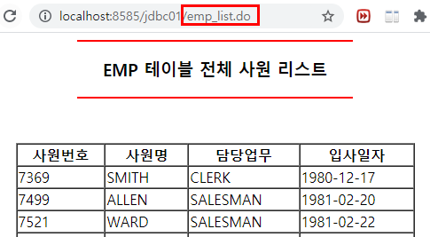

# SPRING

## 3. Spring JDBCTemplate
### 3.1. JDBC(Java DataBase Connectivity)
- JDBC는 DB에 접근할 수 있도록 JAVA에서 제공하는 API.
- JDBC는 데이터베이스에서 자료를 쿼리하거나 업데이트 하는 방법을 제공.
- JDBC API 문제점
	1. 쿼리를 실행하기 전과 후에 많은 양의 코드를 작성해야 한다.
		예) 오라클 데이터베이스 로딩, DB와 연결 생성, 명령문(쿼리문), `ResultSet` 연결, 연결 객체 닫기 등
	2. 데이터베이스 로직에서 예외 처리 코드를 수행해야 한다.
	3. 1과 2의 코들르 메서드 호출시마다 반복적으로 작성해야 한다.      
     

### 3.2. Spring JDBCTemplate
- JDBCTemplate은 Spring JDBC 접근 방법 중 하나.
- 내부적으로 JDBC API를 사용하지만 위의 내용과 같은 문제점을 제거한 형태로 Spring에서 제공하는 class.
- Spring JDBC에서 개발자가 핵심적으로 해야 할 작업만 하면 나머지는 Spring Framework에서 알아서 처리한다.


※ Spring JDBC가 하는 일
- `Connection` 열기와 닫기
- `PrepareStatement` 준비와 닫기
- `PrepareStatement` 실행
- `ResultSet` Loop 처리
- `Exception` 처리
- `Transaction` 처리
	
* Spring JDBCTemplate 클래스를 사용하기 위해서는 pom.xml 파일에 아래와 같은 라이브러리를 등록해야 한다.     
<a href="https://github.com/csooy38/github/blob/main/Annotation.md">[spring-jdbc 라이브러리 설정]</a>

	```xml
	<!-- spring-jdbc 라이브러리 -->
	<dependency>
		<groupId>org.springframework</groupId>
		<artifactId>spring-jdbc</artifactId>
		<version>${org.springframework-version}</version>
	</dependency>
	```
	

### 3.3. DataSource
JDBC 명세서의 일부분이면서 일반적으로 DB 연결 공장.    
즉, DB와 관련된 connection(DBCP 방식) 정보를 담고 있다.    
	* DB 종류(oracle.jdbc.driver.OracleDriver)
	* url 정보(jdbc:oracle:this:@localhost:1521:XE)
	* 계정 정보(web)	
	* 계정 비밀번호 정보(1234)
	
	
### 3.4. /WEB-INF/spring/root-context.xml
스프링과 관련된 설정 파일을 설정하는 공간.   

<p align="center"></p>

1. DataSource 정보 설정    
: DB와 관계된 connection(연결방식) 정보를 담고 있는 객체  

	```xml
	<bean name="dataSource" class="org.springframework.jdbc.datasource.DriverManagerDataSource">
		<property name="driverClassName" value="oracle.jdbc.driver.OracleDriver" />
		<property name="url" value="jdbc:oracle:thin:@localhost:1521:XE" />
		<property name="username" value="web" />
		<property name="password" value="1234" />
	</bean>
	```

2. Spring JDBCTemplate 클래스 설정    

	```xml
	<bean name="template" class="org.springframework.jdbc.core.JdbcTemplate">
		<property name="dataSource" ref="dataSource" />
	</bean>
	```

#### [예] Spring JDBCTemplate를 통한 DB 연결 
Oracle SQL Developer에서 제공하는 기본 테이블 EMP을 이용하여 DB 연동을 시도하였다.  
주소창에 "/emp_list.do"를 입력하면 EMP 테이블의 정보를 가져와 화면에 출력되게 한다.   

1. controller 패키지
	- EmpController.java 
2. model 패키지
	- EmpDAO 인터페이스 : 호출하는 클래스와 실제 DB에 접근하는 구현 클래스와의  직접적인 의존관계를 느슨하게 하기 위해 인터페이스 사용.    
	- EmpDAOImpl 클래스 : EmpDAO 인터페이스를 상속바다 추상메서드를 구현.
3. views
	- emp_list.jsp


* **EmpDAO** 인터페이스
일반적으로 DAO에서 선언되는 메서드를 추상메서드로 선언. 

	```java
	@Repository
	public interface EmpDAO {

		List<EmpDTO> getEmpList();	 	// 전체 목록 관련 추상메서드
	}
	```


* **EmpDAOImpl** 클래스
RowMapper<EmpDTO>를 오버라이딩하여 DB의 값을 DTO객체로 받아온다.  
기존의 JSP의 방식에 있던 ResultSet Loop 와 try-catch문은 대체되어 생략된다. 
	* `@Autowired` : 자동으로 의존관계가 설정되는 애노테이션. 무조건 객체에 대한 의존을 주입하는 애노테이션.  
	- `template` : root-context.xml 의 name="template"인 bean.
		- `template.query(sql, rowMapper)` : select 결과값이 여러 개일 때 
		- `template.queryForObject(sql, requiredType, args)` : select 결과값이 하나일 때.   
		args에는 sql문에서 ?에 해당하는 값을 넣는다.
		- `template.update(sql, pss)` : insert, update, delete 쿼리문일 때 사용
		- `template.queryForInt(sql)` : sql문의 결과가  int 타입으로 반환.

	```java
	@Autowired	// 자동으로 의존관계가 설정되는 애노테이션. 무조건 객체에 대한 의존을 주입.
	private JdbcTemplate template;
	String sql = null;

	@Override 	// EmpDAO 인터페이스를 상속받았으므로, 추상메서드 구현
	public List<EmpDTO> getEmpList() {

		List<EmpDTO> list = null;

		sql = "select * from emp order by empno";

		// query : select 결과값이 여러개일 때 
		return list = template.query(sql, new RowMapper<EmpDTO>() {

			@Override
			public EmpDTO mapRow(ResultSet rs, int rowNum) throws SQLException {
				EmpDTO dto = new EmpDTO();
				dto.setEmpno(rs.getInt("empno"));
				dto.setEname(rs.getString("ename"));

				return dto;
			}

		});
	}
	```


* **EmpController**
"/emp_list.do" 매핑주소로 들어오면 list 메서드가 실행된다.  

EmpDAOImpl 클래스의 getEmpList() 메서드를 호출하여 연결 값을 list에 저장한다.  
저장한 값은 model 객체에 저장하여 "views/emp_list.jsp"로 넘긴다. 
			
	```java
	@Autowired
	private EmpDAO dao;

	@RequestMapping("/emp_list.do")
	public String list(Model model) {

		List<EmpDTO> list = this.dao.getEmpList();
		model.addAttribute("List", list);

		return "emp_list";
	}
	```
		
* **emp_list.jsp**
view 페이지에서는 EL언어로 넘어온 값을 받아 출력한다.  
주소창에서 "/emp_list.do" 매핑주소로 들어온 것을 확인할 수 있다. 

<p align="center"></p>


