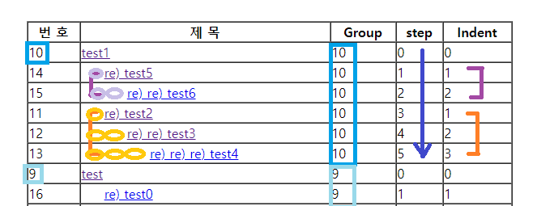
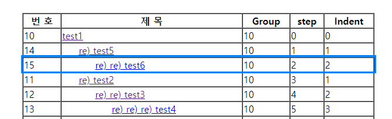
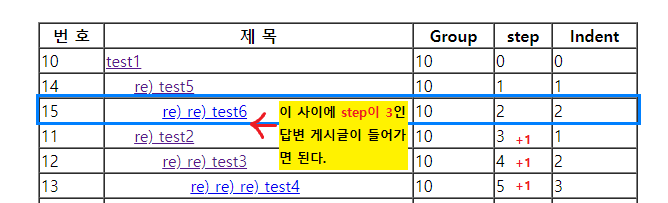
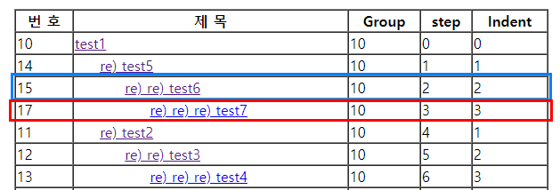

# mapping.properties 파일 방식을 이용하여 게시판 구현하기

14_Board_Reply 구현 내용이다.  
forward로 데이터를 넘기는 게 어려워서 아직 공부 중이다.(+수정완료 210521 | 5-1 참고)

## 1. Action 인터페이스
이전까지는 반환타입을 String, void로 두었다면  
이번에는 ActionForward 객체 타입으로 두어 ActionForward의 멤버변수로 반환할 것이다.  

```java
public interface Action {

	// 반환타입이 ActionFoward인 추상 메서드
	public ActionForward execute(HttpServletRequest request, HttpServletResponse response);
}
```


## 2. ActionForward 클래스
Action 인터페이스를 상속받는 자식 클래스들의 execute메서드 반환타입이 될 클래스다.  
ActionForward 클래스에는 두 가지 멤버변수가 있다.  

1) insRedirect() 멤버 : boolean 타입
	- *.do 페이지(true) : *.do 페이지로 이동한다면 true 값으로 설정한다.   
	- jsp 페이지(false) : .jsp 페이지로 이동한다면 false 값으로 설정한다.    
2) path 멤버 : String 타입
	- 파일 경로 지정. RequestDispatcher()의 인자가 되어 path의 지정경로로 이동한다.  
	

모두 private로 두고 getter()/setter()로 접근하게 한다.  
FrontController, *Action 클래스 등 여러 곳에서 '페이지 이동'을 정리해 줄 중심 변수이다.  

```java
public class ActionForward {

	private boolean isRedirect;
	private String path;
	
	public boolean isRedirect() {
		return isRedirect;
	}
	public void setRedirect(boolean isRedirect) {
		this.isRedirect = isRedirect;
	}
	public String getPath() {
		return path;
	}
	public void setPath(String path) {
		this.path = path;
	}
}
```
	


## 3. mapping.properties 파일
주석으로는 `#`을 사용한다.  
작성방식은 key = value 형태로, getProperty()로 key 또는 value를 호출한다. 
value 값 앞에 특정 문구(execute)을 두어 서블릿 실행과 jsp 파일 이동을 구분한다.   
value 값 앞에 "execute"라고 적혀있는 key 값을 받으면 모두 서블릿 실행으로 연결된다.  
자세한 방식은 FrontController에서 다룬다.   


```file
# 주석처리는 샵(#)을 사용한다. 
# key = value 형태로, 
# getProperty()로 key 또는 value를 호출한다. 

# 게시판 Action Class
bbs_list.do = execute|com.reply.action.BbsListAction
bbs_write_ok.do = execute|com.reply.action.BbsWriteOkAction
bbs_cont.do = execute|com.reply.action.BbsContAction
bbs_update.do = execute|com.reply.action.BbsUpdateAction
bbs_update_ok.do = execute|com.reply.action.BbsUpdateOkAction
bbs_delete.do = execute|com.reply.action.BbsDeleteAction
bbs_delete_ok.do = execute|com.reply.action.BbsDeleteOkAction

# 게시판 view page
bbs_write.do = view/bbs_write.jsp
```


## 4. FrontController
1) 변수 action과 forward를 선언한다.
우선 아래에서 작성할 조건문 안에서 사용될 변수 action과 forward를 선언한다.  
조건문 안에서 선언할 경우 지역변수가 되어 조건문 밖에선 사용하지 못하므로 미리 선언해둔다.  

```java
Action action = null;
ActionForward forward = null;
```


2) Properties 클래스의 변수 prop을 정의한다.  
위에서 작성한 mapping.properties 파일의 내용을 사용하기 위해 Properties 클래스 변수를 정의한다.  

```java
Properties prop = new Properties();

// properties 파일 경로로 InputStream 객체를 생성하면 
FileInputStream fis = new FileInputStream("mapping.properties 파일이 저장된 경로");

// load() 메서드로 파일을 읽어올 수 있게 된다. 
prop.load(fis);
		
// getProperty() : 키를 호출하면 value를, value를 호출하면 키 값을 반환한다.
// 호출한 값을 value로 저장한다. 
// 여기서 command 변수는 mapping.properties의 key가 되므로 value에는 value값이 저장된다.  
String value = prop.getProperty(command);
```


* java.util.Properties 클래스
	- Properties 클래스는 HashTable의 하위 클래스.
	- 보통은 환경 변수 및 속성 값을 Properties 파일에 저장하여 쉽게 접근할 수 있는 장점이 있다.
	- Properties 파일은 일련의 키(key)-값(value)의 한 쌍으로 이루어져 있다. 
	- 보통은 파일에 저장하여 사용한다. 파일 이름을 *.properties 으로 끝나게 한다.
	- InputStream 에 Properties 파일을 인자로 넣어서 그 스트림으로부터 파일을 가져올 때 가장 많이 사용한다. 인자로 들어온 Properties 파일을 읽게 된다.
	- load() 메서드를 이용하여 파일을 읽어들이게 된다. 


3) 동적 객체를 생성한다.  
newInstance() 메서드를 활용하여 value에 저장된 파일의 객체를 생성한다.  
value에 저장된 데이터를 "|"를 기준으로 후자의 데이터를 String 변수로 저장한다.(url_2)
url_2 에는 실행될 액션파일 경로가 저장되어 있으므로, forName()변수로 해당 액션파일의 객체를 생성한다.  

```java
if(value.substring(0, 7).equals("execute")) {	// value의 0번째에서 6번째 인덱스까지 저장된 값이 "execute"라면  
			
	// StringTokenizer 객체를 생성하여 value에 저장된 값을 "|"를 기준으로 나눈다. 
	StringTokenizer st = new StringTokenizer(value, "|");
	
	// value에는 "execute|패키지명.클래스명" 형태로 저장되어 있으므로,
	String url_1 = st.nextToken();	// "execute"
	String url_2 = st.nextToken();	// "패키지명.클래스명"

	try {
		// url_2(패키지명.클래스명)를 로딩한다.
		Class url = Class.forName(url_2); 	
				
		// 동적으로 객체 생성
		// action = new BbsListAction(); 과 동일한 개념
		action = (Action)url.newInstance();
				
		// ActionForward 클래스의 멤버변수들을 사용하기 위해 실행 메서드를 forward에 저장한다.  
		forward = action.execute(request, response);
				
	} catch (Exception e) {
		// TODO Auto-generated catch block
		e.printStackTrace();
	}	
}else {	// value 값이 "execute" 문자열이 아닌 경우 view page로 이동
	forward = new ActionForward();
	
	forward.setRedirect(false);	// view page로 이동시에는 redirect 값이 false
	forward.setPath(value);
}
```

* 동적 객체 생성 : newInstance()
	- Class 객체를 이용하면 new 연산자의 사용 없이 동적으로 객체 생성이 가능하다.
	- 코드 작성 시에 클래스의 이름을 결정할 수 없고, 런타임(실행) 시에 클래스의 이름이 결정되는 경우에 유용하게 사용된다.	  
	- newInstance() 메서드는 기본 생성자를 호출해서 객체를 생성하기 때문에 반드시 클래스에 기본 생성자가 존재해야 한다. 예외가 발생할 수 있는데, 해당 클래스가 추상클래스이거나 인터페이스일 경우 발생하며 또한 클래스의 생성자가 접근 제한자로 인해 접근할 수 없는 경우에도 발생한다. 따라서 예외처리를 해주어야 한다. 			  
	- 반환타입은 Objects 타입이므로 맞게 형변환을 하면 되지만, 클래스의 타입을 모르는 상태이므로 형변환을 할 수가 없다. 이러한 문제를 해결하기 위해서 인터페이스를 사용한다. 
	- Class.forName(class 이름)은 파라미터로 받은 class 이름에 해당하는 클래스를 로딩한 후에 그 클래스에 해당하는 인터페이스를 리턴한다. newInstance() 메서드는 로딩한 클래스의 객체를 생성하는 메서드이고 이렇게 생성된 객체를 동적 객체 생성이라고 한다.   


4) forward의 값에 따라 서블릿을 실행하거나 view page로 이동한다.  
forward의 redirect 값이 
* true : 서블릿 실행
* false : view page로 이동

```java
if(forward != null) {	
	if(forward.isRedirect()) {	// true 인 경우 다시 *.do 실행
		response.sendRedirect(forward.getPath());
	}else {	// false 인 경우 view page로 이동
		RequestDispatcher rd = request.getRequestDispatcher(forward.getPath());
		rd.forward(request, response);
	}
}
```

## 5. 액션 클래스 생성
이제 매핑된 value 값마다 액션 클래스를 생성하고, 코드 작성 후 foward 값을 설정하여 리턴하면 된다.  
클래스 안에는 기존의 액션 클래스처럼 DTO, DAO 객체가 활용될 수 있다. 
예를 들면 다음과 같이 작성할 수 있다.  

```java 
public class BbsDeleteAction implements Action {

	@Override
	public ActionForward execute(HttpServletRequest request, HttpServletResponse response) throws IOException {
		
		int nowPage = Integer.parseInt(request.getParameter("page").trim());
		int bbs_no = Integer.parseInt(request.getParameter("no").trim());
		
		BbsDAO dao = BbsDAO.getInstance();
		BbsDTO dto = dao.getBbsCont(bbs_no);
		
		request.setAttribute("del", dto);
		request.setAttribute("page", nowPage);
		request.setAttribute("no", bbs_no);
		
		// ActionForward 객체를 생성하여 redirect 값을 설정하고 path를 지정한다.  
		ActionForward forward = new ActionForward();
		 
		forward.setRedirect(false);	// redirect가 false 이므로 view page로 이동할 것이다.  
		forward.setPath("view/bbs_delete.jsp");	// 이동할 view page 경로
		
		return forward;
	}
}

```


## 5-1. 데이터 값을 액션클래스에서 함께 넘기는 방법
게시물을 수정하는데 자꾸 페이지 이동에 에러가 발생하였다.  
수정이 성공되거나 비밀번호 불일치로 실패하거나 모두 cont 페이지로 이동하지 못하고 NullPointException 을 출력하였다.  


no변수와 page변수가 함께 넘어가지 않아서 cont 페이지가 열리지 않는다고 판단하여 setAttribute를 설정하는 등 여러가지로 코드를 수정해 보았으나 결과부터 말하자면  


**모두 필요 없었다.**   
수정 성공시에는 forward의 path 지정에서 기존의 방식과 동일하게 경로에서 데이터를 넘기면 되었다.  
수정 실패시에는 오타가 있어 오류가 발생하는 거였다. 생략된 괄호")"를 넣어 수정하니 정상적으로 페이지가 돌아갔다. 오타에 주의하자!

```java
forward.setPath("bbs_cont.do?no="+bbs_no+"&page="+nowPage);
```


아래는 애먹었던 코드 전문

```java
if(bbs_pwd.equals(db_pwd)) {	// 비밀번호가 같은 경우
	
	// 변경된 게시물 작성내용을 dto 객체에 저장		
	BbsDAO dao = BbsDAO.getInstance();
	BbsDTO dto = new BbsDTO();
	
	dto.setBoard_no(bbs_no);
	dto.setBoard_writer(bbs_writer);
	dto.setBoard_title(bbs_title);
	dto.setBoard_cont(bbs_cont);
	dto.setBoard_pwd(bbs_pwd);
			
	// 게시글을 수정하는 메서드 호출
	int res = dao.updateBbs(dto);
			
	if(res > 0) {	// 게시글 수정이 성공한 경우
		out.println("<script>");
		out.println("alert('수정완료!')");
		out.println("</script>");
				
		forward.setRedirect(true);
		forward.setPath("bbs_cont.do?no="+bbs_no+"&page="+nowPage);
	}else {	// 게시글 수정이 실패한 경우
		out.println("<script>");
		out.println("alert('수정실패!')");
		out.println("history.back()");
		out.println("</script>");
	}	
			
}else {	// 비밀번호가 다른 경우
	out.println("<script>");
	out.println("alert('수정실패! 비밀번호를 확인하세요!')");
	out.println("history.back()");
	out.println("</script>");
}			
```


## 6. 답변 기능

<p align="center"></p>

이번 게시판의 테이블은 다음과 같다.  

```sql
create table jsp_bbs(
	board_no number(5) primary key,				-- 게시판 글번호
	board_writer varchar2(20) not null,		-- 게시판 글 작성자
	board_title varchar2(100) not null,		-- 게시판 글 제목
	board_cont varchar2(1000) not null,		-- 게시판 글 내용
	board_pwd varchar2(20) not null,			-- 게시판 글 비밀번호
	board_hit number(5) default 0,				-- 게시판 글 조회수
	board_date date,								-- 게시판 글 작성일자
	board_group number(5),						-- 게시판 글 그룹
	board_step number(5),							-- 게시판 글 답변 단계
	board_indent number(5)						--	게시판 답변글 들여쓰기
);
```

여기서 board_group, board_step, board_indent 가 답변 기능에서 활용되는 컬럼들이다.  
* board_group : 글 번호에 해당하는 답글들을 하나의 그룹으로 묶어주는 컬럼.
* board_step : 답글이 달린 순서에 따라 오름차순으로 정렬하기 위한 컬럼.
* board_indent : 들여쓰기 횟수를 지정하기 위한 컬럼. 


그림으로 나타내면 다음과 같다. 작성순서는 test 옆의 수로 나타내었다.  


<p align="center"></p>

1. 10번 게시글에 달린 답글은 모두 10번 group 으로 묶였다. (board_group)  
2. 답글이 step에 따라 오름차순으로 정렬되었다. (board_step)
3. indent의 수만큼 들여쓰기가 적용되었다. (board_indent)


위와 같이 출력하기 위하여, 답글을 작성할 때는 두 가지 메서드를 호출한다.  

## 6-1. replyUpdate() 
jsp_bbs 테이블 게시판 답변 글의 step을 하나 증가시키는 메서드. 
n번 글에 답변을 달 때, n번 글의 그룹이면서 step이 n번 글의 step보다 큰 모든 게시글의 step을 모두 +1 한다.   


```java
sql = "update jsp_bbs set board_step = board_step + 1 where board_group = ? and board_step > ?";

pstmt = con.prepareStatement(sql);
pstmt.setInt(1, bbs_group);
pstmt.setInt(2, bbs_step);

pstmt.executeUpdate();
```


## 6-2. replyBbs() 

DB에 작성한 답글의 데이터를 저장하는 메서드.  

```java
int result = 0, count = 0;

openConn();
sql = "select count(*) from jsp_bbs";
pstmt = con.prepareStatement(sql);
rs = pstmt.executeQuery();

if (rs.next()) {
	count = rs.getInt(1) + 1;	// sequence 대신 사용하는 방법
}

sql = "insert into jsp_bbs values(?,?,?,?,?,default,sysdate,?,?,?)";

pstmt = con.prepareStatement(sql);
pstmt.setInt(1, count);
pstmt.setString(2, dto.getBoard_writer());
pstmt.setString(3, dto.getBoard_title());
pstmt.setString(4, dto.getBoard_cont());
pstmt.setString(5, dto.getBoard_pwd());
pstmt.setInt(6, dto.getBoard_group());

pstmt.setInt(7, dto.getBoard_step() + 1);	// 답변을 달 게시글보다 step 을 +1한다. 
pstmt.setInt(8, dto.getBoard_indent() + 1);	// 답변을 달 게시글보다 indent 를 +1한다.

result = pstmt.executeUpdate();
```

예를 들어 아래의 그림에서 15번 게시글인 "re) re) test6"에 답글을 작성한다고 가정해 보자.  

<p align="center"></p>

15번 게시글은 10번 게시글의 답글에 답글이 달린, 즉 10번 그룹에 속하는 글이다.   
현재 step이 2 이므로, 아래에 달릴 답글의 step은 3이 되어야 한다.  
이 때 3과 동일한 step이 존재하면 순서가 꼬일 수도 있으므로 3 이상의 step들을 모두 +1씩 해주어야 한다.  


<p align="center"></p>

즉, 답글을 달 15번 게시글의 step인 2보다 큰 수들을 모두 +1씩 해주고 그 사이에 step이 3인 게시글을 넣는 식이다.  
기존글과 답글을 구분하기 위한 들여쓰기를 위해 indent 수도 +1 한다.  


<p align="center"></p>


indent는 게시글 출력시에 반복문의 end 변수로 사용한다.  


```java
<td> 
	<c:forEach begin="1" end="${dto.getBoard_indent() }">
		&nbsp;&nbsp;&nbsp;&nbsp;	// 들여쓰기
	</c:forEach>
						
	<a href="<%=request.getContextPath() %>/bbs_cont.do?no=${dto.getBoard_no() }&page=${page }">
						
		<c:forEach begin="1" end="${dto.getBoard_indent() }">
			re)
		</c:forEach>
		
		${dto.getBoard_title() }
	</a>
</td>
```


